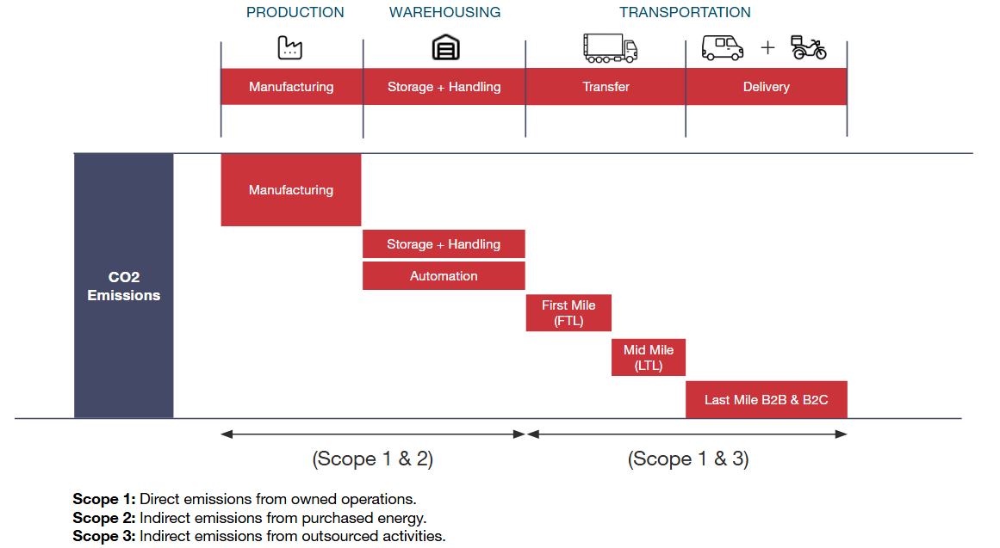

# Paragon’s Assumption Document

<aside>

**Purpose of this document:** This document details every assumption, data source, and methodology underpinning the Paragon (PRGN) end-to-end network optimization. Each section explains *why* the assumption is needed, *how* it was derived, and *what specific numbers* are used - so that every modeling choice can be traced back to a clear rationale.

</aside>

---

# How to Use This Document

This document is written for Paragon's data and modeling team. It has two goals: (1) help you understand every assumption and methodology behind the PRGN end-to-end network optimization, and (2) give you enough detail to reconstruct the input data and rerun the model independently.

**How it is organized.** Each methodology section follows the same pattern - *why* the assumption is needed, *how* it was derived, and *what specific numbers* are used. Sections are ordered to mirror the modeling pipeline:

- Sections 1–3 cover the inputs: project scope, data preparation, and demand.
- Sections 4–5 cover the distribution network - design rules and cost/operational parameters.
- Section 6 covers manufacturing (MNO).
- Section 7 covers environmental impact.
- Section 8 covers automation.
- Section 9 explains how everything is assembled into the optimization model.

**Relationship to the technical model file.** This document explains the data and methodology. The full mathematical formulation - decision variables, constraint equations, and the objective function - is provided in the code. Consult that code for the exact equations; consult this document for the rationale and input values.

# Modeling Workflow

The model runs in stages: data is prepared, network and manufacturing inputs are generated, the optimizer runs, and results are classified and costed in post-processing. The table below shows the end-to-end execution order and where each step is documented.

**Table 0.1:** End-to-end modeling workflow

| **Step** | **Stage** | **What happens** | **Section(s)** |
| --- | --- | --- | --- |
| 1 | Prepare data | Repair and complete 2025 actuals: extrapolate December sales, impute unknown B2C locations, reassign first/mid-mile and last-mile B2B costs, and build Malaysia costs. | 2 |
| 2 | Build demand | Project demand to 2030 using cascading-priority IPF reconciliation, then group products and ship-to points. | 3 |
| 3 | Balance flows | Remove stock-balancing shipments and enforce flow in = flow out for every facility × product group. | 4.1 |
| 4 | Build candidate network | Cluster demand to propose new locations, add Paragon-required FCs, finalize the facility footprint, and place MFCs. | 4.2–4.6 |
| 5 | Generate flows & routes | Create the allowed candidate flows under SLA coverage and inter-island rules. | 4.7 |
| 6 | Generate cost & operational parameters | Compute distance, transportation cost, warehousing cost, DOS, capacity utilization, and inventory opportunity cost. | 5.1–5.6, 8 |
| 7 | Generate manufacturing inputs | Compute COGM, production capacity and product-to-line mapping, and the factory expansion plan. | 6 |
| 8 | Run optimization | Run the Baseline scenario once and the Optimized scenario three times to minimize total end-to-end cost. | 9 |
| 9 | Post-process results | Classify facility types from flow patterns, apply post-classification cost corrections, compute lead time and required SQM, and estimate environmental impact. | 4.6, 5.7, 5.8, 5.9, 7 |

# 1. Project Context

## 1.1. Scope

**In scope:**

- **Geography:** Indonesia and Malaysia
- **Channels:** B2B and B2C
- **Products:** SKUs appearing in 2025 sales data

**Out of scope:**

- SMO and Head Office operations
- Products appearing in sales data but not in production data (1% demand)

## 1.2. Objective

Design the end-to-end network configuration (manufacturing + distribution) to serve Paragon's projected demand through **2030**, optimize distribution and manufacturing cost.

The project comprises two primary workstreams:

- **Distribution Network Optimization (DNO)** - identify warehouse locations and sizes, assignment of demand, and transportation flows.
- **Manufacturing Network Optimization (MNO)** - identify product mix and production-line allocation.

## 1.3. Baseline Chain

The model is not built directly on raw historical data. Instead, a series of adjustments ensures the starting point is clean, balanced, and comparable - so that optimization results reflect genuine improvement rather than data artifacts.

**Historical Baseline 2025** → **Adjusted Baseline 2025** (cleaned and standardized for modeling) → **Model Baseline** (same standardized inputs, processed through the optimization model)

The Adjusted Baseline applies the data cleaning described in Section 2 (extrapolation, exclusions) and the grouping from Section 3, then standardizes flows via the flow-balancing process (Section 4.1) and recalculates costs using the methodologies in Section 5. The Model Baseline takes these same standardized inputs and runs them through the optimization engine to produce a cost-comparable starting point against which optimized scenarios are measured.

# 2. Data Foundation

## 2.1. Data Periods

Not all data covers the full year 2025. To build a complete annual dataset, actuals are supplemented with extrapolated values where needed.

**Table 2.1:** Data coverage periods

| **Data Type** | **Actuals** | **Extrapolated** |
| --- | --- | --- |
| Sales / Demand | Jan–Nov 2025 | Dec 2025 |
| Transportation | Jan–Nov 2025 | Annualized using demand full year 2025 and transportation ratio in Jan-Nov 2025. |
| Cost | Jan–Sep 2025 | Not month-extrapolated - annualized via standardized rates |
| Inventory | Jan–Nov 2025 (month-end snapshot) | - |
| Production | Jan–Nov 2025 | Dec 2025
Using demand growth rate from Nov 2025 → Dec 2025, applying on production volume in Nov 2025. |

Cost actuals run Jan–Sep 2025. The missing months are **not** filled by month-level extrapolation. Instead, the Jan–Sep cost is converted into **standardized per-unit cost rates** (by cost component and region, as described in Section 5), which are then applied to the **full-year annualized volume** to derive total annual cost. This keeps cost on the same annualized basis as demand without inventing month-level cost figures. 

## 2.2. Data Repair Methods

The methods below ensure missing periods are filled consistently, so the model operates on a complete and comparable annual dataset.

### 2.2.1. December 2025 Sales Extrapolation

The November → December 2024 month-over-month growth rate is checked from 2024 data and applied to November 2025 actuals to estimate December 2025 sales:

> December 2025 = November 2025 actual × (1 + Nov→Dec 2024 growth rate), 
where Nov→Dec 2024 growth rate = (December 2024 ÷ November 2024) − 1
> 
1. **Compute growth rates** at the most granular level: SubChannel × Sales Area × Island × SubCategory × PTG × Brand.
2. **Validate and exclude** unreliable growth rates:
    - Sales exist in only either November or December 2024 (weak/missing data).
    - Growth rate exceeds **±100%** (treated as an unreliable outlier).
    - November 2024 sales volume < 100 units (insufficient base).
3. **Fallback logic** - if growth is invalid at a detailed level, progressively aggregate to broader levels until a reliable rate is found:
    1. SubChannel – Sales Area – Island – SubCategory – PTG – Brand
    2. SubChannel – Sales Area – Island – Category – Brand
    3. Channel – Island – Category – Brand (only dominant groups; others grouped)
    4. National level

### 2.2.2. B2C Unknown Location Assignment

**Objective**

Assign missing Province/City on B2C transactions so all demand can be mapped geographically, **without changing total volume or value.**

**Approach (city-split imputation)**

Use **known-location** orders to infer where **unknown-location** orders should be attributed. For each missing record, redistribute its demand across cities using the most comparable historical **city share**. 

**Steps**

1. **Build city splits** from valid records which have available Province & City data at the most granular level available:
    
    `YearMonth + FacilityID + DeliveryType + SubCategory + Brand + PTG` 
    
2. **Impute missing locations** by applying the best-matching split
3. **Preserve totals**: `QtyOrderInPCS` is conserved exactly, and `ValueInIDR` is also allocated in the same proportions. Allocated quantities are **always rounded to the nearest integer** (as shown in the worked example below).

**Fallback hierarchy (when no split exists at the most detailed level)**

Keep `YearMonth`, `FacilityID`, `DeliveryType`, `ProductID` unchanged, step down product detail until a valid split is found:

1. `YearMonth + FacilityID + DeliveryType + ProductID + SubCategory + Brand + PTG`
2. `YearMonth + FacilityID + DeliveryType + ProductID + SubCategory + Brand`
3. `YearMonth + FacilityID + DeliveryType + ProductID + SubCategory`
4. `YearMonth + FacilityID + DeliveryType + ProductID` 

**Special case: M03 & M04 Instant Delivery**

Instant Delivery has insufficient valid location data, so **Regular Delivery** is used as the proxy city distribution for the same `YearMonth × FacilityID` (and `ProductID` where possible). In this proxy matching, `DeliveryType` is intentionally not part of the key.

**Example**

A transaction group is missing both Province and City:

| YearMonth | FacilityID | ProductID | DeliveryType | SubCategory | Brand | PTG | Province | City | Quantity (PCS) |
| --- | --- | --- | --- | --- | --- | --- | --- | --- | --- |
| 2025-10 | D52 | 80080 | Instant Delivery | Lip Make Up | OMG | XSBottle-Lip&FaceMakeUpLiquidCream | NA | NA | **5** |

Within the known-location data, two records share the same key (`YearMonth + FacilityID + DeliveryType + ProductID + SubCategory + Brand + PTG`) and define the city-share distribution:

| YearMonth | FacilityID | ProductID | DeliveryType | SubCategory | Brand | PTG | Province | City | Quantity (PCS) | Share |
| --- | --- | --- | --- | --- | --- | --- | --- | --- | --- | --- |
| 2025-10 | D52 | 80080 | Instant Delivery | Lip Make Up | OMG | XSBottle-Lip&FaceMakeUpLiquidCream | Sulawesi Selatan | Kota Makassar | 170 | 97.7% |
| 2025-10 | D52 | 80080 | Instant Delivery | Lip Make Up | OMG | XSBottle-Lip&FaceMakeUpLiquidCream | Sulawesi Selatan | Gowa | 4 | 2.3% |

Applying these shares to the 5 missing pieces:

| Province | City | Quantity Calculation (PCS) | Allocated Quantity (PCS) |
| --- | --- | --- | --- |
| Sulawesi Selatan | Kota Makassar | 5 × 97.7% = 4.89 | 5 |
| Sulawesi Selatan | Gowa | 5 × 2.3% = 0.11 | 0 |

### 2.2.3. Reassign Missing First & Mid-mile (FMM) Transportation Cost

**Objective**

The Transportation Order (TO) dataset records every shipment, but its costs are not directly usable: some routes have missing or zero cost, while some multi-drop shipments have a single combined cost that needs to be split across multiple legs. This work reassigns the missing cost back to individual lanes in a structured way, so that every FMM lane has a cost figure consistent with data of Paragon Finance team.

**Approach**

1. **Scope FMM movements:** Keep only records that represent First & Mid Mile flows; exclude Last Mile customer deliveries.
2. **Convert volume to a common basis:** Enrich TO records with product attributes to convert pieces into pallets (using the pcs-per-pallet conversion rate at Product ID level, taken from the product master provided by Paragon), then combine with lane distance to compute the allocation key:
    
    > **Pallet-KM = Pallet volume × Distance in KM**
    > 
    
    Pallet-KM represents the transport weight of each lane, so longer and higher-volume lanes carry a proportionally larger share of cost.
    
3. **Classify each route by cost situation:** Each TO route falls into one of three cases, each handled differently.
    
    
    | **Route situation** | **Treatment** |
    | --- | --- |
    | Cost available and route is simple | Keep the original PRGN shipment cost |
    | Cost available but route is multi-drop or multi-flow | Reallocate the existing PRGN cost across its lanes (Step 4) |
    | Cost missing or zero | Allocate from the Finance cost gap (Step 5) |
4. **Redistribute multi-drop / multi-flow costs:** Some shipments deliver to several destinations or move goods through several legs under a single cost value. In these cases, that single cost is split across the individual legs in proportion to each leg's pallet-km.
5. **Fill missing-cost lanes using Paragon Finance data:** First, calculate the unaccounted cost - the difference between Finance's reported FMM total and the PRGN shipment costs already assigned in steps 3 & 4. Then distribute this amount across the lanes with missing or zero cost, in proportion to each lane's pallet-KM.
6. **Add insurance:** Allocate the insurance cost from Finance team across all FMM lanes using the same pallet-KM basis.
7. **Aggregate to model input:** Roll up the result to lane level by movement type, origin, and destination.

### 2.2.4. Allocate Last-mile B2B Cost

Allocate finance last-mile B2B cost back to each DC (cost owner), then distribute that DC’s cost to routes using pallet-km. This keeps totals aligned with finance while making route costs proportional to delivered volume and distance.

**Approach:**

1. Convert delivered quantity to **pallets** (using the pcs-per-pallet conversion rate at Product ID level, taken from the product master provided by Paragon), then calculate **Pallet_KM = DeliveredPallet × DistanceKM** for each delivery leg.
2. Define the **cost owner (SourceFacilityID)**:
    - **Ship-direct:** SourceFacilityID = the shipping DC (DC → Customer).
    - **Last-mile-hub-served:** treat as 2 legs (**DC → last-mile hub**, **last-mile hub → Customer**) but keep the **parent DC** as SourceFacilityID for both legs.
3. Build the **finance cost pool** by summing finance last-mile cost to **SourceFacilityID** (this is the DC’s **Actual** cost to allocate).
4. Allocate costs:
    - **Direct (non-depot) deliveries:** compute a DC-specific rate `Rate_DC = Actual / Σ(Pallet_KM)` and assign `Cost = Rate_DC × Pallet_KM`.
    - **Last-mile-hub-enabled deliveries:** treat the movement as 2 legs and allocate with island benchmark rates, using the **1.35 rate** on the **DC → last-mile hub** leg. Apply leg weights (**0.8** for DC→Customer, **1.2** for last-mile hub→Customer), then normalize so the DC total matches finance actual.

### 2.2.5. Malaysia Distribution Cost

Malaysia does not have the same granular historical cost data as Indonesia. CEL uses **Paragon-provided benchmark rates** to set the total cost envelope, and **Indonesian (Java) cost structures** to distribute that total into meaningful components and individual flows.

#### Warehousing Cost

**Step 1 - Set the total.** Total Warehousing Cost is derived from Malaysia sales volume × **Rp 3,386 per sold pcs** (benchmark rate provided by Paragon).

**Step 2 - Estimate the component split.** Java's cost-per-unit rates are applied to Malaysia's volumes to produce an initial cost estimate for each component: the storage rate (per pallet) on total volume, and the manpower and packaging rates (per pcs) on Malaysia's B2B and B2C volumes separately, since those two rates differ by channel. This yields both the *relative proportion* between storage, manpower, and packaging and the *B2B-vs-B2C split within* the manpower and packaging components.

**Step 3 - Scale to match the total.** The components are then scaled so they sum to the Paragon-provided total at the target proportions below. Scaling is applied at the component level (storage / manpower / packaging); the B2B-vs-B2C breakdown estimated in Step 2 is preserved within the manpower and packaging components. Target proportions:

| **Component** | **Share of Total** |
| --- | --- |
| Storage | 30% |
| Manpower | 50% |
| Packaging | 20% |

#### Transportation Cost

- **First Mile:** Paragon's Malaysia rate card is applied directly - no estimation needed.
- **B2B Last Mile:**
    - **Total cost envelope:** Malaysia sales volume × **Rp 479 per sold pcs** (benchmark rate provided by Paragon).
    - **Flow-level allocation:** Java's B2B last mile cost per pallet-km is used to estimate the relative cost of each individual delivery route (based on Malaysia's delivered volume and route distances). These flow-level estimates are then proportionally scaled so that the sum matches the Paragon-provided total.

# 3. Demand

## 3.1. Demand Projection (2025 → 2030)

The network must be designed not just for today’s volumes but for where demand will be in 2030. These projections drive facility sizing, location decisions, and capacity investment timing.

Paragon provides annual growth rates across several dimensions - by sub-channel & country, by brand–PTG–SubCategory, and by B2B sales area. B2C regional growth is estimated separately by CEL using GRDP data from government sources. 

Since these growth rates come from separate datasets and may not align perfectly, we reconcile them using a **cascading priority** approach.

### Input

The projection starts from the 2025 sales baseline, which contains demand volume and value at detailed customer–product level. This is the same demand baseline as the **Adjusted Baseline 2025** (Section 1.3): outbound sales is the standard used in flow balancing, so the demand side is identical before and after baseline adjustment. This baseline is then projected forward using multiple growth-rate datasets provided across different business dimensions:

- **Sales baseline 2025:** historical demand volume and sales value by customer, product, channel, geography, and product attributes, on ProductID, B2B ShipToID, and B2C City/Regency level.
- **Sub-channel – Country projection:** growth rate by commercial channel and country.
- **Brand – PTG – SubCategory projection:** growth rate by product hierarchy.
- **B2B Sales Area CAGR:** geography-level growth rate for B2B demand.
- **B2C regional growth:** estimated by CEL using GRDP data from government sources, by province for Indonesia and by state / geography for Malaysia where applicable.
- **Price assumption:** price is assumed to increase by **2% per year**. Growth is applied on different bases by source: the **Sub-channel – Country** growth rates are applied on **net sales value**, which is then converted back to volume by **dividing by the 2%-per-year-inflated price**; all other growth sources (Brand–PTG–SubCategory, B2B Sales Area, and B2C GRDP) are applied **directly on volume**.

### Projection Granularity

Growth is applied at the most detailed available level for each projection source:

- **Sub-channel – Country:** applied by `SubChannel` and `Country`.
- **Brand – PTG – SubCategory:** applied by `Brand`, `PTG`, and `SubCategory`.
- **B2B geography:** applied by `Sales Area`.
- **B2C geography:** applied by province / city-regency GRDP growth, depending on the available government data granularity.

Because these projection sources are prepared on different dimensions, their projected totals may not naturally align. Therefore, a reconciliation step is required to ensure that the final demand projection is internally consistent across channel, product, and geography dimensions.

### Methodology

The demand projection follows a **cascading priority and reconciliation approach**. The highest-priority dimension sets the fixed projection total, while lower-priority dimensions are redistributed to match their growth signals without breaking the totals already set by higher-priority dimensions.

This reconciliation is performed using **Iterative Proportional Fitting (IPF)**. IPF adjusts the demand distribution across the target dimension while preserving the total volume of higher-priority dimensions. In practice, this allows the model to retain multiple growth signals while ensuring that the final projection remains consistent.

The process is as follows:

1. **Apply the first-priority projection**
    - Apply the growth rate of the highest-priority dimension directly onto the 2025 baseline.
    - This creates the first projected demand view for 2026–2030.
    - The total volume by this dimension is treated as fixed in later steps.
2. **Reconcile the second-priority projection**
    - Apply the second growth-rate dataset to generate target demand totals by the second-priority dimension.
    - Use IPF to redistribute the projected demand so that the second-priority growth signal is reflected, while preserving the totals of the first-priority dimension.
3. **Reconcile the third-priority geography projection**
    - Apply B2B Sales Area CAGR and B2C GRDP-based growth to generate geography-level targets.
    - Use IPF to redistribute demand across geography while preserving both higher-priority dimensions.
    - B2B and B2C are reconciled separately because their geography definitions and growth sources are different.
    - For geographies without available CAGR or GRDP growth data, the previous-step demand distribution is retained.

### Priority Order

Three projection scenarios are prepared. The **Base** and **Pessimistic** scenarios use the same priority order (below) and differ only in the **Sub-channel – Country** growth dataset; the **Visioning** scenario uses a different priority order:

**Base scenario - default model input**

1. Sub-channel – Country
2. Brand – PTG – SubCategory
3. B2B Sales Area / B2C regional GRDP growth

Base scenario is used as the default demand projection for all network optimization model runs.

**Pessimistic scenario**

Uses the **same priority order as Base**, but applies a different (more conservative) **Sub-channel – Country** growth dataset.

**Visioning scenario - sensitivity analysis**

1. Brand – PTG – SubCategory
2. Sub-channel – Country
3. B2B Sales Area / B2C regional GRDP growth

Pessimistic and Visioning are used to test the impact of alternative growth assumptions, especially when product-growth expectations are treated as the primary driver of future demand.

### Output

The output is a reconciled demand projection from **2025 to 2030** at detailed customer–product–channel–geography granularity (ID level).

## 3.2. Product & Ship-To Grouping

With thousands of individual SKUs and delivery points, the model would be computationally intractable without aggregation. Grouping consolidates items that share similar logistics characteristics so that the model operates at a manageable level of granularity without sacrificing accuracy.

### Product Groups

**Scope:** All SKUs in 2025 sales, excluding products appearing in sales but not in production.

**Grouping basis:** Each product is assigned to a Product Group defined by **3 attributes**:

1. **Sub Category** - the product family (e.g., Face Care, Hair Care).
2. **PTG Code** - the filling machine type used in production.
3. **MFC eligibility** - whether the product is eligible for Micro Fulfillment Centers (Yes/No).

**Rationale:** Each of the three attributes is used for a specific reason:

- **Sub Category × PTG** - these two together determine a product's COGM, so products that share them have the same manufacturing cost.
- **MFC eligibility** - separates instant products (eligible for Micro Fulfillment Centers) from non-instant products, because the two are fulfilled differently.

Products matching on all three behave the same in both cost and fulfillment, so they can be modeled as one unit.

**Quality check:** After initial grouping, each group is reviewed so that products within it behave similarly in terms of pallet conversion rate (pcs/pallet) and inventory levels. Where a group contains outlier products, those products are **moved out into a separate group**, based on two product-level checks:

- **Pallet conversion rate:** any product whose pallet conversion rate exceeds **10,000 pcs/pallet** is moved into a separate group.
- **DOS:** any product whose DOS exceeds **100 days** (a slow mover) is moved into a separate group. DOS here is measured **per product at the national level**, using **2025 data** (see the historical DOS formula in Section 5.4).

For example, if a group of 5 products contains 2 products with DOS above 100 days, those 2 are separated into a new group, leaving the remaining 3 in the original group. The same logic is applied across all groups.

**Result:** Starting from **2,078 in-scope product IDs** (after excluding products appearing in sales but not in production), the grouping reduces the product dimension to **142 product groups** (110 non-MFC and 32 MFC).

### Ship-To Groups

**Grouping basis:** Geographic location.

- B2B: All B2B ship-tos within the same district are aggregated into a single ship-to group. Each group is represented by the district’s demand-weighted centroid (the geographic center of the district, weighted by each ship-to’s demand). To preserve the option of direct NDC sourcing, high-demand ship-tos are kept as individual nodes and excluded from grouping when **both** conditions are met: (i) 2030 demand > 6M pcs and (ii) distance to either NDC Jatake or NDC Batang within 200 KM *(legacy threshold - should be synced with the current NDC→Customer distance threshold in Section 4.7)*. There are 7 ship-tos that meet these criteria:
    - 105695-002
    - 118438-598
    - 124624-000
    - 128112-002
    - 138789-000
    - 150794-001
    - 230001-001
- **B2C:** No grouping is applied - B2C demand is already at the city/regency level, which is the lowest available granularity. Each city/regency is represented by its **population-weighted centroid** (based on 2022 district population data).

**Result:** Starting from **34,922 B2B ship-to IDs**, the district-level grouping reduces these to **3,433 B2B ship-to groups**. B2C operates at **645 cities/regencies**.

# 4. DNO - Network Design

This section defines the facility network the optimizer works with - the existing and newly defined locations it can choose from, how each facility type is identified, and the rules that connect them. One principle frames the whole section: the optimizer treats every location as a generic warehouse node and does **not** pre-assign facility types. Types are classified only **after the model run**, from the resulting flow patterns (Section 4.6).

How the network is defined is explained subsection by subsection:

- **4.1 Flow Balancing** - clean the existing flows into a consistent starting point.
- **4.2 New Warehouse Locations** - candidate sites proposed from demand clustering.
- **4.3 New FC Locations** - new FCs required by Paragon for specific cities.
- **4.4 Micro Fulfillment Centers (MFCs)** - forced B2C facilities placed by a separate method.
- **4.5 Final Footprint** - the merged set of existing and new facilities fed to the model.
- **4.6 Facility Type Definitions** - how each activated location is classified after the run, plus the multi-purpose attribute.
- **4.7 Flow & Route Rules** - which candidate flows between facilities are allowed.

The post-classification cost corrections that follow from the facility classification are described in **Section 5.9**.

## 4.1. Flow Balancing

Historical flow data contains stock-balancing shipments and other non-standard movements that would distort the model if left uncorrected. The flow-balancing process ensures a clean, physically consistent starting point.

**Steps:**

1. **Remove stock-balancing flows** (as identified and provided by Paragon) from the historical data.
2. **Enforce flow balance:** For every facility × product group combination, ensure **flow in = flow out**. Outbound volume (delivery to customers) is taken as the standard, and inbound volumes are adjusted backward accordingly.

This process applies to both the Adjusted Baseline 2025 and the Model Baseline, ensuring all scenarios start from the same balanced flow foundation.

## 4.2. New Warehouse Location from Demand Clustering

Rather than evaluating every possible location, demand clustering identifies the areas with the highest concentration of demand. This narrows the candidate set to locations that are most likely to reduce last-mile cost and improve service levels.

**Method:** **K-Medoids clustering** is applied on combined B2B and B2C demand points (not separated by channel). The algorithm is run repeatedly from k=1 to k=85 clusters, and all resulting centroids across all k values are consolidated into a single candidate pool.

**Deduplication rules:**

- Remove a centroid if it falls within **20 km** of an existing facility or another cluster centroid.
- Remove a centroid if it is located in a forest area.

**Result:** Starting from 442 raw centroids, deduplication reduces the set to **71 new candidate locations**. Combined with 66 existing facilities, the model receives **137 total candidate locations** to choose from. All locations - existing and new - are treated equally by the model with no inherent bias unless explicitly constrained.

## 4.3. New FC Location for Required Cities

For cities that Paragon requires to have an FC but do not currently have one, new FC locations are identified manually by selecting suitable warehouse sites (typically in industrial zones) within each city. The city list is provided by Paragon.

The table below lists the FC locations required by Paragon, together with whether an existing facility is already nearby. Most of these cities already have a facility nearby, so only **Jayapura** and **Kupang** require opening a new facility.

**Table 4.3.1:** FC locations required by Paragon and nearby facility status

| **City** | **Nearby Facility** |
| --- | --- |
| Kota Cikarang | Last-mile Hub Bekasi |
| Kota Depok | DC Direct Bogor  |
| Kota Gorontalo | Last-mile Hub Gorontalo |
| Kota Jakarta | Last-mile Hub Bekasi |
| Kota Jayapura | None |
| Kota Kupang | None |
| Kota Malang | Last-mile Hub Malang |
| Kota Pangkal Pinang | DC Satellite Bangka |
| Kota Yogyakarta | FC Yogyakarta  |

**Assumption:** The new facilities in this section can be either an FC or an MWH. In the model they are treated as MWH first and classified later (see Section 4.6).

## 4.4. Micro Fulfillment Center (MFC)

MFCs are designed to serve high-velocity B2C demand in dense urban areas with faster delivery times than a standard FC. Because their viability depends on sufficient demand density in a small radius, they are placed using a separate, targeted methodology rather than the general network optimizer.

MFCs are **forced locations** (not chosen by the optimizer) and follow a dedicated allocation logic.

### Scope & Eligibility

- B2C 2030 demand, A-class SKUs only (as provided by Paragon).
- City-level demand is distributed to districts using **population share**.
- **Capacity constraint:** Each MFC has a maximum throughput of **1.5M pcs**.
- **Distance calculation:** Euclidean (straight-line) distance is used for MFC coverage analysis, unlike the driving/sea-distance approach used elsewhere in the network model.

### City Shortlist

- **Jabodetabek** (multi-MFC scenario, exploring 1 to 25 MFCs): Jakarta, Bogor, Depok, Tangerang, Tangerang Selatan, Bekasi, and their respective regencies.
- **Non-Jabodetabek cities** (1-2 MFC per city): Palembang, Mataram, Bandung, Surabaya, Banjarmasin, Surakarta, Semarang, Batam, Makassar, Malang, Pekanbaru, Bandar Lampung, Padang, Yogyakarta, Denpasar, Medan, Banda Aceh, and Pontianak.

### Objective

For each city, the MFC is placed at the district location that **maximizes covered B2C demand** within a **20 km radius**, subject to the **capacity constraint**.

### Location Selection Methodology

All approaches start by converting district-level demand into a **demand concentration heatmap** (using Kernel Density Estimation). This reveals where high-demand districts cluster together, forming natural hotspots that guide MFC placement. Two different methods are then applied depending on the complexity of the area.

**Jabodetabek (multi-MFC):**

Because Jabodetabek requires multiple MFCs serving a dense, overlapping metro area, an advanced partitioning approach is used to divide the region into balanced, compact service zones:

1. **Generate service zone options:** The algorithm explores thousands of ways to partition Jabodetabek's districts into zones, each constrained to be geographically contiguous and within the MFC capacity range (~1.5M pcs).
2. **Select the most compact layouts:** Only the most geographically regular partitions are retained (avoiding long, snaking zones that would be impractical to serve).
3. **Score by demand concentration:** Each zone is scored against the demand heatmap. At each MFC count (1 through 25), the combination of zones with the highest total demand concentration wins.

**Existing + New variant:** For scenarios that retain current MFC locations (e.g., Fatmawati, Pulo Asem), those locations are locked in place and only the remaining districts are re-partitioned to determine the best additional MFC placements.

**Non-Jabodetabek (single MFC per city):**

Smaller cities typically need only one MFC, so a simpler seed-and-expand approach is used:

1. **Identify the demand hotspot:** The district with the highest demand concentration in the city (including bordering neighbors) is selected as the MFC location.
2. **Define the service territory:** Starting from that district, expand outward through adjacent districts in order of demand concentration until either the cumulative demand reaches the **1.5M pcs capacity target** or the coverage reaches **20 km in radius** - whichever is hit first. 

In cases where a single MFC cannot fulfill the city's demand within these constraints, a **second MFC** is proposed as an option.

### Demand Split (MFC vs FC)

Within an MFC's coverage area, only A-class B2C demand is eligible for MFC fulfillment. All other B2C demand (non-A-class SKUs and districts outside coverage) continues to be served by regular FCs.

The share of eligible demand actually served by MFCs varies by region and is modeled under two scenarios:

- **Non-Jabodetabek (all scenarios):** MFCs serve **100%** of A-class B2C demand within their coverage.
- **Jabodetabek - Scenario A (full MFC):** MFCs serve **100%** of A-class B2C demand within their coverage - same as non-Jabodetabek.
- **Jabodetabek - Scenario B (partial MFC):** MFCs serve only **10%** of A-class B2C demand within their coverage. The remaining **90%** is handled by nearby FCs through regular delivery.

MFC demand fully cannibalizes B2C demand. This means that every unit of demand shifted to an MFC results in an equivalent reduction in FC demand.

### Current Selected Scenario

There are **17 MFCs** in total: **4 in Jabodetabek** + **13 in Non-Jabodetabek**.

**Jabodetabek:** the 4 MFCs are forced to serve at their maximum capacity of 1.5M pcs, so no A-class B2C serve percentage applies (neither 10% nor 100%).

**Non-Jabodetabek:** these 13 MFCs cover **11 cities** - **Bandung** and **Surabaya** each have 2 MFCs, and the remaining 9 cities have 1 each. The shortlist was reduced because Paragon dropped cities whose B2C demand was too low to fill an MFC's 1.5M-pcs capacity. The removed cities are:

- Kota Batam
- Kota Bandar Lampung
- Kota Padang
- Kota Mataram
- Kota Banda Aceh
- Kota Pontianak
- Kota Banjarmasin

## 4.5. Final Facilities Footprint for Model

Existing network footprint + new facilities required by PRGN + new MFCs - current MFCs (Pulo Asem, Fatmawati) - merged facilities

### New facilities required

**Table 4.5.1:** Required new facilities

| **New Facility** | **Island** |
| --- | --- |
| D7068 Serang  | Java |
| D8386 Tangerang | Java |
| FC06 Kupang | Bali - Nusra |
| FC05 Jayapura | Papua |
| D6767 Kuching | East Malaysia |

### Merged facilities

**Table 4.5.2:** Merged facilities

| **Merged Facility** | **Merged to** | **Island** |
| --- | --- | --- |
| DEPO02 Last-mile Hub Tegal | D42 FC Tegal | Java |
| DEPO18 Last-mile Hub Yogyakarta | D80 FC Yogyakarta | Java |
| D45 FC Kediri | D30 RDC Kediri | Java |
| D53 FC Medan | D16 RDC Medan | Sumatra |
| DEPO19 Last-mile Hub Padang  | D68 FC Padang | Sumatra |
| D51 FC Palembang | D18 RDC Palembang | Sumatra |
| D72 FC Pontianak | D20 DC Direct Pontianak | Kalimantan |
| D81 FC Banjarmasin | D06 RDC Banjarmasin | Kalimantan |
| D66 FC Palu | D44 DC Satellite Palu | Sulawesi |
| D78 FC Manado | D31 DC Satellite Manado | Sulawesi |
| D79 FC Bali | D03 DC Satellite Bali | Bali - Nusra |

## 4.6. Facility Type Definition

Facilities are classified **after the model run** (post-processing) based on resulting flow patterns.

### Classification rules

- **NDC**: Fixed production sites (Jatake, Batang) - not chosen by the model.
- **RDC**: Sourced directly from the **NDC** and supplies **at least one** downstream facility (DC / FC / LMH-FC).
- **DC Direct**: Sourced directly from the **NDC** and does **not** transfer to any other facility (excluding LMH, LMH-FC, and MFC).
- **DC Satellite**: Not sourced directly from the **NDC**, and sourced from an **RDC**.
- **FC**: Serves **B2C only**.
- **MFC**: Forced locations (Section 4.4) - fixed type, cannot be reclassified.

Any of the above facility types (except NDC and MFC) can also be a **Multi-purpose Warehouse** if it serves both B2B and B2C demand from the same location. This is an independent attribute - for example, a DC Direct can be multi-purpose, and so can a DC Satellite.

### LMH (Last-mile hub)

Last-mile hubs are smaller, lower-cost facilities that handle local last-mile delivery without holding full inventory. Classifying a facility as a last-mile hub (rather than a full DC) reduces warehousing cost, but only where a nearby upstream facility can reliably replenish it.

A facility qualifies as a **LMH** only if it meets **all** of the following:

1. **B2B only** (does not serve B2C demand)
2. **No downstream transfer** (does not act as a source for any other facilities)
3. Meets the **Source Distance** and **Coverage MinShare** thresholds (by MainIsland) below.

**Table 4.6.1:** LMH classification thresholds by MainIsland

| **MainIsland** | **Source Distance (km)** | **Coverage Radius (km)** | **Coverage MinShare** |
| --- | --- | --- | --- |
| Java (Jabodetabek) | 200 | 25 | 90% |
| Java (non-Jabodetabek) | 200 | 50 | 80% |
| Sumatra | 250 | 150 | 80% |
| Kalimantan | 500 | 100 | 80% |
| Sulawesi | 500 | 150 | 80% |
| Maluku | 500 | 250 | 80% |
| Bali - Nusra | 500 | 250 | 80% |
- **LMH-FC**: A LMH facility that can serve both **B2B** and **B2C**.

## 4.7. Flow & Route Rules

The model retains **all existing flows** from the current network as-is. **New candidate flows** (e.g., from a new candidate facility to a demand point) are pre-generated and fed into the model as additional options for the optimizer to choose from. These new flows must satisfy both the SLA coverage constraints and the allowed inter-island combinations described below, ensuring that only realistic, serviceable routes are made available to the model.

### SLA Coverage Constraints

These distance thresholds define how far a facility can be from its demand points, and are used to filter candidate flows in the model input data.

**B2B Last Mile:**

- **Java:** ≤ 150 km (target SLA ≤ 1 day)
- **Outer Java:** ≤ 500 km (target SLA ≤ 3 days)

**B2C Last Mile:**

- **All regions:** ≤ 100 km from at least one eligible facility (excluding NDC and last-mile hubs). Cities beyond this threshold are assigned to a designated regional FC hub (see Last Mile B2C Flow Rules below).

### Allowed Inter-Island Combinations

For First Mile:

- All flows from NDC to any facility are created, excluding NDC → last-mile hub with distance > 150km

For Mid Mile and Last Mile B2B:

- All **intra-island** flows are allowed by default.
- **DC → last-mile hub** lanes (mid mile) are limited to routes within **200 km**.
- The following **inter-island** combinations are also permitted:

**Table 4.7.1:** Allowed inter-island flow combinations

| **Origin Island** | **Destination Island** |
| --- | --- |
| Java | Bali - Nusra |
| Sulawesi | Maluku |
| Sulawesi | Papua |
| East Malaysia | Peninsular Malaysia |
| Peninsular Malaysia | East Malaysia |
- NDC → Customers flow are also created if they satisfy the following requirements:
    - Demand of the ShipToID (2030) ≥ 6M pcs
    - Distance from the NDC (Jatake/Batang) ≤ 150km

### Additional First Mile Constraints

- Sumatra can only be served from NDC Jatake.
- In Java, locations nearer to Jatake needs to be served by NDC Jatake, and vice versa for Batang.

### Last Mile B2C Flow Rules

B2C flows are created based on proximity to eligible facilities (excluding NDCs and last-mile hubs).

Inter-island serving restrictions

- **Sulawesi** cities can only be served by **Sulawesi** facilities.
- **Bali - Nusra** cities can only be served by facilities located in **Java** or **Bali - Nusra**.
- **Kalimantan** cities can only be served by **Kalimantan** facilities. Likewise, **Kalimantan** facilities can only serve **Kalimantan** cities.

**First optimization run**

An initial candidate set of feasible B2C flows is created after applying the inter-island restrictions above.

- For each B2C city located within **100 km** of one or more eligible facilities, flows are created to all eligible facilities within that radius.
- If no eligible facility exists within 100 km, the city is assigned to the closest designated regional FC hub:
    - **Indonesia:** RDC Makassar, RDC Kediri, FC Tegal, RDC Palembang, RDC Medan, DC Direct Pontianak, and RDC Banjarmasin.
    - **Malaysia:** FC Shah Alam.

**Subsequent optimization runs**

After the first optimization run, facilities are ranked by B2C volume and the **top 30 facilities** are retained as the candidate B2C network.

For each B2C city, only the flow to the **nearest facility among these top 30 facilities** is retained. All other B2C facility-to-city flows are removed from the optimization model.

This **top-30 restriction** is required by PRGN and reflects an operational constraint from the e-commerce platform, which supports a maximum of **30 hubs** in the fulfillment network configuration.

# 5. DNO - Cost & Operational Parameters

**Why generalize costs?** 

Existing facilities have historical cost data, but new candidate locations do not. Additionally, some existing facilities may show outlier costs due to data quality issues. To ensure the model evaluates all locations on a fair, like-for-like basis, we standardize cost rates at the regional level (typically by island). This removes site-specific anomalies and ensures the optimizer's decisions are driven by network design trade-offs - not by data availability or data quality differences between facilities.

**Islands without historical data:** Where island-level data is unavailable, proxy rates from comparable islands are used: **East Malaysia** uses Peninsular Malaysia rates; **Papua** uses Maluku rates. This applies across all cost components in this section (transportation, warehousing, and handling).

**Table 5.1:** Summary of cost inputs to the model

| **Cost Component** | **Model Input** | **Unit** |
| --- | --- | --- |
| First Mile | Cost per pallet (A → B) | IDR / pallet |
| Mid Mile | Cost per pallet (A → B) | IDR / pallet |
| Last Mile B2B | Cost per pallet (A → B) | IDR / pallet |
| Last Mile B2C | Cost per KG (A → B) | IDR / kg |
| Fixed Storage Cost | Cost (different for each facility) | IDR |
| Variable Storage Cost | Cost per average inventory pallet | IDR / pallet |
| last-mile hub Rental | Cost per outbound pallet | IDR / pallet |
| Handling (Manpower) | Cost per outbound pallet | IDR / pallet |
| Handling (Packaging) | Cost per outbound pallet | IDR / pallet |
| DOS | DOS per facility - product group | Days |
| Inventory Opportunity Cost | WACC | % |
| Inventory Opportunity Cost | Price per PCS | IDR / pcs |
| Lead Time | Days per route (A → B) | Days (post-processing) |

## 5.1. Distance Calculation

Route distance is a foundational input to both transportation cost estimation (cost per pallet-km × distance) and lead time calculation (distance ÷ speed). Due to Indonesia’s and Malaysia’s archipelago geography, a tiered methodology is applied to derive accurate route distances for all origin–destination pairs:

- **Intra-island and short-crossing routes** (e.g., Java ↔ Sumatra via ferry, Java ↔ Bali, Kalimantan ↔ East Malaysia, Sumatra to Peninsular Malaysia via land border): Driving distances are obtained from routing software.
    - OSRM parameters:
        - **Routing engine:** OSRM
        - **Map data source:** OpenStreetMap data
        - **Vehicle type/routing mode:** Car/driving route
        - **Distance type:** Road-network distance, not straight-line distance
        - **Routing algorithm:** MLD / Multi-Level Dijkstra
        - **Routing weight:** `routability`; OSRM selects the most suitable car route, not necessarily the shortest-distance route
- **Inter-island routes requiring sea crossing** (e.g., Java → Kalimantan, Sulawesi → Maluku): Total distance is decomposed into three segments:
    - Inland road distance from origin to the nearest departure port (road distance from OSRM)
    - Sea distance between the departure and arrival ports (haversine distance). Below is the data containing the list of Indonesia’s ports
        
        [Indonesia's ports.csv](Indonesias_ports.csv)
        
    - Inland road distance from the arrival port to the destination. Each province/state is mapped to a designated representative port. (road distance from OSRM)
- **Indonesia → Malaysia corridor:** A fixed distance of **1,667 km** is applied.
- **Data quality corrections:** Routes returning anomalous values (e.g., 0 km) are identified and corrected manually using Google Maps as a reference.

## 5.2. Transportation Cost

Transportation costs are computed **only for allowed flows** - i.e., existing flows retained from the current network and new candidate flows that satisfy the rules defined in Section 4.7. For all other origin–destination pairs (routes not explicitly created), the model assigns a default prohibitive cost (a very large number) to effectively prevent the optimizer from selecting them, while still preserving model feasibility in edge cases.

### First Mile (NDC → Facility)

**Why:** First-mile cost from NDC to warehouses must be estimated for both existing and new candidate DC locations, so the model can evaluate sourcing trade-offs.

**How:**

- Build a **cost-per-pallet heatmap** from NDCs to city/regency destinations using historical cost or transport quotations from Paragon.
- Cost per pallet = transportation cost of the truck ÷ pallet capacity of that truck (truck type varies by flow - not a single vehicle type).
- Apply the heatmap to estimate first-mile cost for any existing or new DC location based on its city/regency.
- **Outlier smoothing:** Regions with values materially different from surrounding areas are adjusted using the average of neighboring regions.

### Mid Mile (Inter-Facility)

**Why:** Mid-mile costs connect facilities to each other (DC → DC, DC → FC, DC → last-mile hub, DC → MFC). These costs determine whether consolidating through fewer, larger facilities is cheaper than distributing through many smaller ones.

**How:** Lane-level cost benchmarks are derived from historical shipments using the weighted-average cost per pallet-km, differentiated by flow type. The final cost per pallet is obtained by multiplying the rate by the route distance.

**Table 5.2.1:** Mid-mile cost benchmarks by flow type (2025)

| **Flow Type** | **Cost Benchmark Method** | **Rate (IDR/pallet-km)** |
| --- | --- | --- |
| DC → DC | Weighted-avg cost per pallet-km of destination main island | 2,065–3,769 (varies by island) |
| DC → FC | Weighted-avg cost per pallet-km across all historical DC-to-FC lanes | ~3,453 |
| DC → Last Mile Hub | Inherited from Last Mile cost logic (by origin island) | 1,343–5,379 (varies by island) |
| Last Mile Hub → MFC | Weighted-avg B2B cost per pallet-km (by origin island) | 6,973–28,334 (varies by island) |

**Table 5.2.2:** DC → DC cost per pallet-km by destination island (2025)

| **Destination Island** | **Cost per Pallet-KM (IDR)** |
| --- | --- |
| North Sumatra | 2,065 |
| Central Sumatra | 3,769 |
| South Sumatra | 2,669 |
| Java | 3,186 |
| Bali - Nusra | 3,453 |
| Kalimantan | 3,415 |
| Sulawesi | 3,310 |

**Additional rules:**

- A **cost adjustment factor** is applied to all flows to account for stock-balancing shipments excluded from the adjusted baseline. The factor is calculated as: Total Cost (on destination island) ÷ Curated Flow Cost (on destination island). Curated flows are defined by Paragon.
    
    For example, Java has a factor of 1.248, meaning total cost is 24.8% higher than curated flows alone.
    
    **Table 5.2.3:** Cost adjustment factors by destination island (2025)
    
    | Destination Main Island | Factor |
    | --- | --- |
    | Sumatra | 1.054 |
    | Java | 1.248 |
    | Bali - Nusra | 1.027 |
    | Kalimantan | 1.015 |
    | Sulawesi | 1.011 |
    | Maluku | 1.003 |
    | Papua | 1.000 |
    | Malaysia | 1.000 |

### Last Mile B2B (Facility → B2B Ship To Group)

**How:**

- **New DC → Customer flows:** Use historical shipment data to compute cost per pallet-km by destination. Apply the destination's rate to any new flows serving the same destination.
- **NDC → Customer flows:** Determine cost based on the customer’s city/regency and retrieve the corresponding cost per pallet from the first-mile heatmap.

### Last Mile B2C

B2C last-mile delivery cost is managed outside the network optimization model (handled separately by 3PL partners). Accordingly, B2C transportation cost is set to **zero** in the model - the optimizer’s role for B2C is to determine the optimal facility-to-city assignment based on warehousing and first and mid mile cost, not delivery cost.

### Inflation

Since the model projects costs to 2030, inflation is applied by cost component to avoid understating future operating expenses. Rates are provided by Paragon:

**Table 5.2.4:** Transportation inflation rates by sub-component

| **Cost Category** | **Sub-component** | **Rate** | **Basis** |
| --- | --- | --- | --- |
| Transportation | Cargo Services | 2.60% | General inflation |
| Transportation | Insurance | 2.60% | General inflation |
| Transportation | Driver | 7.50% | Minimum wage raise |
| Transportation | Vehicle Cost | 2.60% | General inflation |
| Transportation | Operational | 5.80% | Gas price raise |
| Transportation | Retribution & Other | 2.60% | General inflation |

**Table 5.2.5:** Weighted transportation inflation rates

| Flow Type | Weighted Inflation Factor (over 5 years) | Weighted Annual Inflation Rate |
| --- | --- | --- |
| First and Mid Mile | 1.1546 (increase 15.46% over 5 years) | 2.92% |
| Last Mile | 1.3280 (increase 32.80% over 5 years) | 5.84% |

## 5.3. Warehousing Cost

Warehousing cost captures the fixed and variable expenses of operating each facility. Standardizing rates at the island level removes site-specific anomalies and enables fair comparison between existing and candidate locations.

Total warehousing cost = **Storage** + **Handling**. For last-mile hubs, the storage component is replaced by a flat **rental cost** - a last-mile hub's rental cost is the equivalent of its storage cost (see Storage Cost below).

Where a facility is automated, these base manpower and storage costs are reduced before the optimization is rerun - see the **Automation** section for the archetype classification, the automation decision, and the resulting cost reductions.

### Storage Cost

**Fixed storage cost:**

- Compute the island-level weighted-average cost per capacity pallet (weight = pallet capacity), separately for MFC and non-MFC warehouses.
- For multi-role warehouses, one combined storage cost is used (no split between B2B and B2C).
- Apply the island-level rate back to each warehouse:
    - **Fixed Storage Cost = Island Cost per Pallet × Warehouse Pallet Capacity**
    
    **Table 5.3.1:** Storage cost per pallet by island (2025)
    
    | **Island** | **Facility Type** | **Annual Storage Cost per Pallet (IDR)** |
    | --- | --- | --- |
    | Malaysia | DC/FC | 84,815,202 |
    | Sumatra | DC/FC | 128,854,857 |
    | Java | DC/FC | 156,598,007 |
    | Java | MFC | 267,069,404 |
    | Bali - Nusra | DC/FC | 133,729,769 |
    | Kalimantan | DC/FC | 118,035,053 |
    | Sulawesi | DC/FC | 81,010,063 |
    | Maluku / Papua | DC/FC | 89,484,508 |

**Variable storage cost:**

- **Storage Cost per Pallet = Island Cost per Pallet**
- Used as a penalty when a warehouse exceeds its capacity, or when the warehouse operates on fully variable storage cost (in optimized scenarios).
- Last-mile hubs, NDC Jatake, and MFC are excluded from variable storage.

**Special rules:**

- **NDC** is excluded from the storage cost benchmark.
- **Last-mile hub rental cost:** Flat rate of 481,088 IDR × storage inflation factor. This rental cost serves as the last-mile hub's storage cost (last-mile hubs are charged rental instead of inventory-based storage).

### Handling Cost

**Why:** Handling costs vary by channel and cost type. Separating them ensures the model correctly reflects the operational cost differences between B2B and B2C operations.

**How:** Calculated separately by cost type (Manpower vs Packaging) and by channel (B2B vs B2C):

- **Warehouses:** Island-level weighted-average cost per pallet (weight = outbound volume in pallets).
- **Last-mile hubs:** National weighted-average cost per pallet (weight = outbound volume in pallets).
- **Exclusions:** NDC and DEPO15 are excluded from the benchmark.

**Table 5.3.2:** Handling cost per pallet by island and channel (2025)

| **Island** | **Facility Type** | **B2B Manpower (IDR/pallet)** | **B2B Packaging (IDR/pallet)** | **B2C Manpower (IDR/pallet)** | **B2C Packaging (IDR/pallet)** |
| --- | --- | --- | --- | --- | --- |
| Malaysia | DC/FC | 4,333,729 | 135,679 | 9,348,895 | 9,181,053 |
| Sumatra | DC/FC | 410,648 | 43,795 | 2,207,206 | 2,283,198 |
| Java | NDC | 98,593 | 17,326 | 0 | 0 |
| Java | DC/FC/MFC | 330,002 | 39,588 | 3,070,494 | 3,377,251 |
| Bali - Nusra | DC/FC | 540,897 | 33,099 | 153,482 | 1,065,168 |
| Kalimantan | DC/FC | 440,711 | 57,367 | 1,621,313 | 933,320 |
| Sulawesi | DC/FC | 369,169 | 65,406 | 2,269,280 | 3,158,500 |
| Maluku / Papua | DC/FC | 1,109,069 | 70,235 | 3,445,753 | 3,370,102 |
| National | Last-mile hub | 187,880 | 1,556 | 0 | 0 |

### Inflation

**Table 5.3.3:** Warehousing inflation rates

| **Cost Category** | **Sub-component** | **Rate** | **Basis** |
| --- | --- | --- | --- |
| Storage | - | 2.60% | General inflation |
| Handling | Manpower (Outsource) | 7.50% | Minimum wage raise |
| Handling | Packaging (Supplies) | 2.60% | General inflation |

## 5.4. Days of Stock (DOS)

DOS translates inventory into a time-based metric reflecting how long current stock at a facility can sustain demand. This is **local DOS** (on-site inventory at the facility level) and does not account for in-transit stock.

### Historical DOS (2025)

Historical DOS is calculated at the **facility × product group** level using FY2025 data.

**Scope:**

- Period: FY2025, using month-end snapshot logic.
- SKU coverage: All SKUs appearing in Sales Orders.
- Stock type: Stock only - transit and quarantine excluded.
- Outbound definition: Includes Sales Orders (delivery) and STOs (transfer).

**Formula:**

> DOS = Average Inventory (pcs) ÷ Total Outbound (pcs) × 360
> 

### Target DOS (2030)

Target DOS for 2030 is defined at the **facility** level and differs between B2B and B2C.

**B2B Target DOS:**

- Facility-level targets are provided by Paragon for a set of reference locations.
- A **target DOS heat map** is generated from these reference points using convex hull interpolation. New or candidate facilities retrieve their B2B DOS based on the heat map value at their city/regency location.

**B2C Target DOS:**

- **FC Tegal:** 3 days.
- **All other warehouses:** 4 days.

**Malaysia:**

- A single target of **33 days** is applied across the country for both B2B and B2C.

**Buffer:** A **40% uplift** is applied on top of all target DOS values.

## 5.5. Warehouse Capacity Utilization

Warehouse capacity utilization determines whether each facility can physically hold the inventory required by the optimized network. It connects the DOS targets (Section 5.4) to the physical pallet capacity of each warehouse.

**Inventory volume in the model:**

For each facility, the model computes total inventory in pallets based on the assigned demand flows and DOS targets:

> Inventory (pallets) = (Last Mile B2B volume × DOS_B2B + Last Mile B2C volume × DOS_B2C + First & Mid Mile volume × DOS_B2B) ÷ 360
> 

This inventory volume is then /0.85 (assuming 85% utilization) and compared against each facility's **pallet capacity** to assess whether the warehouse can accommodate the required stock.

**NDC calibration factor:** A **1.44×** multiplier is applied to NDC inventory (from Paragon's internal analysis) to address a specific gap in the data. This applies to both NDC Jatake and NDC Batang.

**Capacity enforcement:** If a warehouse exceeds its pallet capacity, a per-pallet penalty is charged on the excess inventory (see variable storage cost in Section 5.3).

## 5.6. Inventory Opportunity Cost (IOC) & WACC

Inventory ties up working capital and affects service levels. IOC ensures the model accounts for the financial cost of holding stock, preventing over-consolidation (which reduces transport cost but increases inventory) or over-distribution (which reduces per-site inventory but increases total system stock).

**Formula:**

> IOC = Inventory (pcs) × WACC × Average Price per pcs × Inventory Days ÷ 360
> 

**Key rates:**

- **WACC:** 10% (provided by Paragon).
- **Average price per pcs:** Calculated from historical sales data, with 2%/year price inflation applied for future years.

## 5.7. Lead Time

*Post-processing output - computed after the optimization run, not a model input.*

Transportation lead time is used in post-processing to evaluate service levels for the optimized network. It is estimated for all First Mile, Mid Mile, and Last Mile B2B flows by separating each route into an **inland leg** and, where applicable, a **sea leg**.

> **Total Lead Time = Inland Lead Time + Sea Lead Time**
> 

### Inland Lead Time

Inland lead time is derived from route distance (Section 5.1) and assumed travel speed:

> Inland Lead Time = Inland Distance (km) ÷ Inland Speed (km/h)
> 

**Table 5.7.1:** Assumed inland travel speeds

| **Flow Type** | **Inland Speed** |
| --- | --- |
| First Mile & Mid Mile | 45 km/h |
| Last Mile B2B - Jabodetabek and urban destinations (kota) | 20 km/h |
| Last Mile B2B - All other destinations | 45 km/h |

For short sea-crossing corridors served by **RoRo ferry** (Java ↔ Sumatra, Java ↔ Bali), ferry transit time is estimated using Google map and added to the inland driving time.

**Table 5.7.2:** State-level RoRo ferry crossing times (days)

| **Origin State** | **Destination State** | **Lead time (days)** |
| --- | --- | --- |
| Bali | Nusa Tenggara Barat | 0.1291667 |
| Nusa Tenggara Barat | Nusa Tenggara Timur | 0.6229167 |
| Maluku | Maluku Utara | 1.8513889 |
| Bali | Nusa Tenggara Timur | 1.3520833 |

### Sea Lead Time

For routes requiring a major sea crossing, sea lead time is assigned from a port-to-port lead time matrix. The matrix is constructed primarily from **SuperCargo** shipping schedule pages, using the following priority:

1. **Direct lookup** - the exact city-to-city corridor in the same direction.
2. **Reverse lookup** - the same corridor in the opposite direction.
3. **Regression estimate** - where sea distance is known but no direct/reverse reference exists, a linear regression fitted on observed lead times vs. sea distance (~0.8 correlation) is used.
4. **Proxy route** - the nearest comparable corridor or same-island hub route, used only as a final fallback when sea distance data is unavailable.

For **Malaysia** inter-coast routes (Peninsular ↔ East Malaysia), sea lead times are sourced from published shipping line schedules.

### Last-mile hub Lead Time

For facilities classified as last-mile hubs (Section 4.6), the end-to-end lead time to the customer is calculated as the sum of two legs:

> Last-mile hub Lead Time = Source DC → last-mile hub Lead Time + last-mile hub → Customer Lead Time
> 

This reflects the additional replenishment step required for last-mile hub operations.

### B2C Last Mile Buffer

For B2C, an additional fixed handling/time buffer is applied on top of the base travel-time estimate, this represents the time needed to prepare the goods before shipping:

- **Last Mile FC → B2C City:** +0.5 days
- **Last Mile MFC → B2C City:** +0.05 days

## **5.8. Required SQM Calculation**

*Post-processing output - computed after the optimization run, not a model input.*

The Required SQM calculation estimates the warehouse footprint needed to support the future network, using **2030 projected inventory** and **2030 outbound volume** by facility.

### Overview

The sizing parameters (sqm per inventory pallet and sqm per outbound pallet) are first calculated from **2025 data**, then applied to **2030 projected inventory and outbound volume** to estimate the SQM required in 2030.

Each facility is split into functional parts based on its role:

- **DC part:** B2B transfer + B2B last-mile activities
- **FC part:** B2C fulfillment activities
- **LMH part:** B2B last-mile hub activities

Each part uses two parameters:

- **Storage parameter:** weighted sqm per inventory pallet
- **Operation parameter:** weighted sqm per outbound pallet

### Calculation

- **DC SQM** = (Avg Inventory 2030, pallets × DC Storage Parameter) + (Outbound DC Volume 2030, pallets × DC Operation Parameter)
- **FC SQM** = (Avg Inventory 2030, pallets × FC Storage Parameter) + (Outbound FC Volume 2030, pallets × FC Operation Parameter)
- **LMH SQM** = (Outbound LMH Volume 2030, pallets × LMH Operation Parameter)
- **Total SQM Needed** = DC SQM + FC SQM + LMH SQM

### Multi-role synergy adjustment

For facilities that have both **DC** and **FC** parts, apply a synergy factor:

- Total SQM Needed = (DC SQM + FC SQM) × 85% + LMH SQM

### Weighted Parameters

Assumption:

- Utilization in storage part = inventory in pallet 2025 / capacity in pallet
- Utilization in operation part = 100%
- For FC, FC Kediri is taken as reference.
- FC and LMH use a single parameter set across all main islands.
- LMH has no storage parameter (sized as an operation-only facility).
- NDC Jatake is fixed at **11,000 sqm** (Jatake 6) as it is owned.

**Table 5.8.1:** Required-SQM weighted parameters by facility type

| Type | Facility Type | Main Island | Storage Parameter (sqm/inventory pallet) | Operation Parameter (sqm/outbound pallet) |
| --- | --- | --- | --- | --- |
| DC | NDC | Java | 1.399 | 0.059 |
| DC | RDC | Java | 4.147 | 0.162 |
| DC | RDC | Non Java | 2.679 | 0.161 |
| DC | DC Direct | Java | 3.519 | 0.099 |
| DC | DC Direct | Non Java | 3.534 | 0.261 |
| DC | DC Satellite | Java | 3.675 | 0.332 |
| DC | DC Satellite | Non Java | 3.484 | 0.250 |
| FC | FC | All Main Islands | 7.412 | 0.577 |
| LMH | LMH | All Main Islands | 0.000 | 0.209 |

## 5.9. Post-Classification Cost Corrections

During the model run, the optimizer does not know which facilities will end up as last-mile hubs or FCs - so all non-MFC facilities are initially costed as DCs (DC → DC mid-mile rate, inventory-based storage cost, and DC-level handling cost). Once facility types are classified after the run (Section 4.6), the following costs are corrected:

**Table 5.9.1:** Post-classification cost corrections

| **Cost Component** | **During Model Run** | **After Classification** | **Why** |
| --- | --- | --- | --- |
| **Mid-mile rate** | DC → DC rate for all facilities | Recalculated at DC → FC or DC → last-mile hub rate | FCs and last-mile hubs have different transport cost structures than DCs |
| **Storage cost** | Inventory-based (cost per pallet × inventory level) | last-mile hubs: replaced with **rental cost** (flat rate per outbound pallet) | last-mile hubs do not hold significant inventory (cost is driven by throughput, not stock) |
| **Handling cost** | DC-level handling rate | last-mile hubs: replaced with **last-mile hub-level handling rate** | last-mile hub operations are simpler (B2B only, no B2C picking) |

These adjustments apply only to **last-mile hubs** and **single-channel FCs**. All other facility types (RDC, DC Direct, DC Satellite, Multi-purpose WH) retain the DC-level costs used during the model run.

# 6. Manufacturing Network Optimization (MNO)

## 6.1. MNO Cost

The MNO cost input for the model includes two types of cost: fixed factory overhead cost and variable COGM. Before going to how the COGM and fixed factory overhead cost are calculated, we need to know how the cost types of different conversion cost categories are classified.

### How Conversion Cost Is Structured

Conversion cost is split into two parts:

- **Variable Conversion Cost** - expenses that scale with production volume (charged per piece).
- **Fixed Conversion Cost** - expenses the factory incurs regardless of volume (charged as a sum per year).
    
    For both **Jatake** and **Batang**, fixed costs are further split into **fixed-fixed** (truly volume-independent) and **variable-fixed** (categorized as fixed but with some volume sensitivity). This distinction matters because the variable-fixed portion is calculated per piece using a scaling factor, while fixed-fixed is a sum.
    

The tables below show exactly how each cost item is classified in the model for each factory.

**Table 6.1.1: Conversion Cost Classification**

| **Cost Item of Conversion** | **Type Cost in Model for Jatake** | Note for Jatake | **Type Cost in Model for Batang** | Note for Batang |
| --- | --- | --- | --- | --- |
| **Variable Cost:** |  |  |  |  |
|  Direct Labor | Variable |  | Variable |  |
|  DL - Overtime - PKWT | Variable |  | Variable |  |
|  Direct Labor & Overtime - HL | Variable |  | Variable |  |
|  Utilities - Electricity | Variable |  | Variable |  |
|  Utilities - Fuel (Solar & Gasoline) & Gas | Variable |  | Variable |  |
|  Utilities - Water | Variable |  | Variable |  |
|  Supporting Production - APP | Variable |  | Variable |  |
| **Fixed Cost:** |  |  |  |  |
|  Indirect Labor | Fixed-Fixed |  | Fixed-Fixed |  |
|  Employee Related Allowance | Fixed-Fixed |  | Fixed-Fixed |  |
|  Depreciation & Amortization | Variable-Fixed | Fixed and variable components represent 77% and 23% of Depreciation & Amortization, respectively. | Variable-Fixed | Fixed and variable components represent 35% and 65% of Depreciation & Amortization, respectively. |
|  Repair & Maintenance | Variable-Fixed | 100% of Repair & Maintenance is variable | Variable-Fixed | 100% of Repair & Maintenance is variable |
|  Supporting Production Expenses | Fixed-Fixed |  | Fixed-Fixed |  |
|  Other Expenses | Fixed-Fixed |  | Fixed-Fixed |  |

### 6.1.1. Fixed Factory Overhead Cost

The fixed factory overhead cost includes: Indirect Labor, Employee Related Allowance, Part of Depreciation & Amortization, Supporting Production Expenses, Other Expenses. The table below shows the cost of each factory. 

**Table 6.1.1.1:** Fixed factory overhead cost by factory (from Paragon)

|  | **Jatake 2030** | **Batang 2030** |
| --- | --- | --- |
| **Fixed Factory Overhead 
(lump sum/year)** | 468B IDR/year | 290B IDR/year |

### 6.1.2. Cost of Goods Manufactured (COGM)

COGM is the total cost to manufacture one piece. It has three parts: raw materials, packaging material, and conversion cost (variable + variable-fixed).

#### Raw Material & Packaging Material Cost

RM and PM were given by PRGN and remain unchanged from 2025 to 2030.

#### How We Calculate 2030 COGM

**Table 6.1.2.1:** COGM calculation summary by factory (2030)

|  | **Jatake 2030** | **Batang 2030** |
| --- | --- | --- |
| **RM & PM  
(cost per piece, by PTG × SubCategory)** | Take from 2025 historical data | Take from 2025 historical data |
| **Variable Conversion Cost 
(cost per piece, by PTG × SubCategory)** | Jatake 2025 cost/piece → × 0.37 (calculate Jatake 2025 variable cost) → × 1.28 (scale to 2030) = Jatake 2030 Variable Conversion Cost | Jatake 2025 cost/piece → × 0.37 (calculate Jatake 2025 variable cost) → × 1.28 (scale to 2030) → × 0.62 (convert Jatake 2030 variable conversion cost to Batang 2030 variable conversion cost) =Batang 2030 Variable Conversion Cost |
| Variable-Fixed Conversion Cost
**(cost per piece, by PTG × SubCategory)** | Jatake 2030 Variable Conversion Cost  → x 0.22 (calculate variable-fixed Conversion Cost) | Jatake 2030 Variable Conversion Cost → x 0.37 (calculate variable-fixed Conversion Cost) |
| **COGM per piece** | RM + PM + Variable Conversion Cost + Variable-Fixed Conversion Cost | RM + PM + Variable Conversion Cost + Variable-Fixed Conversion Cost |

The scaling factors used to project conversion cost are derived from Paragon's cost data (CC Category & FOH), details as below:

**Table 6.1.2.2:** Scaling factors for conversion cost projection

| **Factor** | **What it means** | **How it was calculated** |
| --- | --- | --- |
| 0.37 | The share of Jatake’s 2025 total conversion cost that is variable, used to isolate the variable component from the total. | 180,242 ÷ (180,242 + 309,680) (Variable Cost ÷ Total Conversion Cost) |
| 1.28 | Variable cost per piece at Jatake is expected to grow by 28% from 2025 to 2030, reflecting cost inflation and scale changes. | 627.11 ÷ 491.52 (Jtk 2030 Variable Cost/PCS ÷ Jtk 2025 Variable Cost/PCS) |
| 0.22 | Jatake’s additional variable-fixed cost component (repair & maintenance, partial depreciation) is equal to about 22% of Jatake 2030’s variable cost. | 138.77÷627.11 (Jtk 2030 Variable-Fixed Cost/PCS ÷ Jtk 2030 Variable Cost/PCS) |
| 0.62 | Batang’s variable cost per piece is about 62% of Jatake 2030 | 391 ÷ 627.11 (Btg 2030 Variable Cost/PCS ÷ Jtk 2030 Variable Cost/PCS) |
| 0.37 | Batang has an additional variable-fixed cost component (repair & maintenance, partial depreciation) equal to about 37% of Jatake 2030’s variable cost. | 231.14 ÷ 627.11 (Btg 2030 Variable-Fixed Cost/PCS ÷ Jtk 2030 Variable Cost/PCS) |

**Table 6.1.2.3**: Source data for factor derivation (CC Category & FOH)

| **Type** | **Unit** | **Jatake 2025** | **Jatake 2030** | **Batang 2030** | Jtk 2025 Variable % | Jtk 25→ Jtk 30 | Jtk 30→Btg 30 | Jtk 30→Jtk 30 variable-fixed | Jtk 30→Btg 30 variable-fixed |
| --- | --- | --- | --- | --- | --- | --- | --- | --- | --- |
| Note | Note: Variable cost is spread over actual demand; variable-fixed cost is spread over expected utilized capacity (capacity × 60%), since it's incurred against planned output rather than units sold |  |  |  |  |  |  |  |  |
| Column description |  | Value of Jatake in 2025 | Value of Jatake in 2030 | Value of Batang in 2030 | Percentage of variable conversion cost of Jatake in 2025 | A factor to project the Jatake variable conversion cost from 2025 to 2030 | A factor to convert the Jatake variable conversion cost to Batang variable conversion cost | A factor to convert the Jatake variable conversion cost to Jatake variable-fixed cost | A factor to convert the Jatake variable conversion cost to Batang variable-fixed cost |
| Demand | Million Pieces | 367 | 664.38 | 445.35 |  |  |  |  |  |
| Capacity | Million Pieces |  | 1084.66 | 939 |  |  |  |  |  |
| Variable Conv. Cost
(From Data) | Million Rupiah | 180,242 | 416,640 | 174,134 | 0.37 |  |  |  |  |
| Variable Conv. Cost/PCS 
( Variable Conv. Cost/ Demand) | Rupiah/PCS | 491.52 | 627.11 | 391 |  | 1.28 | 0.62 |  |  |
| Fixed Conv. Cost | Million Rupiah | 309,680 | 558,468 | 419,766 |  |  |  |  |  |
| Fixed-Fixed Conv. Cost
(Part of Depreciation+ Repair & Maintenance) | Million Rupiah | 309,680 | 468,157 | 289,544 |  |  |  |  |  |
| Variable-Fixed Conv. Cost
(Fixed Conv. Cost - Fixed Fixed Conv. Cost) | Million Rupiah |  | 90,311 | 130,222 |  |  |  |  |  |
| Variable-Fixed Conv. Cost/PCS
(Variable-Fixed Conv. Cost/(Capacity * 0.6)
0.6 is assumed to be the utilization of a whole factory | Rupiah/PCS |  | 138.77 | 231.14 |  |  |  | 0.22 | 0.37 |

## 6.2. Production Capacity & Production Mapping

Production capacity determines how many units each factory can produce over a given period - in this case, a one-year period. It is driven by two inputs: **production line speed** (pieces per minute) and **production time**. **Production mapping** specifies which products are assigned to which production lines in the model.

### 6.2.1. Production Capacity

#### Total Production Time Calculation

The effective annual time of each line is calculated as below:

> Total Production Time (Minutes) = **Total Possible Time * Target Utilization**
> 

where

- Total Possible Time is the maximum annual capacity of each production line, calculated using a standard operating time assumption:
    
    Total Possible Time (per line) = 60 mins/hr x 24 hrs/day × 5 days/week × 4 weeks/month × 12 months/year
    
- Target Utilization is a rate to reflect planned downtime, changeovers, and maintenance, provided by Paragon as in table 6.2.1.

**Table 6.2.1:** Production line utilization targets

| **Product Type** | **Target Utilization** |
| --- | --- |
| Liquid & Semi-solid | 60% |
| Powder | 75% |

#### Production Capacity

Key assumptions:

- Line speeds are from the adjusted demonstrated PPM.
- For existing production lines (those present in the 2025 data), production capacity is calculated using the following formula:
    
    Production Capacity = Production Speed (pieces/minute) × Total Production Time (minutes) 
    
- For the new lines added at the Jatake and Batang factories, production capacity is determined using a weighted average computed at the product-type level. As a result, each new line is assigned a single capacity figure per product type (liquid, semi-solid, or powder), regardless of the specific PTG or subcategory.

How to calculate production capacity:

1. Look up the adjusted demonstrated speed (PPM) for each line.
2. Calculate the production capacity for every existing line.
3. Compute a volume-weighted average production capacity at product type level. The table below shows the production capacity for each product type
    
    **Table 6.2.2:** Production capacity for new lines
    
    | Product Type | Capacity per new line (pieces) |
    | --- | --- |
    | Powder | 6,608,918 |
    | Liquid | 8,589,790 |
    | Semisolid | 4,973,987 |

### 6.2.2. Production Mapping

**Production mapping** defines which products can be made on which production lines. The data is structured with three columns - **Factory | Production Line | Product** - and tells the model the valid product-to-line assignments: 

- **Existing lines** are restricted to the products they actually ran in the historical data. For example, line LIP08 produced PTG1 and PTG2 in the 2025 production data, so in the model it can only produce PTG1 and PTG2 products.
- **New lines** are given more flexibility: a new line can produce any product within its product type, regardless of PTG. For example, a new line in the Jatake liquid factory can produce any liquid product, irrespective of its specific PTG.

## 6.3. Factory Expansion Plan

The number of production lines at each Jatake factory is fixed according to Paragon's expansion plan (shown below). Batang's line count is treated as unconstrained in the model - the optimizer is free to allocate as many lines as needed, so the results indicate how large Batang would need to be to serve its assigned demand.

**Table 6.3.1:** Jatake factory expansion plan - number of production lines

| **Factory** | **Note** | **2025** | **2026** | **2027** | **2028** | **2029** | **2030** |
| --- | --- | --- | --- | --- | --- | --- | --- |
| Jatake 1 |  | 18 | 16 | 16 | 16 | 16 | 16 |
| Jatake 2 | Extension for liquid products only | 44 | 58 | 58 | 58 | 58 | 58 |
| Jatake 4 | Extension for semi-solid products only | 26 | 46 | 46 | 46 | 46 | 46 |

# 7. Environmental Impact

## 7.1. Scope of Environmental Impact Assessment

The environmental impact assessment estimates the carbon footprint of the end-to-end supply chain network designed in this study. The analysis focuses on operational emissions associated with product manufacturing, warehousing, transportation, and warehouse automation.

The current methodology aligns with the following greenhouse gas accounting boundaries:

- **Scope 1:** Direct emissions from owned operations where applicable.
- **Scope 2:** Indirect emissions from purchased electricity and energy consumption.
- **Scope 3:** Indirect emissions from outsourced logistics and transportation activities.

## 7.2. Transportation Emissions

### Key assumptions for transportation emission factors

Transportation emissions are calculated using benchmark emission factors from the GLEC framework. Each Paragon transport movement is mapped to the closest GLEC vehicle category before applying the corresponding emission factor.

**Table 7.2.1:** Key assumptions for transportation emission factors

| **Assumption** | **Treatment in the model** |
| --- | --- |
| Carbon accounting boundary | Emission factors are based on **Tank-to-Wheel (TTW)** emissions only. |
| Emission factor source | Emission factors use **GLEC benchmark/default values**, not supplier-measured data. |
| Vehicle mapping | Paragon vehicle types are mapped to the closest available **GLEC vehicle category**. |
| Shipment weight | Product pieces are converted into **tonnes** before applying weight-based emission factors. |
| Transport distance | Distance is estimated using the **shortest feasible route plus a 5% adjustment factor**. |
| Transport flow type | Each movement is classified by flow type, such as **First Mile, Mid Mile, Last Mile, Instant Delivery, or Ocean Transport**. |
| Last-mile treatment | Direct B2B delivery uses a full-truckload factor; indirect B2B/B2C delivery uses an urban delivery factor. |

GLEC framework: 

[Global Logistics Emissions Council Framework.pdf](Global_Logistics_Emissions_Council_Framework.pdf)

Vehicle types used by Paragon were mapped to the closest available GLEC transport category. Emission factors were then assigned based on the mapped GLEC vehicle class.

For road and ocean transport:

$$
\text{CO2e} = \text{Volume(t)} \times \text{Distance (km)} \times \text{Transport EF (gCO2e/t-km)}
$$

For motorbike instant delivery:

$$
\text{CO2e} = \text{Number of trips} \times \text{Distance (km)} \times \text{Motorbike EF (gCO2e/km)}
$$

The current model uses the following transportation emission factors.

**Table 7.2.2:** Applied Transportation Emission Factors and Assumptions

| **Category** | **PARAGONCORP Vehicle** | **GLEC Vehicle Type** | **Emission Factor** | **Unit** | **Assumed Capacity per Shipment/trip** | Utilization
Capacity of the Emission factor calculation | **Current Assumption** |
| --- | --- | --- | --- | --- | --- | --- | --- |
| First Mile (FM) | Container 40, Tronton, Troso, … | Dry Van/ TL | 79 | gCO2e/ MT-km | 20 tons  | 85% | Full truckload movement from factories to warehouses using Truck TL / Dry Van |
| Mid Mile (MM) | Blind Van, Truck Engkel (CDE), Truck Double Engkel (CDD) | Rigid Truck | 360.83 | gCO2e / MT-km | 4 tons | 85% | Intermediary transfer movement using Truck LTL |
| Last Mile B2B - Indirect | Blind Van, Truck Engkel (CDE), … | Van | 756 | gCO2e / MT-km | 3 tons | 85% | Van (<3.5 t)  |
| Last Mile B2B - Direct | Container 40, Tronton, Troso, … | Dry Van/ TL | 79 | gCO2e / MT-km | 20 tons | 85% | Full truckload direct delivery to customer / destination |
| Last Mile B2C | Blind Van, Truck Engkel (CDE), … | Van | 756 | gCO2e / MT-km | 3 tons | 85% | Van (<3.5 t) |
| Motorbike - Instant Delivery | Motorcycle | Motorcycle | 63.55 | gCO2e / km | 5 pieces | 100% | Instant delivery from MFC to customers |
| Ocean - Cross-border | Container Ship | Container Ship | 22.35 | gCO2e / MT-km | Based on relevant ocean transport mode | 85% | Average ocean container transport for import / export movement |

## 7.3. Warehousing Assumptions

### Key assumptions for warehousing emission factors

Warehousing emissions are calculated using benchmark emission factors from the GLEC framework. Each facility is classified based on its dominant logistics activity, then assigned the corresponding GLEC warehouse emission factor.

**Table 7.3.1:** Key assumptions for warehousing emission factors

| **Assumption** | **Treatment in the model** |
| --- | --- |
| Emission factor source | Warehouse emission factors are based on **GLEC benchmark/default values**, not facility-metered energy data. |
| Facility classification | Facilities are classified as either **mainly handling** or **storage + handling**, based on the dominant logistics activity. |
| Mainly handling factor | **1.3 kgCO2e/t** is applied where handling activities account for more than 80% of facility activity. (Facility such as LMH, FC, LMH-FC) |
| Storage + handling factor | **5.6 kgCO2e/t** is applied where both storage and handling are significant, with neither activity exceeding 80%. (Facility such as DC Direct, RDC, DC Satellite, NDC) |
| Activity base | Emissions are calculated based on **outbound tonnes**. |
| Reference throughput | GLEC factors assume a facility throughput of **70,000 tonnes of outbound freight per year** to estimate the kgCO2e/t. |
| Operating condition | Factors assume **ambient-temperature facilities**. |
| Energy coverage | Factors include benchmark electricity, heating fuel, and material-handling equipment energy based on UK grid emissions. |
| Geographic basis | Underlying datasets are based on facilities located in **Europe**, using an average UK grid electricity factor. |

Warehousing emissions are calculated as:

$$
\text{CO2e} = \text{Outbound volume (t)} \times \text{Warehouse EF (kgCO2e/t)}
$$

The model applies one GLEC warehouse emission factor per facility type. It does not separately calculate emissions by storage duration, pallet-days, floor area, or actual facility energy consumption.

## 7.4. Production Emissions

### Key assumptions (production)

- **Production category:** Products are grouped into **Liquid, Semisolid, or Powder** (each category has a different emission factor).
- **Electricity grid factor:** Electricity-related calculations use **0.76 kgCO2/kWh** (affects powder production adjustment and automation electricity emissions).

**Table 7.4.1:** Production Assumptions Summary

| **Assumption** | **Current Setting in Model** | **Why It Matters** |
| --- | --- | --- |
| Product category mapping | Each product is mapped to Liquid, Semisolid, or Powder. | Reclassification changes the production emission factor applied to the volume. |
| Production volume conversion | PCS are converted into MT using product weight assumptions. | Any change in product weight or unit-to-tonne conversion changes production emissions. |
| Liquid process | Liquid products assume room-temperature mixing and standard electricity use. | If heating, cooling, or special treatment is required, the liquid factor may be understated. |
| Semisolid process | Semisolid products assume heating to 70–80°C, emulsification, boiler usage, and rapid cooling. | If actual process temperature, steam usage, or cooling demand differs, semisolid EF should be updated. |
| Powder process | Powder products are estimated using a mechanical comminution proxy with additional electricity of 18 kWh/MT. | If actual milling, pressing, or mixing energy is available, the powder factor should be recalculated. |
| Electricity grid factor | Indonesia grid factor of 0.76 kgCO2/kWh is used for the powder adjustment. | Changing the grid factor changes the additional powder CO2 calculation. |
| Factory-specific energy data | Current factors are benchmark / proxy factors, not factory-metered energy intensity. | If Paragon provides actual electricity, fuel, steam, or boiler data by product category, production factors should be replaced. |
| Boundary | Current production factors focus on manufacturing energy and process intensity. | If raw material upstream emissions, packaging, waste, or product disposal are included, the boundary expands beyond production operations. |

Production emissions are estimated using product-category emission factors. Products are grouped into Liquid, Semisolid, and Powder categories based on their main manufacturing process and energy intensity.

**Formula**

$$
\text{CO2e} = \text{Production volume (t)} \times \text{Production EF (gCO2e/t)}
$$

**Table 7.4.2:** Production Emission Factor Mapping

| **Product Category** | **Current Emission Factor** | **Unit** | **Main Energy Driver** |
| --- | --- | --- | --- |
| Liquid | 274,000 | gCO2e / MT | Room-temperature mixing with standard electricity consumption |
| Semisolid | 409,000 | gCO2e / MT | Heating, emulsification, boiler usage, and cooling |
| Powder | 423,000 | gCO2e / MT | Mechanical milling and pressing with higher electricity intensity |

**Powder Factor Derivation**

Powder products are estimated using semisolid production as the baseline plus additional electricity required for milling.

$$
\text{Additional CO2} = 18 \times 0.76 = 13.68\ kgCO_2e/MT
$$

$$
\text{Powder EF} = 409{,}000 + 13.68 \times 1000 = 422{,}680 \approx 423{,}000\ gCO_2/MT
$$

### References (production)

- Ecoinvent 3.8 (for liquid & semisolid factors) + Benchmark Consulting ISO 14067 context:
    
    [cosmetics-10-00132.pdf](cosmetics-10-00132.pdf)
    
- Powder proxy / mechanical comminution reference (pages 2–3):
    
    [processes-13-01523.pdf](processes-13-01523.pdf)
    

## 7.5. Automation Scenario

### Key assumptions (automation)

- **Automation equipment electricity:** Automation equipment adds incremental electricity consumption based on **kWh per piece handled** (automation may reduce some warehouse emissions but also adds electricity demand).
- **Equipment and infrastructure emissions:** The current model only accounts for operational emissions and does not include emissions from manufacturing equipment, machinery, buildings, or other infrastructure.

**Table 7.5.1: Warehouse automation - emissions assumptions summary**

| Parameter | Value | Basis / Where used |
| --- | --- | --- |
| Manpower-linked share of warehouse energy | ≈ 26% (0.2605) | Weighted blend of warehouse activity energy shares (0.65×0.30 + 0.12×0.20 + 0.06×0.55 + 0.03×0.20 + 0.01×0.25) - see 7.5.2 |
| Manpower reduction from automation | Scenario input (%) | Multiplies the 26% share in the net automation formula |
| Electricity grid factor | 0.76 kgCO2/kWh | Indonesia grid; same factor used in 7.4 |
| Per-piece energy basis | kWh/pc = equipment kWh/hr ÷ throughput pcs/hr | Derived from Table 7.5.3 |
| Per-piece emission basis | gCO2/pc = kWh/pc × 0.76 × 1000 | Converts per-piece energy to emissions |

Automation impact is currently estimated using two components:

1. **Manpower emission reduction** from automation (assumed to be the same as manpower cost reduction from the Automation case study).
2. **Incremental electricity emissions** from automation equipment.

The net effect of warehouse automation on emissions combines the reduction in manpower-linked warehouse energy with the additional electricity drawn by the automation equipment itself:

> **Net Automation CO2e = Warehouse Emission after Automation + Incremental Automation Electricity Emission**
> 

where:

- **Warehouse Emission after Automation** = Base Warehouse Emission × (1 − 26% × Manpower Reduction %). The manpower-linked share of warehouse energy (≈ 26%) is reduced in proportion to the manpower displaced by automation (see Section 7.5).
- **Incremental Automation Electricity Emission** = Σ (Automation equipment energy per piece × Throughput × 0.76 kgCO2/kWh), summed across all automation equipment types (see Table 7.5.3).

### **Manpower emission reduction** from automation.

**Table 7.5.2:** Share of ****warehouse energy consumption by source and manpower-contributed share

| **Emission Source**  | **Share of Total Energy** | **Current Manpower Impact** | Interpretation | Expected impact |
| --- | --- | --- | --- | --- |
| Warehouse lighting | 65% | 30% | This factor account for 65% of warehouse energy; 30% of this may be manpower-related | Automation / better control may reduce manual lighting-related usage |
| Space heating, gas oil | 12% | 20% | This factor account for 12% of warehouse energy; 20% of this may be linked to occupied area/manpower | Lower occupied area or better control may reduce heating-related energy |
| Office lighting | 6% | 55% | This factor account for 6% of warehouse energy; 55% of this may be manpower-related | Lower office manpower may reduce office lighting demand |
| Space heating, kerosene | 3% | 20% | This factor account for 3% of warehouse energy; 20% of this may be linked to occupied area/manpower | Lower occupied area or better control may reduce heating-related energy |
| IT | 1% | 25% | This factor account for 1% of warehouse energy; 25% of this is related to manpower | Some IT usage may scale with manpower |
| Others  | 13% | N/A | This factor account for 13% of warehouse energy; no direct manpower impact assumed | Other resources don’t affect manpower |

**Manpower Emission Calculation**

The current calculation is:

$$
0.65 \times 0.30 + 0.12 \times 0.20 + 0.06 \times 0.55 + 0.03 \times 0.20 + 0.01 \times 0.25 = 0.2605
$$

The result, approximately **26%**, represents the share of total warehouse energy consumption that is assumed to be linked to manpower-related activities. This factor is then used to adjust the warehouse emission factor under the automation scenario.

$$
\text{Warehouse EF after automation} = \text{Base Warehouse EF} \times (1 - 26\% \times \text{Manpower Reduction})
$$

The manpower reduction is retrieved from section 8.5.2. Only 26% of warehouse emissions are assumed to be affected by manpower. Therefore, automation does not reduce all warehouse emissions. For example, if manpower is reduced by 20%, total warehouse emissions are reduced by 5.2% equal to (20% × 26%).

### Incremental electricity emissions from automation equipment.

Incremental electricity emissions from automation equipment are calculated as:

$$
\text{kWh/pc} = \frac{\text{kWh/hr}}{\text{pcs/hr}}
$$

$$
\text{gCO2/pc} = \text{kWh/pc} \times 0.76 \times 1000
$$

$$
\text{CO2 increase} = \text{Throughput (pcs)} \times \text{gCO2/pc}
$$

**Table 7.5.3:** Automation Equipment Energy and Throughput Assumptions

| **Equipment** | **Throughput** | **Electricity** | **kWh/pc** | **gCO2/pc** | **Main Sensitivity** |
| --- | --- | --- | --- | --- | --- |
| AMR per robot | 500 pcs/hr | 0.1875 kWh/hr | 0.000375 | 0.285 | Number of robots, charging profile, utilization |
| Conveyor - medium | 5,000 pcs/hr | 10 kWh/hr | 0.002000 | 1.520 | Conveyor length, load, operating hours |
| Auto bagging - PaceSetter HB | 800 pcs/hr | 1.5 kWh/hr | 0.001875 | 1.425 | Bagging speed, idle time |
| Vertical Lift Module | 300 pcs/hr | 1.5 kWh/hr | 0.005000 | 3.800 | Storage/retrieval cycles, utilization |
| Tabletop auto bagging | 400 pcs/hr | 0.5 kWh/hr | 0.001250 | 0.950 | Actual packing rate, idle time |

# 8. Automation

## 8.1. Objective & Scope

### 8.1.1. Objective

Define which facility archetypes receive automation and translate those choices into model inputs. The goal is to reduce warehouse manpower cost (mainly picking & packing) and capture selected storage benefits where higher storage density creates economic value.

### 8.1.2. Scope

- **Automation CAPEX:** Facility-level investment by archetype.
- **Annual automation cost:** Recurring cost derived from CAPEX.
- **Handling manpower reduction:** Productivity-driven reduction on manpower cost (picking and packing where applicable).
- **Storage benefit:** Reflected via storage cost reduction and/or storage density multiplier (depends on archetype and ownership/rental logic).

### 8.1.3. Approach

Automation is part of the model: its cost impact feeds the warehousing data, and the optimization is then rerun. For each facility the logic follows three steps:

1. **Identify the archetype** - classify the facility by network role, throughput scale, and channel profile (Section 8.2), which fixes its automation package (Section 8.3).
2. **Size CAPEX and cost impact** - compute CAPEX and annual cost (Section 8.4) and the manpower/storage reductions (Section 8.5). These reduced costs are written back into the warehousing data, and the model is rerun if the facility is decided to be invested.
3. **Decide whether to automate** - apply the payback test (Section 8.6); a facility is automated only if its payback falls within the threshold.

## 8.2. Archetype Classification

Automation economics differ significantly across facilities. What works for a high volume hub does not fit a small last-mile site. Grouping facilities into archetypes allows a consistent automation package, CAPEX, and expected savings to be applied to each group.

Facilities are classified based on:

- **Network role:** NDC / hub / local fulfillment / downstream node.
- **Throughput scale:** Higher volume supports heavier automation (example: AMR), while smaller sites use lighter packages (example: PTL, scanning, tabletop autobagger).
- **Channel profile:** B2B gains mostly from picking; B2C gains from both picking and packing.
- **Physical & ownership constraints:** Building constraints and owned vs. rented affect feasible tech and whether density gains reduce recurring cost.

### Hub archetypes (Future Network with MFCs 2030 scenario)

**Table 8.2.1:** Hub archetype throughput thresholds

| **Hub archetype** | **Throughput (M PCS/year)** | **Role logic** |
| --- | --- | --- |
| Regional Hub | ≥ 40 | Large RDC / DC Direct nodes with enough B2B + B2C to justify AMR picking and B2C packing automation. |
| Medium Hub | 18 – <40 | Mid-scale RDC / DC Direct nodes with sufficient volume for a smaller AMR package. |
| Small Hub | 6 – <18 | Smaller DC Direct nodes; lighter automation is assumed (AMR not economically justified). |

**FC with LMH:**

- **Large FC with LMH:** B2C-focused sites with enough B2C last-mile volume to justify stronger picking + packing automation.
- **Small FC with LMH:** Smaller B2C nodes; use lighter automation.

## 8.3. Automation package by archetype

**Table 8.3.1:** Automation package by archetype

| **Archetype** | **Assumed package (rationale)** |
| --- | --- |
| NDC Batang | AMR + selective racking (high throughput, ceiling height supports vertical utilization; improves picking and reserve storage). |
| NDC Jatake | AMR + selective racking (constrained building; focus on picking productivity and capacity within footprint). |
| Regional Hub | AMR picking + selective racking + autobagger + sortation wall (high B2B + B2C volume). |
| Medium Hub | Smaller AMR package + autobagger + small sortation wall (lower peak/buffer needs vs. Regional Hub). |
| Small Hub | PTL + voice picking + VLM + racking upgrades + tabletop autobagger (light package; no AMR). |
| DC Satellite | Reference (light) package only: racking + WMS upgrade + RF scanning + voice picking (conveyor only if a future phase is activated). DC Satellite is evaluated like every other archetype; leaving it un-automated is an *output* of the payback calculation (currently not justified), not an upfront assumption. |
| Large FC with LMH | Goods-to-person or AMR picking + autobagger + sortation (B2C volume justifies stronger fulfillment automation). |
| Small FC with LMH | PTL + scanner-directed work + tabletop autobagger (too small for AMR, but still captures picking/packing productivity). |
| MFC / MFC | PTL + scanner-directed work + tabletop autobagger (+ optional put-to-light wall). Heavy automation not assumed due to small footprint and already-dense layout. |

## 8.4. CAPEX & annual cost

CAPEX formulas estimate automation investment consistently across facilities that differ in role, size, and throughput. Each archetype's CAPEX follows $a\times\text{volume} + b$ structure:

- **`b`**: fixed site-enablement package (system integration, infrastructure preparation, basic equipment setup).
- **`a × volume`**: capacity-dependent equipment that scales with throughput (racking, picking stations, packing equipment, sortation).

### 8.4.1. CAPEX formulas (B IDR)

**Table 8.4.1:** CAPEX formulas by archetype (B IDR)

| **Archetype** | **CAPEX (B IDR)** |
| --- | --- |
| NDC Batang | `15 + 0.07 × Throughput` |
| NDC Jatake | `13 + 0.08 × Throughput` |
| Regional Hub | `(1.2 + 0.244 × Throughput) + (0.5 + 0.10 × B2C Last Mile Volume)` |
| Medium Hub | `(0.5 + 0.329 × Throughput) + (0.5 + 0.10 × B2C Last Mile Volume)` |
| Small Hub | `(1.6 + 0.23 × Throughput) + (0.5 + 0.10 × B2C Last Mile Volume)` |
| DC Satellite | `0.85 + 0.05 × Last Mile Volume` |
| Large FC with LMH | `6.6 + 0.44 × B2C Last Mile Volume` |
| Small FC with LMH | `0.5 B IDR/site` |
| MFC / MFC | `0.48 B IDR/site` |

**Notes:** Throughput = total transfer-out volume. Last-mile volume = B2B + B2C last-mile. Volume unit = M PCS.

**Example: DC Direct Bogor (D09).** The facility is classified as a **Regional Hub**, with the following 2030 volume profile:

- Throughput: **53.33 M PCS**
- B2C Last-Mile volume: **25.51 M PCS**

Applying the Regional Hub CAPEX formula:

> CAPEX 2030 = (1.2 + 0.244 × 53.33) + (0.5 + 0.10 × 25.51) ≈ **17.26 B IDR**
> 

### 8.4.2. Annual automation cost

**Table 8.4.2:** Annual automation cost components

| **Component** | **Assumption** | **Interpretation** |
| --- | --- | --- |
| Depreciation | 12.5% of CAPEX | 8-year depreciation for automation equipment. |
| Cash OPEX | 10.0% of CAPEX | Maintenance, software, spare parts, energy, support. |
| **Total annual automation cost** | **22.5% of CAPEX** |  |

## 8.5. Parameter & cost impacts

The reductions below are applied to the base warehousing manpower and storage costs defined in Section 5.3. The adjusted costs are then fed back into the warehousing data and the optimization model is rerun.

### 8.5.1. Handling manpower cost reduction

Formula:

$Net manpower reduction = Picking share × Picking reduction + Packing share × Packing reduction$

Standard shares:

**Table 8.5.1:** Standard picking and packing shares by archetype

| **Archetype** | **Channel** | **Picking share** | **Packing share** |
| --- | --- | --- | --- |
| NDC / Hubs / DC Satellite | B2B | 60% | Not separately automated |
| Hubs | B2C | 60% | 40% |
| Large FC with LMH | B2C | 60% | 40% |
| Small FC with LMH / MFC / MFC | B2C | 60% | 45% |

Net reduction assumptions:

**Table 8.5.2:** Net handling manpower reduction by archetype and channel

| **Archetype** | **Channel** | **Picking share** | **Picking reduction** | **Packing share** | **Packing reduction** | **Net reduction** |
| --- | --- | --- | --- | --- | --- | --- |
| NDC Batang | B2B/B2C | 60% | 50% |  |  | 30% |
| NDC Jatake | B2B/B2C | 60% | 50% |  |  | 30% |
| Regional Hub | B2B | 60% | 50% |  |  | 30% |
| Regional Hub | B2C | 60% | 55% | 40% | 65% | 59% |
| Medium Hub | B2B | 60% | 45% |  |  | 27% |
| Medium Hub | B2C | 60% | 50% | 40% | 60% | 54% |
| Small Hub | B2B | 60% | 35% |  |  | 21% |
| Small Hub | B2C | 60% | 20% | 40% | 50% | 32% |
| DC Satellite | B2B | 60% | 35% |  |  | 21% |
| Large FC with LMH | B2C | 60% | 55% | 40% | 65% | 59% |
| Small FC with LMH | B2C | 60% | 20% | 45% | 50% | 35% |
| MFC / MFC | B2C | 60% | 20% | 45% | 50% | 35% |

### 8.5.2. Storage cost reduction

Formula:

$New storage cost = Old storage cost × (1 - ReductionPercentage )$

**Table 8.5.3:** Storage cost reduction by archetype

| **Archetype** | **Reduction** | **Logic** |
| --- | --- | --- |
| NDC Batang | 0% | Owned site: density improves utilization but does not reduce recurring rental cost |
| NDC Jatake | 0% | Owned site: value captured through consolidation/overflow avoidance rather than rent reduction |
| Regional / Medium / Small Hub | 20% | Rented sites: density improvement can translate into smaller footprint |
| DC Satellite | 0% | Not automated in current scope |
| Large FC with LMH | 20% | Rented site: automation reduces pick aisles / reserve footprint |
| Small FC with LMH | 0% | Already high density, no recurring storage cost reduction |
| MFC / MFC | 0% | Already high density, no recurring storage cost reduction |

### 8.5.3. Storage density multiplier

**Table 8.5.4:** Storage density multiplier by archetype

| **Archetype** | Multiplier | **Logic** |
| --- | --- | --- |
| NDC Batang | 1.9× | Selective pallet racking + AMR improve vertical utilization and pick-face efficiency |
| NDC Jatake | 1.6× | Selective pallet racking + AMR improve capacity; lower ceiling limits uplift vs. Batang |
| Regional / Medium / Small Hub | 1.5× | AMR-compatible shelving + racking upgrades improve pick-aisle and reserve utilization (VLM supports slow movers for Small Hub) |
| DC Satellite | 1.0× | No automation investment and no density hardware assumed |
| Large FC with LMH | 1.5× | AMR-compatible shelving improves eaches-zone utilization |
| Small FC with LMH | 1.0× | Existing narrow-aisle shelving is already dense |
| MFC / MFC | 1.0× | Existing high-density narrow-aisle shelving is already dense |

## 8.6. Payback Calculation

### 8.6.1. Purpose

Estimate **the first quarter** when automation investment becomes attractive for each facility using simple payback (for investment timing, not net present value NPV or internal rate return IRR).

### 8.6.2. Data sources

- **Q1 2026:** Baseline 2025 (proxy for the 2026 starting point)
- **Q4 2030:** Future Network with MFCs 2030 scenario (2030 endpoint)

### 8.6.3. Core formulas

For facility $i$ at period $t$:

$$
\text{Payback}_{i,t}=\frac{\text{CAPEX}_{i}}{\text{Net Benefit}_{i,t}}
$$

$$
\text{Net Benefit}_{i,t}=\text{Cost Savings}_{i,t}+\text{NDC Overflow Saving}_{i,t}-\text{Additional OPEX}_{i,t}
$$

### 8.6.4. CAPEX

CAPEX is derived from the assigned automation archetype:

$$
\text{CAPEX}_{i}=A_{r_i}\times \text{Relevant Volume}_{i}+B_{r_i}
$$

where $r_i$ is the archetype, and $A$/ $B$ are archetype-specific variable/fixed coefficients.

### 8.6.5. Cost savings

Cost savings include manpower and storage savings:

$$
\text{Cost Savings}_{i,t}=(\text{Manpower Reduction Rate}_{i}\times \text{Manpower Cost}_{i,t})+(\text{Storage Reduction Rate}_{i}\times \text{Storage Cost}_{i,t})
$$

### 8.6.6. Additional OPEX (cash)

$$
\text{Additional OPEX}_{i,t}=0.10\times \text{CAPEX}_{i}
$$

**Note:** Depreciation is excluded from payback (non-cash element)

### 8.6.7. Quarterly payback (Q1 2026 → Q4 2030)

Payback is evaluated quarterly using one of the following:

A) Forward interpolation (existing facilities) 

Use when the facility exists in Baseline 2025 and payback is **positive** in both Q1 2026 and Q4 2030.

$$
\text{Payback}_{i,q}=\text{Payback}_{i,\text{Q1 2026}}+\frac{k_q}{19}\times\left(\text{Payback}_{i,\text{Q4 2030}}-\text{Payback}_{i,\text{Q1 2026}}\right)
$$

where $k_q$ is the quarter index (0 to 19).

**B) Backward calculation**

Use when either:

- payback is negative in Q1 2026 but positive in Q4 2030 (existing facilities), or
- the facility is new (not in Baseline 2025)

In these cases, payback is recalculated quarter-by-quarter anchored on the 2030 design and adjusted backward using:

- Demand projection 2026-2030

**Table 8.6.1:** Demand projection 2026–2030

| Year | B2B Volume (M PCS) | B2C Volume (M PCS) |
| --- | --- | --- |
| 2025 | 289.26 | 49.19 |
| 2026 | 357.18 | 80.26 |
| 2027 | 433.16 | 110.59 |
| 2028 | 512.97 | 142.75 |
| 2029 | 598.96 | 176.75 |
| 2030 | 692.29 | 210.56 |
- Quarterly demand share (Baseline 2025)

**Table 8.6.2:** Quarterly demand share (Baseline 2025)

| Quarter  | Volume (M PCS) | Ratio (%) |
| --- | --- | --- |
| Quarter 1 | 77.37 | 22.9 |
| Quarter 2 | 83.33 | 24.6 |
| Quarter 3 | 85.41 | 25.2 |
| Quarter 4 | 92.34 | 27.3 |
- Cost inflation

**Table 8.6.3:** Cost inflation rates

| Cost Component | Inflation Rate (%) |
| --- | --- |
| Manpower Cost (r_MP) | 7.5 |
| Storage Cost (r_ST) | 2.6 |

**Step 1 - Demand factor**

$$
\text{Demand Factor}_{a,y} = \frac{D_{a,y}}{D_{a,2030}}
$$

The applied demand quantity $D$ depends on the facility archetype:

**Table 8.6.4:** Applied demand unit by facility archetype

| **Facility Archetype** | **Demand Unit** | **Channel Scope** |
| --- | --- | --- |
| MFC | B2C Last Mile | B2C only |
| Large / Small Standalone FC | B2C Last Mile | B2C only |
| NDC / Regional / Medium / Small Hub | Throughput | B2B + B2C |
| DC Satellite | Last Mile | B2B + B2C |

**Step 2 - Backward-adjusted quarterly saving**

For each year $y$ from 2030 back to 2026, deflate the 2030 cost base by the inflation rates (table 8.6.3), then scale by demand factor and quarterly share:

$$
\text{Manpower Saving}_{i,q} = \frac{\text{Manpower}_{i,2030} \times{ManpowerReduction}}{(1+r_{MP})^{2030-y}} \times \text{Demand Factor}_{a,y} \times \text{Quarter Share}_{a,q}
$$

$$
\text{Storage Saving}_{i,q}= \frac{\text{Storage}_{i,2030}\times {StorageReduction}}{(1+r_{ST})^{2030-y}} \times \text{Demand Factor}_{a,y} \times \text{Quarter Share}_{a,q} 
$$

And then, we have annualized saving:

$$
\text{Annualized Gross Saving}_{i,q} = (\text{Manpower Saving}_{i,q} + \text{Storage Saving}_{i,q}) \times 4 + \text{Overflow WH Savings}_{i,q}
$$

**Note:** Overflow WH Savings are applied only to NDC Jatake and NDC Batang.

**Step 3 - Net benefit**

$$
\text{Additional OPEX}_{i} = 10\% \times \text{CAPEX}_{i}
$$

$$
\text{Annualized Net Benefit}_{i,q} = \text{Annualized Gross Saving}_{i,q} - \text{Additional OPEX}_{i}
$$

**Step 4 - Quarterly payback**

$$
\text{Payback}_{i,q} = \frac{\text{CAPEX}_{i}}{\text{Annualized Net Benefit}_{i,q}}
$$

### 8.6.8. Investment timing rule

Investment timing is the first quarter where payback is within the 3-year threshold.

If payback is negative in both Q1 2026 and Q4 2030, the automation is treated as a net loss over the horizon: no investment timing is assigned and the facility is left un-automated.

### 8.6.9. NDC overflow warehouse avoidance saving (Jatake & Batang only)

For NDC Batang and NDC Jatake, net benefit includes savings from avoiding overflow storage for slow movers:

$$
\text{NDC Overflow Saving}_{i}=\text{Storage Avoidance}_{i}+\text{Handling Avoidance}_{i}+\text{Transfer Avoidance}_{i}
$$

**Assumptions**

**Table 8.6.5:** NDC overflow avoidance - assumptions

| Parameter | Value |
| --- | --- |
| DOS | 20 days |
| Distance between overflow warehouse and NDC | 20 km |
| Handling cost per pallet of NDC | 161,241 IDR/pallet |
| Handling cost per pallet of DC | 518,769 IDR/pallet |
| Transfer cost | 23,236 IDR/pallet-km |
| Storage cost per pallet | 21,365,068 IDR/pallet |

**How each component is derived** (per facility, using the assumptions above):

- **Storage avoidance** = Overflow pallets × Storage cost per pallet × (DOS ÷ 360)
- **Handling avoidance** = Overflow pallets × (NDC handling + DC handling per pallet) (both the DC handling and the NDC re-handling are avoided)
- **Transfer avoidance** = Overflow pallets × Transfer cost per pallet-km × Distance × 2 (round trip)

Worked example - NDC Batang (3,225 pallets): 3.83 B (storage) + 2.19 B (handling) + 3.00 B (transfer) = 9.02 B IDR.

**Inputs used in the model**

**Table 8.6.6:** NDC overflow avoidance - model inputs and resulting savings

| Facility | Overflow volume | Storage avoidance | Handling avoidance | Transfer avoidance | Total saving |
| --- | --- | --- | --- | --- | --- |
| NDC Batang | 3,225 pallets | 3.83 B IDR | 2.19 B IDR | 3.00 B IDR | 9.02 B IDR |
| NDC Jatake | 3,000 pallets | 3.56 B IDR | 2.04 B IDR | 2.79 B IDR | 8.39 B IDR |

### 8.6.10. Example

**a/ Forward method**

DC Direct Bogor (D09) is classified as a Regional Hub. In **Future Network with MFCs 2030 scenario**, its cost profile at the two endpoints of the 2026–2030 horizon is summarized below:

**Table 8.6.7:** DC Direct Bogor - endpoint cost profile (forward method)

| Year | Component | Value (B IDR) |
| --- | --- | --- |
| 2026 | CAPEX | 8.88  |
| 2026 | Manpower B2B Cost | 2.74 |
| 2026 | Manpower B2C Cost | 0 |
| 2026 | Storage Cost | 5.63 |
| 2030 | CAPEX | 17.26 |
| 2030 | Manpower B2B Cost | 4 |
| 2030 | Manpower B2C Cost | 33.08 |
| 2030 | Storage Cost | 7.86 |

Step 1 - Compute the net benefit at both endpoints: Applying the Regional Hub assumptions (30% manpower reduction for B2B, 59% for B2C, 20% storage reduction) together with the 10% additional OPEX charge on CAPEX:

- Net Benefit 2026 = 2.74 × 30% + 5.63 × 20% − 8.88 × 10% = 1.06 B IDR
- Net Benefit 2030 = 4 × 30% + 33.08 × 59% + 7.86 × 20% − 17.26 × 10% = 20.57 B IDR

Step 2 - Derive the endpoint payback periods:

- Payback Q1 2026 = CAPEX 2026 ÷ Net Benefit 2026 = 8.88 ÷ 1.06 = 8.38 years
- Payback Q4 2030 = CAPEX 2030 ÷ Net Benefit 2030 = 17.26 ÷ 20.57 = 0.84 years

Step 3 - Interpolate quarterly payback: Using the Q1 2026 and Q4 2030 figures as anchors, the payback period for each intermediate quarter is obtained by linear interpolation across the 19 quarters in between, generating the quarterly schedule below.

**Table 8.6.8:** DC Direct Bogor - interpolated quarterly payback (forward method)

|  Quarter | Payback Period (years) |
| --- | --- |
| Q1 2026 | 8.38 |
| Q2 2026 | 7.98 |
| Q3 2026 | 7.58 |
| Q4 2026 | 7.19 |
| Q1 2027 | 6.79 |
| Q2 2027 | 6.39 |
| Q3 2027 | 6.00 |
| Q4 2027 | 5.60 |
| Q1 2028 | 5.20 |
| Q2 2028 | 4.81 |
| Q3 2028 | 4.41 |
| Q4 2028 | 4.01 |
| Q1 2029 | 3.62 |
| Q2 2029 | 3.22 |
| Q3 2029 | 2.82 |
| Q4 2029 | 2.43 |
| Q1 2030 | 2.03 |
| Q2 2030 | 1.63 |
| Q3 2030 | 1.24 |
| Q4 2030 | 0.84 |

**b/ Backward method**

MFC Gajah Mungkur (MFC20110) is classified as MFC archetype. Its 2030 cost profile is summarized as below:

**Table 8.6.9:** MFC Gajah Mungkur - 2030 cost profile (backward method)

| Component | Value (B IDR) |
| --- | --- |
| CAPEX | 0.48 |
| Manpower B2C Cost | 2.14 |
| Storage Cost | 0.35 |
- Q4 2030:
    - Step 1:
        - Demand factor = 1
        - Quarterly demand share = 27.3%
    - Step 2: Cost saving
        - Manpower saving = 2.14 x 35% x 27.3% = 0.204 B IDR
        - Storage saving = 0.35 x 0% x 27.3% = 0
    - Step 3: Annualized saving = 0.204 x 4 - 0.48 x 10% = 0.77 B IDR
    - Step 4: Quarterly payback = CAPEX 2030 ÷ Annualized saving = 0.48 ÷ 0.77 = 0.62 years

…repeat for the remaining quarters of 2030.

- Q4 2029:
    - Step 1:
        - Demand factor = B2C volume 2029 ÷ B2C volume 2030 = 176.75 ÷ 210.56 = 0.84
        - Quarterly demand share = 27.3%
    - Step 2: Cost saving
        - Manpower saving = 2.14 × 35% × 0.84 × 27.3% ÷ (1 + 7.5%) = 0.1598 B IDR
        - Storage saving = 0.35 × 0% × 0.84 × 27.3% ÷ (1 + 2.6%) = 0
    - Step 3: Annualized saving = 0.1598 x 4 - 0.48 x 10% = 0.591 B IDR
    - Step 4: Quarterly payback  = CAPEX 2029 ÷ Annualized saving = 0.48 ÷ 0.591 = 0.81 years
    
    Continue iterating backward (quarter by quarter) until the payback matches the planned opening quarter of that facility. MFCs are assumed to open in **Q1 2027**, which is why the schedule below starts there:
    

**Table 8.6.10:** MFC Gajah Mungkur - backward quarterly payback schedule

| Quarter | Payback Period (years) |
| --- | --- |
| Q1 2027 | 2.03 |
| Q2 2027 | 1.85 |
| Q3 2027 | 1.80 |
| Q4 2027 | 1.64 |
| Q1 2028 | 1.38 |
| Q2 2028  | 1.27 |
| Q3 2028 | 1.24 |
| Q4 2028 | 1.13 |
| Q1 2029 | 1.00 |
| Q2 2029  | 0.93 |
| Q3 2029 | 0.90 |
| Q4 2029 | 0.81 |
| Q1 2030 | 0.77 |
| Q2 2030  | 0.71 |
| Q3 2030 | 0.69 |
| Q4 2030 | 0.62 |

# 9. Modeling Approach

This section explains how all of the assumptions described above are brought together into a single optimization model.

## 9.1. Objective Function

<aside>

**Minimize Total End-to-End Cost =** Transportation Cost + Warehousing Cost + Production Cost + Virtual Penalty

</aside>

Each cost component is calculated as follows:

- **Transportation Cost** = First-Mile + Mid-Mile + Last-Mile B2B + Last-Mile B2C
- **Warehousing Cost** = Storage Cost +  Last-mile hub Rental Cost + Packaging Cost + Manpower Cost
- **Production Cost** = Fixed Conversion Cost + Σ (COGM per piece × Production Volume)
- **Virtual Penalty** = (Unmet Demand + Excess Production Capacity) * Big M

## 9.2. General Constraints

- Flow balance: flow in = flow out at the product group × facility level.
- Production volume = demand volume + 10% buffer.
- Production Volume ≤ Production Capacity (soft-constraint)

The full mathematical formulation (decision variables, constraint equations, and objective function) is provided in the code.

## 9.3. Modeling Setup by scenario

For Baseline scenario, only run 1 time and force (almost) everything

For Optimized scenario, run 3 times

**Table 9.3.1:** Modeling setup for Optimized scenario

|  | Running | Output processing |
| --- | --- | --- |
| First run | Assign demand points to DCs to minimize CTS (assume every DC can be supplied by NDC). | 1/ Identify candidate warehouses to close (based on inventory pallets):
  • Keep if closing breaks B2B SLA coverage: ≤ 150 km (Java) / ≤ 500 km (outside Java)
  • Close the remaining candidates

2/ Only top 30 facilities (based on B2C Last-mile volume in pcs) can serve B2C in the next runs. |
| Second run | Reassign orphan demand points to DCs to minimize CTS (still assume every DC can be supplied by NDC). | 1/ Determine NDC sourcing eligibility:
  • Facilities with outbound volume ≥ 6M pcs qualify for direct NDC supply

2/ Assign each facility and demand point to a factory zone (Jatake or Batang):
  • Each facility is tagged as "Jatake-zone" or "Batang-zone" based on which NDC supplies it more.
  • Smaller facilities (not directly sourced by NDC) must be replenished through a hub in the same zone (e.g., a Jatake-zone facility cannot be fed by a Batang-zone RDC/DC Direct, and vice versa).
  • Each demand point inherits the zone of the facilities that serve it most, and can only be supplied by facilities in that same zone.

3/ Reduce B2C manpower cost by 9% for multi-role warehouses. |
| Third run | Introduce mid-mile and let the model optimize CTS. | After the run, identify eligible last-mile hubs to convert (Section 4.4) and single FCs to apply the correct rental, handling, last mile B2B cost (for last-mile hubs), mid-mile cost (for last-mile hubs and FCs) |

**Table 9.3.2:** Modeling cost and flow/production forcing by scenario

|  | Cost | Flow / Production forcing |
| --- | --- | --- |
| Baseline 2025 |   • Storage Cost = Fixed Cost + Variable Cost for exceeding capacity | Force all distribution flows with ratio same as historical baseline 
Force production as historical baseline |
| Baseline 2030 (Jatake only) |   • Storage Cost = Fixed Cost + Variable Cost for exceeding capacity | Force Mid Mile, Last Mile B2B, and Last Mile B2C with ratio same as historical baseline 
Do not transfer Liquid Product between NDC Jatake and NDC Batang |
| Baseline 2030 (with Batang) |   • Storage Cost = Fixed Cost + Variable Cost for exceeding capacity | Force Mid Mile, Last Mile B2B, and Last Mile B2C with ratio same as historical baseline 
Do not transfer Liquid Product between NDC Jatake and NDC Batang |
| For non-Baseline scenarios |   • Storage Cost = Fully variable for all warehouses, except NDC Jatake with fixed storage cost)
  • Add 15% storage cost buffer (except NDC Jatake) to represent the avg  inventory covers 85% utilization of WHs | Force MFC flows (instant delivery from MFC to customers - not optimized by the model)
Do not transfer Liquid Product between NDC Jatake and NDC Batang |
| For automation scenarios |   • Storage Cost = Fully variable for all warehouses, except NDC Jatake with fixed storage cost)
  • Add 15% storage cost buffer (except NDC Jatake) to represent the avg  inventory covers 85% utilization of WHs
  • Apply cost reduction on manpower and storage cost based on facility type (based on Automation business cases) | Force MFC flows (instant delivery from MFC to customers - not optimized by the model)
Do not transfer Liquid Product between NDC Jatake and NDC Batang |