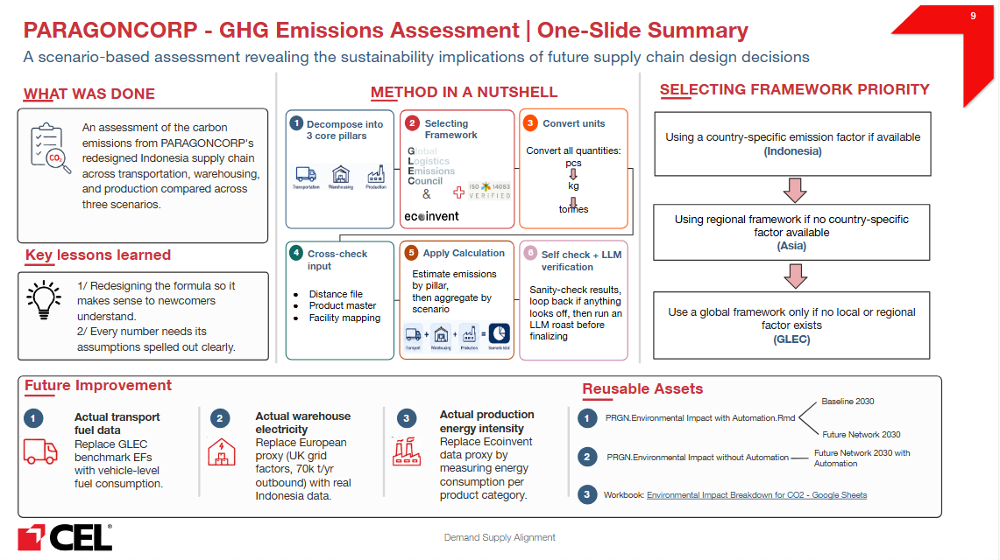
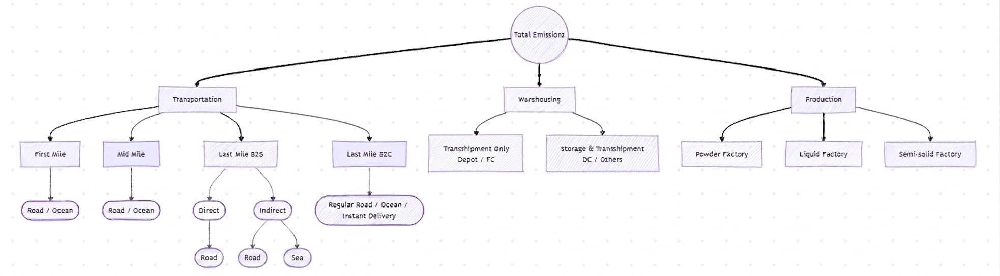

# Environmental Impact

Client / EngagementParagon - ENO: Paragon - ENO
ETA: June 30, 2026
Initiative type: Study
Last validated: July 21, 2026
Lead author: Khoa Tran
Meeting: With manager + team
Reuse tags: carbon-baseline
Reviewer: Dung Huynh
Status: Final

## 🔧 Part 1 Revision Checklist

<aside>
📝

Fixes to apply to Part 1, grouped by section (from the 29 Jun review).

</aside>

**Summary**

- Comments from Dung - slide - Jul 02
    1. All 3 future improvements can be grouped into 1 point which is use actual data. Then have 3 subpoints (Replace …, Replace…, Replace…)
    2. Key lesson 1 is unclear and it is not captured in the document. Please make the slide and document consistent.
    3. Why framework priority take too much space? Better if you can show that it is what happens in point 2 of the Method.
    4. Is the framework priority applied for all or only warehousing and transportation? Since from the table in Summary section, GLEC is only for warehousing and transportation.
    5. Your rmd files are not directly reusable. And again the slide is inconsistent with the document.
    6. Should include a block for Input and Output
    7. Overall your slide doesnt reflect your document (the content is inconsistent and some sections are missing). You may follow Phuong Anh slide.
- Comments from Dung - part 1 - Jul 02
    
    ### Summary
    
    1. **"What was the initiative?"** The intro says "three core pillars" but immediately adds automation as a fourth item. State plainly that there are three pillars (transportation, warehousing, production) plus automation as a scenario layer.
    
    ### Method
    
    1. **"What and Why choosing GLEC:"** State clearly that GLEC covers only Transportation and Warehousing. Presenting "What and Why choosing GLEC" and then showing Production, Automation, and Electricity on other frameworks in the next table is confusing. Scope the GLEC heading to the two pillars it actually covers.
    2. What about the frameworks chosen for Production, Automation, and Electricity? Why you choose them?
    3. **"Why 26%:"** This is placed too early; you explain the number before the reader knows how it is used. Move it to after "General calculation logic (by pillar)," and cross-reference that the full derivation lives in Table 7.5.2 in Part 2.
    4. **"General calculation logic (by pillar):"** The diagram (attached image) needs clarification: 
        1. what are "Direct" and "Indirect" under Last Mile B2B, and why does "Direct" require both Road and Ocean while "Indirect" does not; 
        2. rename "Depot" to "Last-mile hub" for consistency; 
        3. give an example of what "Others" includes.
    5. **"Why this approach (alternatives rejected):"** "the available data was too sparse and inconsistent to rely on" is unclear.
    6. **"Scope - what it covers and what it does not:"** This duplicates the Analysis Scope already given in the Summary. A cross-reference is enough; keep only the "does not cover" list if it adds something new.
    7. **"Units & conventions:"** Where does 0.45 tonnes per pallet come from, and why not convert pcs to pallet using the existing conversion rate instead of a flat pallet weight? State the source and reconcile it with the pcs to tonnes logic used elsewhere.
    8. **"Approach:"** A new analyst cannot see why the model was split into two Rmd files before understanding the automation logic. Add one line explaining that automation changes the warehousing calculation, which is why it needs a separate file.
    
    ### Pitfalls & reuse
    
    1. **"What did you do by hand that isn't in any script?"** You say the vehicle to GLEC mapping is "hardcoded in the script" and also "must be manually re-done." Clarify whether it is manual only for a new client or on every run, so a new analyst knows if they must touch it to reproduce your result.
    
    ### Inputs
    
    1. **"Main data sources (high level):"** The transport flow classification bullet is cut off ("Transport flow cla"). Complete it and define the classification (FM, MM, LM, Instant, Ocean) or point to where it is defined.
    
    ### Outputs & where it landed
    
    1. **"How to read it:"** This mixes navigation with findings. Keep "how to read" as navigation (which tab holds which total) and move the interpretive findings up to Key results.
- Comments from Dung - part 2 - Jul 02
    
    ### General structure
    
    1. **"Overall structure:"** Add numbered headings across Part 2 so sections can be navigated and cross-referenced. This also fixes the orphan "Table 7.5.2," which implies a numbering scheme that appears nowhere else.
    2. **"Table labelling:"** Table numbers and names are inconsistent; only one table is numbered (7.5.2) while the rest are not. Number and title every table, and make in-text references match.
    3. **"Calculation framework:"** Use one consistent template for every pillar: (1) Inputs you use, (2) Frameworks and parameters you assume, (3) Calculation logic. The order currently varies by pillar, which makes it hard to follow and to reproduce.
    
    ### Transportation methodology
    
    1. **"Transportation flows / Emission factors:"** You give a flow list, then a separate benchmark EF list, then an assumptions table. Merge them into one table (flow, vehicle, capacity, utilization, EF, formula) with a single calculation logic line. Also state explicitly that Direct Last Mile B2B uses the First Mile EF, which is not currently mentioned.
    
    ### Warehousing methodology
    
    1. **"Warehouse classification + factors:"** Use one naming convention across both parts. Part 1 uses "Transshipment only" and "Storage & Transhipment," while Part 2 uses "Mainly Handling" and "Storage + Handling." Pick one set of names and use it everywhere.
    2. **"Warehouse classification + factors:"** The benchmark assumptions (70,000 t/year, UK grid, European profile) are not reconciled with the Indonesia grid factor (0.76) used elsewhere. Please state clearly.
    
    ### Automation methodology
    
    1. **"Why 26% / Table 7.5.2:"** This is the correct home for the 26% derivation; move it here from Method and cross-reference. Also state the source of the per-source energy shares and manpower percentages so the 26% is auditable.
    
    ### Limitations
    
    1. **"Limitations:"** Define WTW (well to wheel) the first time it appears. A new analyst will not know the term, and it shows up in both Limitations and Open items without explanation. Contrast it briefly with the tank to wheel boundary you actually used.
- Comments from Pierre
    - [x]  Make scope crystal clear: only **manufacturing → end customer (MFC / LMH)**; raw materials (front) and post-handoff to customer (back) are out of scope
    - [x]  State out-of-scope items plainly: raw materials, packaging, and CO2 from source → NDC
    - [x]  Add a concrete cut-off example (e.g., Shopee delivers to customer → after that point not counted)
    - [x]  State clearly whether Instant Delivery is included in scope
    - [x]  Reduce AI-generated / generic phrasing → write more personally and concretely
    - [x]  "What's the one…" → keep only the first line, convert to a bullet point
    - [x]  Rewrite items (1), (2), (3) as clean bullet points
    
    **Method**
    
    - [x]  Add the data priority pyramid: Paragon → Indonesia → Asia → Global (note: more "out" = less accurate; rationale for GLEC as global base)
    - [x]  Explain each framework first, then add GLEC vs. alternatives comparison showing why GLEC was chosen
    - [x]  Source the assumptions: where 26% manpower share comes from, and where 0.76 kgCO2/kWh (Indonesia grid) comes from
    - [x]  Document the CO2 calculation logic explicitly: EF × distance × fill rate × payload, the ton-km formula, and per-km vs. per-ton-km distinction
    - [x]  Fix "actively mapping" wording + give example (matching GLEC truck types to Indonesian trucks the client uses)
    - [x]  Note that multi-drop is not yet considered
    - [x]  Push back / justify the "pcs per trip" assumption (5 pcs/trip for instant delivery)
    - [x]  Clarify ocean routing: tortuosity (detour) factor + maritime shipping lane logic (not facility profiles)
    - [x]  Add a ballpark / order-of-magnitude estimate + one fully worked example leg, validated before scaling
    - [x]  Add a flowchart (mermaid) of all calculation branches (FM, MM, LM, Instant, Ocean, warehousing, production, automation)
    - [x]  Be more specific in the general parts — specific + practical
    
    **Pitfalls & reuse**
    
    - [x]  Call out pcs → tonnes conversion as its own explicit bullet (critical, easily-missed first step)
    - [x]  Add self-validation checkpoints / gates — distance file check (correct number of sea lanes, correctly tagged), MD5 debug — before running
    - [x]  Document the sea-distance-tagged-as-road bug as a pitfall; note distances are point-to-point, not cumulative
    - [x]  Reduce AI-style text → more specific/personal explanations and examples
    - [x]  Link the codebase / folder
    
    **Inputs**
    
    - [x]  Add vehicle master data: max payload, fill rate, capacity for all modes (truck, ship, motorbike, minivan)
    
    **Outputs & where it landed**
    
    - [x]  Instant Delivery: add the actual numbers
    - [x]  State the automation trade-off between cost savings and emissions clearly
    
    **Runtime expectations**
    
    - [x]  (Lower priority) Keep runtime tied to input complexity — already mostly done
- Comments from Dung - **part 1** - Jun 17
    
    Easy to understand now but still some areas for improvements. In addition, have you used LLM (Notion AI) to roast your documentation? You might need to ask it to roast supposing it is a new analyst with no context.
    
    **Method**
    
    1. Your “Approach” isn't really an approach - it mostly restates what the model *is* and repeats the Summary (“estimate the end-to-end carbon footprint across the four pillars”) and the calculation logic (“computed per pillar, aggregated by scenario”). An approach should explain *how* you actually tackled the problem, 
    e.g.: decompose the footprint into 4 independent pillars; because Paragon gave no measured primary data, choose a benchmark-factor approach (GLEC + Ecoinvent proxies) over measured data; normalize all activity to common units (tonnes / tonne-km) and map each flow to a benchmark EF; build scenario-by-scenario (Baseline → Future Network → +Automation) so each delta is attributable to a specific design change. Rewrite it as the logic of how the work was done, not a one-line description of the deliverable.  **✅**
    2. General calculation logic: missing production **✅**
    3. Scope: “ (FM, MM, LM, Instant, Ocean)” → what is FM, MM, LM, Instant, Ocean? Will the new analyst know them? **✅**
    4. “road distance = shortest feasible route × **1.05** (routing inefficiency” → why mention shortest feasible route and where 1.05 comes from? **✅**
    
    **Pitfalls & reuse**
    
    1. “What did you do by hand” → vehicle-to-GLEC mapping: do you still have to do this mapping manually each time you run the script, or is it already embedded in the script now? Please clarify this in the document. **✅**
    2. “What would have saved you a full day”:
        - I'm not sure why you need the flowchart - how will it actually help you?
            
            —> Build a flowchart help mapping all calculation branches and their corresponding EFs (e.g., for transportation: which flow type (B2C regular or B2C instant,…)→ which key identifier → which EF applies). This makes it easier to identify all cases before coding and to pinpoint exactly which branch to inspect when something breaks.
            
        - Why is each run “complicated” when you said the runtime is only 2-3 minutes? And what is GIGO? **✅**
        - “Don't abstract into functions too early” - I get your point, but why “hard-code variables”?
            
            —> Hardcoding variables keeps each value visible in the script, making it easier to inspect and trace what went wrong if the output looks off, instead of using function we need to trace back to identify the errors.
            
    3. “What would you do differently next time” - I only understand the warehousing part. What is “primary operational data”? What do you mean by “replace benchmark proxies with measured data (…)”? Please spell out the transport and production parts in plain terms too. **✅**
    4. “errors propagate to production, transportation, and warehousing outputs.” → hard to digest **✅**
    5. You could also develop a CO2 framework so new people know how to approach CO2 estimation rather than researching from scratch. A Google Sheet isn't enough - that's project material, not a training/technical template. Worth building a framework with emission-factor mapping for everything, plus research into better ways to estimate CO2. This can be shared in Sharing 2.
    
    **Inputs**
    
    1. “Automation design assumptions (where applicable)” → what is equipment throughput and utilization? Do you mean equipment used and manpower cost reduction per facility? **✅**
    
    **Outputs**
    
    1. Deliverable: documentation is not a deliverable worth mentioning here. **✅**
    2. How to read it: This section lists takeaways, but doesn't actually tell a new reader *how to read the output*. **✅**
        1. Point to where the numbers live - which tab/sheet has the headline total, how the three scenarios sit side by side, what's a total vs. a per-pillar number.
        2. "Lower tCO2e = lower footprint" is filler - cut it. 
        3. "Scenario hierarchy" isn't a hierarchy
        4. For automation, state the net plainly (≈ +1,940 tCO2e net) so the reader knows how to interpret the trade-off.
    
    **Runtime expectations**
    
    1. Runtime expectation: Is it really 3 minutes? As I recall, whenever we asked you to change something, you usually mention “it is still running”. **✅**
- Comments from Dung - **part 1 -** Jun 16
    
    **Overall**
    
    - This section is hard to digest. Rewrite it for someone who did *not* know it. Zoom out and ask: if I hadn't done this myself, would I understand it? Apply that test to every section.
    - Choose easy way to answer a question, for example “**Where it landed:** Environmental Impact workstream under the Indonesia 2030–2035 Demand–Supply Alignment study; presented to PARAGONCORP for scenario comparison and to support network design + automation decisions.” I would prefer the answer to be “In the final report of Paragon ENO.” **✅**
    - Inconsistency: *“MT”* **and “***tonnes*” **✅**
    
    **Summary**
    
    - *Why the client needed it* - the current answer is wrong. Revisit the real business reason. **✅**
    - *What it produced* - is this really a "model"? Be precise about what the deliverable actually is (workbook? calculator? one-off estimate?). **✅**
    - *Scope 1 / 2 / 3* - you mention this repeatedly. Most readers won't know the terms, and it doesn't need repeating. Explain it once or cut it.
    
    **Method**
    
    - *What is GLEC?* **✅**
    - *Why GLEC?* Was it the only option, or did you choose it against specific criteria? Show the selection logic, not just the justification. **✅**
    - “All quantities (pcs, pallet) converted to **tonnes**” is it using conversion rate on ID level or group level? **✅**
    
    **Inputs**
    
    - Keep inputs general, not file-path detailed (the file paths belong in Part 2). E.g. transportation flows, inventory data, production data. **✅**
    
    **Runtime expectations**
    
    - Not "not applicable" - as I recall, a run takes ~20 min **✅**
    
    **Pitfalls & reuse**
    
    - *"What would have saved you a full day…"* - I don't follow your point. Do you mean setting up an EF framework? If so, how would you structure it so it's reusable for new projects? Also worth adding:
        - Validate the distance file first - a wrong distance file makes the whole calculation wrong.  **✅**
        - Don't run the function before everything is validated, since each run is slow. **✅**
    - *"Did by hand"* - research doesn't count as "by hand." This doc is for a new analyst to reproduce your result. If the parameters are already in the script, they shouldn't need to do anything manually - so what is genuinely manual? **✅**
    - *Reusable* - "reusable" means usable on the *next* project: a function, mapping table, script, or workbook that runs on new data with minimal change. Give the link / function name / file so the reader knows exactly what you mean. (The "Reusable assets" property is also still empty.)**✅**

# One Slider

# Part 1 - Overview

## Summary

- **What was the initiative?** Comprehensive environmental impact assessment to estimate the operational carbon footprint (**tCO2e = tonnes of CO2-equivalent**) of the newly designed supply chain network, built on **three core pillars: transportation, warehousing, and production**. Warehouse **automation is considered as** **scenario layer** applied on top of warehousing.
- **Why the client needed it:** Paragon needs to quantify the **emissions impact** of key network design choices (instant delivery expansion, distribution flow redesign, warehouse automation) so sustainability can be evaluated **side-by-side with cost and service level** in the final scenario recommendation.
- **What it produced (deliverable + link):** 
Scenario comparison workbooks (Google Sheets):
    - **Main carbon workbook** for transportation / warehousing / production + scenario totals: [Environmental Impact Breakdown for Transportation Flow - Google Sheets](https://docs.google.com/spreadsheets/d/11kYRHGlaqz1LB11hWzJ4CsBhdK0d96RjYTSZoUta518/edit?gid=805156444#gid=805156444);
    - **Automation workbook** to compute the automation electricity CO2e (fed into the main comparison): [Automation_PARAGONCORP_CO2 - Google Sheets](https://docs.google.com/spreadsheets/d/1cWV9FMax4kQoG9-APwgHRumH88zGREuLVvmGgf32NvM/edit?gid=1338128696#gid=1338128696)
- **Key results / recommendation:**
    - **Overall footprint reduction (Future Network 2030):** −6.6% total emissions (**46,116 → 43,065 tCO2e**).
    - **Instant delivery trade-off:** Excluding the added instant-delivery load, the network redesign alone would cut transportation emissions by ~36%; but expanding instant delivery to **17 MFCs** adds emissions back, so final transportation lands at **11,131 tCO2e** (14,181 → 11,131, ~−21% vs baseline).
    - **Automation trade-off:** Automation increases total emissions to **45,005 tCO2e,** a net **+1,938 tCO2e** (added electricity demand **+2,066 tCO2e** minus **~128 tCO2e** warehouse savings), in exchange for **~112B IDR** in cost savings.
    - **Transportation sensitivity:** Transportation emissions are highly sensitive to network structure, so expanding instant delivery can offset the gains from the network redesign.
    - **Production:** Production emissions mainly reflect volume shifts across scenarios, not process redesign.
- **Analysis Scope**

The analysis scope covers **only PARAGONCORP's own operating activities,** starting from **manufacturing the products at the factory** and ending when **goods reach the end customer (MFC/LMH)**. It does **not** consider upstream steps before the factory (e.g., sourcing, packaging or collecting raw materials), and it stops at the point of handoff to the end customer, beyond that, wherever the vehicle goes afterwards, those emissions are **not counted**.

- **Instant Delivery (Last Mile B2C):** Paragon does not operate this leg itself, it relies on e-commerce platforms (Shopee, TikTok Shop, Lazada). The platform sends its own driver to a Paragon facility to pick up the goods and deliver to the end customer. We therefore count **only the motorbike emissions from the Paragon facility to the end customer**; any movement of the driver before arriving at the Paragon facility and after delivering to customers is out of scope.
- **Who did what:** @Khoa Tran.
- [x]  A reader with no context understands purpose and outcome from this section alone

## Method

- **Approach:**
    1. **Decompose the footprint into 3 core pillars:** Transportation, Warehousing, and Production. Automation is not a separate pillar, but a **scenario layer applied on top of Warehousing**, where manpower-related CO2 decreases while electricity-related CO2 increases as manual operations are replaced by automated equipment.
    2. **Source emission factors as close as possible to Indonesia's real conditions, following a priority hierarchy.** Because ParagonCORP operates in Indonesia, I first researched Indonesia-specific emission factors; when those weren't available, I researched an Asia-regional framework; and only when that was also missing did I fall back to a global framework (GLEC). The goal at each step was to stay as close as possible to the real characteristics of where the operations actually happen.
    3. **Build the workbook in two code structures (2 R Markdown / Rmd files)**: 
        - One Rmd covering **Baseline 2030** and **Future Network 2030**;
        - One Rmd for **Future Network 2030 & Automation** (because the warehousing calculation logic changes under automation).
- **What and Why choosing GLEC**:
    - GLEC (Global Logistics Emissions Council) Framework is an industry-standard methodology specifically designed to quantify logistics-related greenhouse gas emissions across **transportation and warehousing activities**. It provides benchmark emission factors by vehicle type, transport mode, and facility category, making it directly applicable to supply chain carbon estimation.
    - GLEC was the only framework that covers **transport modes *and* warehousing under one consistent methodology**, while aligning with ISO 14083 / the GHG Protocol and being the most widely adopted industry benchmark until 2026 (Smart Freight Centre). The alternatives each had gaps that would force framework mixing and break scenario comparability:

| Evaluation criteria | GLEC | EPA MOVES | NTM | ISO 14083* |
| --- | --- | --- | --- | --- |
| Origin / developing body | Global (Smart Freight Centre) | USA (Environmental Protection Agency) | Europe / Sweden (Network for Transport Measures) | International (ISO) |
| Comprehensive transport coverage (road, ocean, last mile) emission factor | ✓ | ✗ (road / US focus) | ✓ | ✗ |
| Integrated warehousing emission factors | ✓ | ✗ | ✗ (transport focus) | ✗ |
| Consistent methodology across scope (no framework mixing) | ✓ | ✗ | ✗ | ✗ (separate EF database) |
| Alignment with GHG Protocol | ✓ | Partial | ✓ | ✓ |
| Global benchmark adoption (Smart Freight Centre) | ✓ | ✗ | Partial (EU focus) | ✓ |

**Note**: ISO 14083 is the carbon-accounting standard that GLEC operationalizes; GLEC was chosen as the ready-to-use framework with built-in benchmark emission factors.

- **Frameworks & standards applied:**

| Scope | Selected framework | What it is | Why chosen (core advantages) |
| --- | --- | --- | --- |
| Transportation & warehousing | GLEC framework | Industry-standard logistics GHG methodology; benchmark EFs by vehicle type, transport mode, and facility category. | **One consistent methodology** across all transport modes *and* warehousing; aligns with ISO 14083 / GHG Protocol (see comparison table above). |
| Production | Ecoinvent 3.8 / ISO 14067 | Global LCI database & carbon-footprint standard. | **Process granularity** provides specific chemical proxies to map SKUs into Liquid, Semisolid, and Powder. |
| Automation | MDPI Benchmark (2024) | Peer-reviewed study on warehouse energy splits. | Realistic labour carbon savings (26%) based on actual energy usage. |
| Electricity | [IEA Emissions Factors 2025](https://www.iea.org/data-and-statistics/data-product/emissions-factors-2025) | International Energy Agency's grid database. | **Geographic accuracy:** uses Indonesia's authoritative grid carbon intensity (0.76 kgCO₂/kWh). |
- **General calculation logic (by pillar):**
    - **Transportation (road & ocean):** CO2e = number of trips × average km per trip (km) × capacity (tonnes) × utilization (%) × transport EF (gCO2e/tonne-km)
    - **Instant delivery (motorbike):** CO2e = number of trips × average km per trip (km) × motorbike EF (gCO2e/km) *(number of trips derived from the 5 pcs/trip assumption; detailed assumptions in Part 2 → Transportation methodology)*
    - **Warehousing:** CO2e = outbound throughput (tonnes) × warehouse EF (kgCO2e/tonne)
    - **Production:** CO2e = production volume (tonnes) × production EF (gCO2e/tonne)
    - **Automation (scenario add-on):** CO2e = equipment electricity (kWh) × grid EF (kgCO2e/kWh)
    - **Automation (scenario reduction):** CO2e = outbound throughput (tonnes) × Base Warehouse EF (kgCO2e/tonne) × (1 − 26% × manpower reduction)
    - **Note — Last Mile B2B "Direct" vs "Indirect":** *Direct* = **NDC → last-mile hub or end customer**. *Indirect* = DC/RDC/DC Satellite —> **last-mile hub** or **end customer**

- **Why 26%:** Warehouse energy is broken down by source (lighting, heating, office, IT, etc.), and each source is assigned the portion of its energy that scales with manpower. Weighting each source's energy share by its manpower-linked portion and summing gives **~26%.** Automation therefore lowers the warehouse EF by (26% × manpower reduction), not the full amount. *(See Part 2 → Automation methodology for the full detail explanation).*
- **Why this approach (alternatives rejected):** Paragon had no measured primary data suited to direct emissions accounting, the specific inputs a CO2 calculation needs (e.g. fuel or energy invoices, metered electricity bills, or a summarized one-year emissions record) were not available — so a benchmark-factor approach was used instead, mapping each activity to a GLEC / Ecoinvent emission factor.
- **Units & conventions:**
    - **Weight/volume:** Convert pcs → kg → **tonnes** using a mapping `product_group_id → weight (kg/pcs)`; for warehousing, one pallet is assumed to weigh **0.45 tonnes**.
        - **Where 0.45 t/pallet comes from:** it is the **GLEC framework's own assumption** for the average weight of one pallet — not a number we picked ourselves.
        - **Why we keep it instead of our own pcs → pallet conversion:** the two warehouse emission factors (Table 3.1) are taken **directly from GLEC**, and GLEC derived those EFs *on the basis of* this 0.45 t/pallet assumption. If we converted pallets to tonnes using our own conversion rate, the throughput would no longer rest on the same basis the EF was built on, so the warehouse result would stop matching the framework's assumption and become internally inconsistent. Using 0.45 t/pallet keeps our warehousing input aligned with exactly how the borrowed EF was defined.
    - **Distance:** **km**; road distance = shortest feasible route × **1.05** (a default 5% detour factor per GLEC guidance). Ocean distance uses the **Haversine** formula.
    - **Multi-drop:** not yet considered — each trip is modeled as point-to-point.
    - **Electricity grid factor:** Indonesia grid factor **0.76 kgCO2/kWh** for local electricity impacts (automation and powder proxy).
- [x]  Approach and scope are clear to someone who knows the technique

## Pitfalls & reuse

- **What would have saved you a full day if you'd known it on day one?**
    - **Set up self-validation gates before running.** Each run is slow, so debugging mid-run is time-consuming, we will treat input validation as a set of **run gates**. Clear each gate in order before executing any calculation:
        - **Gate 1 — Distance file.** All road and sea lanes present with correct values; confirm the **number of sea lanes** is right and every lane is **correctly tagged** road vs sea (a sea lane mis-tagged as road silently applies the wrong EF — a real bug we hit). Also note that distances are **point-to-point, not cumulative**. A wrong distance file propagates errors across every transportation pillar and is hard to debug later.
        - **Gate 2 — Instant delivery routes.** All instant-delivery routes are fully included.
        - **Gate 3 — Units conversion.** All SKUs correctly converted from pcs → kg (→ tonnes) by product group.
    - **Don't abstract into functions too early.** Hard-code variables and pass them manually first. This keeps intermediate values observable, makes debugging straightforward, and avoids chasing errors buried inside function calls. Refactor into functions only once the logic is validated end-to-end.
    - **Build a calculation-branch flowchart upfront.** Map all calculation branches (FM, MM, LM, Instant, Ocean, warehousing, production, automation) so when something breaks, you know exactly which node to inspect.
    - **Get a ballpark before scaling.** Before running the full calculation, compute a single transport leg manually to sanity-check the order of magnitude. Example of First Mile Lane:
        - Flow: **First Mile & Inter-factory Transfers** (road, GLEC Dry Van); capacity 20t × 85% utilization = **17 t per trip**; FM EF is **79 gCO2e/tonne-km**.
        - Total activity ≈ Capacity per trip x Avg Km per Trip x Number of Trips = 17 x 187 x 4,988 = 15,877,040 (t-km)
        - CO2e = 15,877,040 × 79 gCO2e ≈ **1,254 tCO2e** for First Mile of Baseline 2030 scenario.
- **What did the client push back on, and why?** The main pushback was on the instant-delivery **"pieces per trip" assumption**. We only raised this question close to the deadline, so we couldn't get a quick response in time and used the assumption that each motorbike carries **5 pcs per trip**.
- **What's the one step that breaks if done out of order?** Converting all product quantities from **pieces → kg → tonnes** is the single load bearing first step.
    - **Do it first** before any emission calculation begins.
    - **Why it matters:** every emission factor is per tonne (production, warehousing) or per tonne-km (transport), so all three pillars take tonnes as their input.
    - **How:** convert pcs → kg → tonnes using the `product_group_id → weight (kg/pcs)` mapping.
    - **What breaks if skipped**:  every downstream number is wrong, and it is hard to catch because the output still looks like valid tonnes while the error propagates silently across production, transportation, and warehousing.
- **What did you do by hand that isn't in any script?** Three things you would need to redo manually:
    - **Vehicle & facility types to-GLEC mapping:** currently hardcoded in the script for Paragon's vehicle mix; if a new client uses different vehicle types, this mapping must be manually re-done by cross-referencing the GLEC framework before updating the script.
    - **Product category EF research:** the three emission factors (Liquid/Semisolid/Powder) are cosmetics-specific and were researched manually, requiring a fresh research cycle for a different industry.
    - **Distance validation:** because scenarios and lanes vary by project, validate distance data case-by-case before running CO2 (typical checks: coverage of all lanes; unit consistency (km); obvious outliers (too short/too long); and spot-checks against a mapping tool or client reference).
- **What would you do differently next time?**
    - **Redesign the calculation formula so a newcomer can follow it.** The textbook formula is not always the right fit for the available data, so document why each pillar's formula was adapted and give one worked example per branch. For example, the standard transportation formula (outbound tonnes × total distance × EF) was reworked into the current trip-based formula (number of trips × km per trip × capacity × utilization × EF) so it matches how the network data is actually structured — this lets a new analyst see what every factor means and reproduce the logic without reverse-engineering the script.
    - **Replace benchmark proxies with the client's actual operational data** for more accurate results, wherever the client can provide it:
        - Actual fuel consumption per vehicle type (instead of benchmark transport EFs).
        - Actual electricity bills per warehouse (instead of European benchmark assumptions).
        - Actual energy usage per product category (instead of Liquid/Semisolid/Powder proxy factors).
    - **Expand the transport boundary from tank-to-wheel to well-to-wheel** if the client wants to capture the full upstream emissions of their fuel supply chain.
- **What here is directly reusable, and where is it?**
    - **GLEC transport EF library + calculation logic** - `Calculation Breakdown for Transportation` tab: covers all transport modes (FM, MM, LM, Instant, Ocean) with mapped EFs and calculation structure.
    - **Warehouse classification logic + EF framework** - `Warehousing & Production` tab: facility classification rules (Mainly Handling vs Storage+Handling) and throughput-based emission calculation.
    - **Production EF framework** - `Warehousing & Production` tab: Liquid/Semisolid/Powder category structure and emission factors (note: EFs are cosmetics-specific and require re-research for a different industry).
    - **Automation electricity impact model** - `CO2 Element` tab in `Automation_PARAGONCORP_CO2` sheet: equipment-level electricity consumption to CO2e conversion, reusable if automation specs (kWh/hr, throughput) are updated to match new facility.
- [x]  All six questions answered; reviewer challenged any that look evasive

## Inputs

- **Main data sources (high level):**
    - Network design outputs: scenario-level shipment flows, inventory positions, production volumes, facility assignments, and scenario definitions (Baseline 2030, Future Network 2030, +Automation).
    - Transportation master data: lane-level road/sea distances, transport flow classification (First Mile / Mid Mile / Last Mile / Instant / Ocean), and any route-specific distance overrides.
    - Facility master data: facility type/classification (e.g., NDC/RDC/DC/Depot/FC/MFC) used to select the correct warehouse handling vs storage assumptions.
    - Product master data: SKU weights/volume conversion inputs (e.g., kg/pcs) and product/factory mappings used for tonnes conversion and production EF proxy assignment.
    - Emission factor library: GLEC-aligned transport and warehousing EFs + production proxy EFs; local grid emission factor for electricity; automation equipment assumptions (when applicable).
- **Detailed file paths:** Part 2 (Data sources & file paths)
- **External references:**
    - **GLEC framework**: transport + warehousing benchmark factors.
    - **Ecoinvent 3.8** + **ISO 14067** context: production factor/proxy framing.
    - Indonesia grid emission factor (**0.76 kgCO2/kWh**): local electricity impacts.
    - Automation vendor specifications: throughput and power assumptions.
    - CO2 Emission Factor Master Database: benchmark transportation factors.
- [x]  Main sources named and traceable; detail deferred to Part 2

## Outputs & where it landed

- **Final deliverable(s):**
    - Environmental Impact Carbon Estimation Workbook ([Environmental Impact Breakdown for Transportation Flow - Google Sheets](https://docs.google.com/spreadsheets/d/11kYRHGlaqz1LB11hWzJ4CsBhdK0d96RjYTSZoUta518/edit?gid=538516340#gid=538516340))
    - Environmental Impact Presentation Deck
- **Where it landed:** In the final report of Paragon ENO.
- **Codebase / folder:** analysis code lives in two project folders (split by scenario):
    - `~/Project/prgn-eno/ANALYSIS/PRGN.Environmental Impact with Automation`
    - `~/Project/prgn-eno/ANALYSIS/PRGN.Environmental Impact without Automation`
- **How to read it:** The workbook is structured for scenario comparison, not audited corporate reporting. Scenario-level totals are obtained by summing across three tabs: `Calculation Breakdown for Transportation` (transportation emissions), `Warehousing & Production` (warehousing and production emissions), and `CO2 Element` in `Automation_PARAGONCORP_CO2` (automation electricity impact). Each tab shows the three scenarios stacked top to bottom, with per-pillar breakdowns within each scenario.
- [x]  Outputs located and their interpretation explained

## Runtime expectations

Total runtime approximately 2–3 minutes: 1–2 minutes for extracting scenario outputs from pickle files, with the remaining time spent on CO2e calculations across all pillars.

- [x]  If the initiative runs, a runtime estimate tied to input complexity is given (or marked not applicable)

---

# Part 2 - Detailed body

**Source of truth**  

This document is the authoritative reference for the PARAGONCORP Environmental Impact Assessment model used to estimate and compare operational greenhouse gas emissions across alternative supply chain network scenarios.  

The methodology is intended for comparative scenario analysis and network design evaluation. It is not intended to serve as an audited corporate GHG inventory or product-level life cycle assessment (LCA).

**How Part 2 is numbered:** Sections are numbered 1–10 so they can be navigated and cross-referenced. Tables are numbered by their section (for example, Table 5.1 is the first table in Section 5, Automation), and every in-text reference uses these numbers.

## 1. Calculation framework

Total CO2e = Production + Warehousing + Transportation + Automation. Each component is calculated independently and aggregated at scenario level.

Every pillar below follows the same three-part template so the logic can be compared and reproduced:

1. **Inputs used** — the activity data the pillar consumes.
2. **Frameworks & parameters assumed** — the emission factors, standards, and assumptions applied.
3. **Calculation logic** — the formula that converts inputs into tCO2e.

## 2. Transportation methodology

**Objective:** estimate operational transportation emissions for all product movements across the designed supply chain network.

**(1) Inputs used**

- Number of trips per lane and average km per trip for each movement.
- Road distance = shortest feasible route × **1.05** (5% detour factor); ocean distance via the **Haversine** formula.
- Flow classification of each movement (see Table 2.1).

**(2) Frameworks & parameters assumed**

- GLEC benchmark emission factors mapped by vehicle type and transport mode.
- Same capacity is assumed across sea and road for a given flow; tonnes moved per trip = capacity × utilization (fill rate).
- **Direct Last Mile B2B uses the First Mile emission factor (79 gCO2e/tonne-km), not the Last Mile van factor.**
- Paragon vehicle types were manually mapped to the closest GLEC benchmark category; revisit this mapping if the vehicle mix changes.

**(3) Calculation logic**

- Road & ocean: CO2e = number of trips × average km per trip (km) × capacity (tonnes) × utilization (%) × transport EF (gCO2e/tonne-km).
- Instant delivery: CO2e = number of trips × distance (km) × motorbike EF (gCO2e/km); number of trips is derived from the 5 pcs/trip assumption.

**Table 2.1 — Transportation flows: vehicle, capacity, utilization, and emission factor**

| Flow | Vehicle | Capacity | Utilization (fill rate) | Emission factor | Notes |
| --- | --- | --- | --- | --- | --- |
| First Mile (FM) | Dry Van / Dry Truck (Container Ship if sea) | 20 tonnes | 85% | 79 gCO2e/tonne-km | Sea leg uses same capacity / utilization |
| Mid Mile (MM) | Rigid Truck (Container Ship if sea) | 4 tonnes | 85% | 360.83 gCO2e/tonne-km | Sea leg uses same capacity / utilization |
| Last Mile B2B – Direct | Dry Van / Dry Truck | 20 tonnes | 85% | 79 gCO2e/tonne-km (First Mile EF) | Uses the First Mile EF, not the van factor |
| Last Mile B2B – Indirect | Blind Van (Container Ship if sea) | 3 tonnes | 85% | 756 gCO2e/tonne-km | Sea leg uses same capacity / utilization |
| Last Mile B2C | Blind Van (Container Ship if sea) | 3 tonnes | 85% | 756 gCO2e/tonne-km | Sea leg uses same capacity / utilization |
| Instant Delivery | Motorcycle | 5 pieces / trip | 100% | 63.55 gCO2e/km | Distance-based (per km), not tonne-km |
| Ocean Transport | Container Ship | Per originating flow | 85% | 22.35 gCO2e/tonne-km | Inter-island transport |

## 3. Warehousing methodology

**Objective:** estimate warehouse operational emissions associated with storage and handling activities.

**(1) Inputs used**

- Outbound throughput (tonnes) per facility (not storage duration / inventory).
- Facility classification (see Table 3.1).

**(2) Frameworks & parameters assumed**

- GLEC warehouse emission factors by facility class (Table 3.1). One naming convention is used across Part 1 and Part 2: **Mainly Handling** and **Storage + Handling**.
- These GLEC benchmark EFs embed 70,000 t/year throughput, ambient operations, 0.45 t pallet weight, a European operating profile, and a **UK grid factor**.
- **Reconciliation with the Indonesia grid factor:** the warehouse EFs are used as published GLEC benchmarks and are **not** re-based to the Indonesia grid. The Indonesia grid factor (**0.76 kgCO2/kWh**) is applied only where emissions are computed directly from electricity — automation equipment (Section 5) and the powder production proxy (Section 4). This grid mismatch on the warehousing pillar is a known limitation (see Section 9).

**(3) Calculation logic**

- CO2e = outbound throughput (tonnes) × warehouse EF (kgCO2e/tonne).

**Table 3.1 — Warehouse classification and emission factors**

| Classification | Facility types | Criterion | Emission factor |
| --- | --- | --- | --- |
| Mainly Handling | LMH, FC, LMH-FC | Handling over 80% of activity | 1.3 kgCO2e/tonne |
| Storage + Handling | RDC, NDC, DC Direct, DC Satellite | Combined storage and handling | 5.6 kgCO2e/tonne |

## 4. Production methodology

**Objective:** estimate manufacturing emissions using benchmark process categories.

**(1) Inputs used**

- Production volume (tonnes) by product category.

**(2) Frameworks & parameters assumed**

- Ecoinvent 3.8 / ISO 14067 proxies mapped to three categories (Table 4.1).
- Powder factor derivation: semisolid baseline + 18 kWh/tonne milling × 0.76 kgCO2/kWh (Indonesia grid).

**(3) Calculation logic**

- CO2e = production volume (tonnes) × production EF (gCO2e/tonne).

**Table 4.1 — Production categories and emission factors**

| Product category | Emission factor |
| --- | --- |
| Liquid | 274,000 gCO2e/tonne |
| Semisolid | 409,000 gCO2e/tonne |
| Powder | 423,000 gCO2e/tonne |

## 5. Automation methodology

**Objective:** estimate the net environmental impact of warehouse automation, capturing (a) warehouse emission reduction from reduced manpower and (b) additional electricity consumption from automation equipment.

**(1) Inputs used**

- Per-facility manpower reduction from the automation design.
- Equipment electricity draw (kWh/hr) and throughput (pcs/hr) per equipment type.

**(2) Frameworks & parameters assumed**

- The per-source warehouse energy shares and manpower-linked percentages are taken from the **MDPI (2024) peer-reviewed warehouse energy-split study** (Table 5.1); this is the source that makes the ~26% manpower share auditable.
- Indonesia grid factor **0.76 kgCO2/kWh** for automation electricity.

**(3) Calculation logic**

- Warehouse reduction: Warehouse EF after automation = Base Warehouse EF × (1 − 26% × Manpower Reduction).
- Added electricity: kWh per piece = equipment kWh/hr ÷ throughput pcs/hr; gCO2e per piece = kWh per piece × 0.76 × 1000.

### Why 26% — derivation (Table 5.1)

Not all warehouse energy is tied to manpower, so automation only reduces the manpower-linked portion of warehouse emissions. Table 5.1 breaks warehouse energy down by source and estimates how much of each source scales with manpower. The per-source energy shares and manpower percentages are sourced from the MDPI (2024) study.

**Table 5.1 — Share of warehouse energy consumption by source and manpower-contributed share (source: MDPI 2024)**

| Emission source | Share of total energy | Current manpower impact | Interpretation | Expected impact |
| --- | --- | --- | --- | --- |
| Warehouse lighting | 65% | 30% | Accounts for 65% of warehouse energy; 30% of this is manpower-related | Automation / better control may reduce manual lighting-related usage |
| Space heating, gas oil | 12% | 20% | Accounts for 12% of warehouse energy; 20% of this is linked to occupied area / manpower | Lower occupied area or better control may reduce heating-related energy |
| Office lighting | 6% | 55% | Accounts for 6% of warehouse energy; 55% of this is manpower-related | Lower office manpower may reduce office lighting demand |
| Space heating, kerosene | 3% | 20% | Accounts for 3% of warehouse energy; 20% of this is linked to occupied area / manpower | Lower occupied area or better control may reduce heating-related energy |
| IT | 1% | 25% | Accounts for 1% of warehouse energy; 25% of this is related to manpower | Some IT usage may scale with manpower |
| Others | 13% | N/A | Accounts for 13% of warehouse energy; no direct manpower impact assumed | Other resources don't affect manpower |

**Manpower emission calculation**

The manpower-linked share is the sum of (energy share × manpower impact) across all sources:

$$
0.65 \times 0.30 + 0.12 \times 0.20 + 0.06 \times 0.55 + 0.03 \times 0.20 + 0.01 \times 0.25 = 0.2605
$$

The result, approximately **26%**, represents the share of total warehouse energy consumption assumed to be linked to manpower-related activities. This factor is then used to adjust the warehouse emission factor under the automation scenario:

$$
\text{Warehouse EF after automation} = \text{Base Warehouse EF} \times (1 - 26\% \times \text{Manpower Reduction})
$$

The manpower reduction value is retrieved per facility from the automation design. Because only ~26% of warehouse emissions are affected by manpower, automation does not reduce all warehouse emissions — e.g. if manpower is reduced by 20%, total warehouse emissions fall by only 5.2% (20% × 26%).

### Automation electricity impact

kWh per piece = equipment kWh/hr ÷ throughput pcs/hr  

gCO2e per piece = kWh per piece × 0.76 × 1000  

Equipment categories: AMR, Conveyor, Auto Bagging, Vertical Lift Module, Tabletop Auto Bagging.  

Embodied equipment emissions excluded.

## 6. Reproducibility path

1. Load updated network design outputs (volumes, flows, facility assignment, scenarios)
2. Convert quantities to tonnes using product weight assumptions
3. Map movements to FM/MM/LM/Instant/Ocean
4. Apply transport factors
5. Classify facilities and apply warehouse factors
6. Map products to Liquid/Semisolid/Powder and apply production factors
7. Apply automation logic where applicable
8. Aggregate Production + Transportation + Warehousing + Automation
9. Compare scenarios

## 7. Data sources & file paths

- Network design outputs (scenario volumes/flows/inventory/facilities)
    - Baseline 2030: `DATA/07.Model_Data_Raw_Output/1By_BL2030_Base_JPlusB/Raw_Output.pkl`
    - Inventory 2030: `DATA/08.Model_Data_Processed_Output/ScenarioData/1By_BL2030_Base_JPlusB/Inventory_Output.parquet`
- Transportation master data (distances + flow type)
    - Distance_LM_existing: `DATA/03.Summarized_data/All_Flows_FMM_LM_Indo_Malay_With_Distance.parquet`
    - Distance_LM_non_existing: `DATA/03.Summarized_data/All_Non_Existing_Flows_FMM_LM_Indo_Malay_with_distance.parquet`
    - Distance_FM_MM_B2BLM: `DATA/08.Model_Data_Processed_Output/MasterData/LeadTime_FirstMid_B2BLastMile.parquet`
- Facility master data
    - Facility Type: `DATA/08.Model_Data_Processed_Output/ScenarioData/1By_BL2030_Base_JPlusB/FacilitySummary_Output.parquet`
    - MFC location: `DATA/03.Summarized_data/Full_MFC_Location.parquet`
- Product master data
    - Product Mapping: `DATA/06.Model_Data_Input/00_MasterData/ProductMaster_2025.parquet`
- References
    - GLEC framework:
    
    [Global Logistics Emissions Council Framework.pdf](Global_Logistics_Emissions_Council_Framework.pdf)
    

## 8. Validation performed

- Formula reconciliation against GLEC methodology
- Manual spot checks on transportation calculations
- Validation of tonnes conversion logic
- Cross-check scenario totals vs component aggregation
- Sensitivity review of key assumptions (transport and automation)

## 9. Limitations

**Well-to-wheel (WTW)** counts emissions from both fuel production and upstream supply (well-to-tank) and fuel combustion in the vehicle (tank-to-wheel). This model uses the narrower **tank-to-wheel (TTW)** boundary — only the combustion emissions of the vehicle — so upstream fuel-supply emissions are excluded.

The model does not:

- Calculate WTW emissions (it uses the tank-to-wheel boundary described above)
- Include embodied carbon (carbon emitted from maintaining or producing machines/infrastructure, …)
- Include upstream raw materials, packaging, waste, end-of-life
- Use facility-metered electricity consumption
- Use actual transport fuel consumption data

Results should be interpreted as benchmark operational estimates, not audited carbon-accounting outputs.

## 10. Open items and future improvements

1. Actual transportation fuel consumption by vehicle type
2. Actual warehouse electricity consumption by facility
3. Actual production energy intensity by product category
4. Indonesia-specific warehouse emission factors
5. WTW transportation boundary
6. Automation utilization rates post-implementation
7. Ocean routing assumptions beyond Haversine

Confidence level: **Medium** (framework-based with multiple proxy assumptions due to limited primary data).

- [ ]  Reproducibility path - another analyst can regenerate the deliverable (run instructions / calculation logic / data structure + update steps).
- [ ]  Data inputs, fully traced - table of every input: source, format, owner, vintage, known issues; cleaning steps reference real scripts.
- [ ]  Tools, code & files - stack, repo/folder links, key scripts with purpose and entry point. No undocumented manual step.
- [ ]  Global assumptions, each with a rationale - nothing load-bearing left in someone's head.
- [ ]  Limitations - what it does NOT do or claim; confidence level; how it was validated.
- [ ]  Open items / things to validate - explicit list of what's uncertain, estimated, or pending client confirmation.
- [ ]  Open-items section present and honest
- [ ]  Reproducibility path verified by reviewer