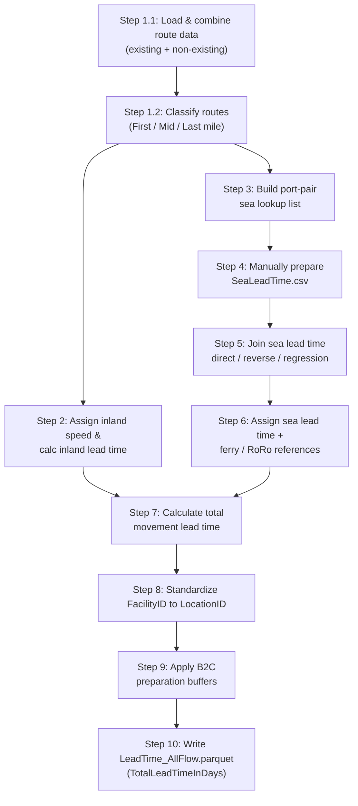

# Lead Time

Client / EngagementParagon - ENO: Paragon - ENO
ETA: June 22, 2026
Initiative type: Data Processing/Modeling
Lead author: Anh Duong
Meeting: None
Reviewer: Duy Tran
Status: Final

- 📖 How to use this template (read once, then collapse)
    
    **The bar.** A new analyst who knows nothing about this work should be able to read this document and restart a similar initiative from scratch without asking the author a single question. If something would block them, it belongs here.
    
    **Scope of a document.** One document per *initiative* - a self-contained piece of analytical work with its own method, inputs, and deliverable. Not per project.
    
    **Header fields** live in the database properties (Client, Initiative type, Status, Lead author, Reviewer, Date closed, Last validated, Reuse tags, Reusable assets) - fill them there, not in the body.
    
    **Process.** Documentation is produced at initiative close; an initiative can't be marked complete until its doc reaches *Final*.
    
    - **Stage 1 - Senior Analyst review (content).** A Senior Analyst who didn't write the doc ticks the checkboxes against the bar and challenges any gaps.
    - **Stage 2 - Manager sign-off.** Manager confirms Stage 1 happened, then flips Status to Final.
    
    **The checkboxes are the definition of done** - ticked by the *reviewer* at Stage 1, not the author. The author uses them while writing as a guide to what "done" means.
    

# Part 1 - Fixed template

## Summary

- **What was the initiative?**
    
    Create a route-level lead-time reference so PRGN can report the expected service time of each available origin-destination route in the network scenarios.
    
    Before this work, the route data showed which flows were available and the distance between origin and destination, but it did not consistently show how long each route would take. As a result, once a network scenario was produced, the team could explain the route structure but did not have a consistent lead-time view to show the service implication of that network.
    
    This initiative filled that reporting gap by assigning planning-level lead time to the available transportable routes. The output allows the team to summarize and compare expected lead time after scenario runs, including routes with inland movement, sea or ferry/RoRo movement, and B2C preparation time where relevant.
    
- **Why the client needed it:**
    
    PRGN's first priority is to expand the network and reach more customers within a reasonable lead time, but the model does not capture this. So when two scenarios have similar costs but clearly different expected service times, highlighting that difference makes the value of this initiative much easier to see.
    
- **What it produced (deliverable + link):** `DATA/03.Summarized_data/LeadTime_AllFlow.parquet`
- **Key results / recommendation:**
A complete route-level lead-time dataset was created for available transportable flows. The main field to use is `TotalLeadTimeInDays`, which represents the final service lead time for each route. For B2C FC/MFC last-mile rows, `TotalLeadTimeInDays` includes the additional preparation buffer, so it may not equal `InlandLeadTimeInDays + SeaLeadTimeInDays`
    
    Recommended sanity check: final row count, duplicate by OriginID - DestinationID, and whether any routes remain with missing lead time.
    
    - All transportable flows now have service lead time;
    - B2C rows include prep buffer, so total lead time is service time, not pure movement time;
    - Cross-island routes are no longer understated by inland distance only;
    - Downstream scenarios can compare lead-time impact consistently.
- **Who did what:** Anh Duong
- [ ]  A reader with no context understands purpose and outcome from this section alone

## Method

- **Approach:**
    
    The lead-time table was built using a rule-based calculation script: `NETWORK DESIGN/PRGN.Create_LeadTime_All.Rmd`. It starts from both existing and non-existing route-distance datasets so the final reference can cover current flows as well as feasible routes that may appear in future network scenarios.
    
    Before calculating lead time, the script combines the route data into one consistent route base and standardizes location references so the output can be joined back reliably to scenario results later.
    
    Lead time is then assigned by movement type:
    
    - **Inland movement:** calculated from inland distance and assumed travel speed, with slower speed applied where urban last-mile treatment is needed.
    - **Sea movement:** assigned from a separately prepared port-to-port sea lead-time reference, because sea lead time was not available in the raw route data. The script matches sea lead time by origin and destination port of each route, first using a researched lead-time value for the exact port pair where available. If the exact direction is not available but the reverse direction exists (for example, Port A → Port B is missing but Port B → Port A has a researched lead time), that reference is reused. For port pairs with no researched reference in either direction, sea lead time is estimated using a regression model built from routes that have both known sea distance and known sea lead time.
    - **Ferry / RoRo movement:** handled separately for short sea crossings that are part of practical road routes, especially in Indonesia. These are added through state-pair or main-island-pair references so cross-island routes are not understated.
    - **B2C preparation buffer:** added only for FC/MFC-to-B2C city flows to reflect preparation time before last-mile delivery.
    
    The final output is `LeadTime_AllFlow.parquet`, with `TotalLeadTimeInDays` as the main reporting field used to show expected service lead time after scenario outputs are generated.
    
- **Why this approach (alternatives rejected):**
    - **Distance-only sea lead time:** A simple speed-over-distance formula was not used for sea lead time because sea movement does not behave like inland trucking. The workflow instead prioritizes researched port-to-port lead-time references, uses reverse-direction references where reasonable, and applies distance-based estimation only for remaining gaps.
    - **Jabodetabek-only urban speed:** Slower last-mile speed was not limited to Jabodetabek, the greater Jakarta metropolitan area. The logic was expanded to other urban / Kota destinations across Indonesia and Malaysia because crowded city areas are also expected to have slower delivery speeds.
- **Scope - what it covers and what it does not:**
    - **Covers:** inland lead time, sea lead time, RoRo / ferry lead time, B2C / MFC last-mile preparation buffers, and existing / non-existing flows from the summarized route-distance inputs.
    - **Does not cover:** ship or ferry schedule timing, sailing frequency, port waiting time, weather disruption, driver shift changes, loading / unloading delays, or day-to-day operational variability.
- **Units & conventions:**
    - `Distance`: kilometres
    - `Speed`: km/h
    - `InlandLeadTimeInDays`: days, calculated from inland travel hours divided by `24`
    - `SeaLeadTimeInDays`: days
    - `RoRo / ferry lead time`: days
    - `B2C / MFC preparation buffer`: days
    - `TotalLeadTimeInDays`: days
- [x]  Approach and scope are clear to someone who knows the technique

## Pitfalls & reuse

- **What would have saved you a full day if you'd known it on day one?**
    - **Short RoRo / ferry crossings need separate treatment.** Some Indonesia routes are mostly inland-road movements but still include a short RoRo or ferry crossing between nearby islands. These routes may not look like long-distance sea freight, but the crossing can still add meaningful lead time. Therefore, they need to be captured separately through state-pair or main-island-pair references instead of being treated as purely inland routes.
    - **Location references should be standardized early.** Facility and location identifiers can be mixed across the route data and model outputs. If they are not cleaned upfront, routes may fail to join or become duplicated after conversion.
    - **DEPO → Customer lead time should stay flexible.** A `DEPO → Customer` route may need to include the previous `Source → DEPO` leg when reporting the full service path. However, this should be applied during analysis after the model source structure is known, not baked into the generic lead-time master table. The same DEPO can be supplied by different sources across scenarios, so adding the source leg too early would make the lead-time table too tied to one assumed network.
- **What did the client push back on, and why?** None received
- **What's the one step that breaks if done out of order?**
    
    Sea/ferry references must be prepared before final total lead time is assigned; otherwise cross-island routes will be understated.
    
- **What did you do by hand that isn't in any script?**
    - **Ferry / RoRo assumptions:** manually identified route pairs that require short ferry / RoRo treatment and added them as hardcoded state-pair or main-island-pair lead-time references. These are cases where the route is not long-distance sea freight, but also should not be treated as purely inland movement:
        - Bali ↔ Nusa Tenggara Barat
        - Nusa Tenggara Barat ↔ Nusa Tenggara Timur
        - Maluku ↔ Maluku Utara
        - Bali ↔ Nusa Tenggara Timur
        - Java ↔ Peninsular Malaysia
        - Sumatra ↔ Java
        - Bali - Nusra ↔ Java
        - Sumatra ↔ Peninsular Malaysia
        - Java ↔ East Malaysia
    - **B2C preparation buffers:** manually set fixed preparation buffers for B2C last-mile routes, jointly assumed and agreed by CEL and PRGN:
        - `FC to B2C City`: `+0.5` days, because FC represents a standard fulfillment center where order preparation, picking, and packing are expected before delivery.
        - `MFC to B2C City`: `+0.05` days, because MFC acts more like an instant hub designed for faster / express shipment, so the added preparation time is much shorter.
- **What would you do differently next time?**
    
    Define route categories from the official flow classification before writing any lead-time rules.
    
    The lead-time logic depends on whether a route is first mile, mid mile, or last mile, because each category can use different speed or adjustment rules. These categories should be mapped from the standardized `FlowType` values in the data, such as `NDC to DC`, `DC to Customer`, `FC to B2C City`, or `MFC to B2C City`.
    
    In the first version, some MFC-to-B2C routes were missed because the logic relied too much on naming patterns. For example, it assumed that all customer-facing routes would contain keywords such as `Customer` or follow the same naming convention as existing B2B flows, instead of checking the full list of standardized `FlowType` values first. As a result, some valid flow types such as `MFC to B2C City` were not captured by the route-classification logic. Next time, start by listing all available `FlowType` values, map each one to the correct route category, and then run a quick check that all expected B2C / MFC flows are included.
    
- **What here is directly reusable, and where is it?**
    
    The reusable patterns in `NETWORK DESIGN/PRGN.Create_LeadTime_All.Rmd`are:
    
    - `haversine_km()` for recalculating distance when OSRM distance is zero but coordinates differ.
    - Bidirectional pair normalization using `pmin()` / `pmax()`, so `A → B` and `B → A` collapse into one pair.
    - Sea lead-time lookup logic: preserve direct/reverse SuperCargo values, estimate missing sea lead time using `lm(SeaLeadTime ~ SeaDistanceKM)`, floor prediction at zero, and generate reversed port pairs.
    - FacilityID → LocationID standardization using `FacilityMaster`.
- [x]  All six questions answered; reviewer challenged any that look evasive

## Inputs

- **Main data sources:**
    - `DATA/03.Summarized_data/All_Flows_FMM_LM_Indo_Malay_With_Distance.parquet`Existing route-distance data for available first-mile, mid-mile, and last-mile flows.
    - `DATA/03.Summarized_data/All_Non_Existing_Flows_FMM_LM_Indo_Malay_with_distance.parquet`Non-existing / potential route-distance data used to prepare lead time for feasible routes that may be selected in future network scenarios.
    - `DATA/03.Summarized_data/SeaLeadTime.csv`Manually prepared sea lead-time reference table, including researched direct / reverse / proxy route references and sea lead-time assumptions.
    - `DATA/02.Cleaned_data/CustomerMasterB2B.parquet`Customer master used to identify customer attributes such as Jabodetabek / urban classification for last-mile speed assignment.
    - `DATA/06.Model_Data_Input/00_MasterData/CustomerMaster_GroupLevel.parquet`Group-level customer master used for location-level customer attributes.
    - `DATA/02.Cleaned_data/FacilityMaster.parquet`Facility master used to standardize `FacilityID` into `LocationID` where needed, because the model uses `LocationID`.
- **External references:**
    - [**SuperCargo route pages](https://www.supercargo.id/ongkir/denpasar-ke-makassar/):** used as the main external source for Indonesia sea shipping lead-time research. Since route references are more searchable by city than by exact port name, port names were mapped to practical logistics city names where needed.
- [x]  Main sources named and traceable; detail deferred to Part 2

## Outputs & where it landed

- **Final deliverable(s):** `DATA/03.Summarized_data/LeadTime_AllFlow.parquet`
- **Where it landed:** `DATA/03.Summarized_data/`
- **How to read it:**
    
    Each row represents a route / flow record with origin, destination, route type, distance fields, speed assumptions, component lead times, and final lead time.
    
    The main field for downstream analysis is:
    
    - `TotalLeadTimeInDays`
    
    This field represents the final service lead time in days for each route. For most routes, it is based on inland lead time plus sea / ferry lead time where applicable.
    
    For B2C routes, the final lead time also includes a preparation buffer to represent order preparation before delivery:
    
    - `FC to B2C City`: `+0.5` days
    - `MFC to B2C City`: `+0.05` days
    
    This means B2C `TotalLeadTimeInDays` should be read as service lead time, not pure movement time.
    
- [x]  Outputs located and their interpretation explained

## Runtime expectations

- **Typical runtime, with input complexity:** full notebook takes about 2 minutes
- **What makes it slower (cost drivers):** NA
- **Hardware / environment measured on:** NA
- [x]  If the initiative runs, a runtime estimate tied to input complexity is given (or marked not applicable)

---

# Part 2 - Detailed body (free-form)

*Write the detailed body here.*

This section explains the step-by-step method used to generate the final route-level lead-time table. It goes deeper than Part 1 by showing how the route universe is prepared, how inland and sea lead times are calculated, how manual sea references and ferry / RoRo assumptions are applied, and how the final output is written. The goal is that another analyst can reproduce the deliverable from the same input files and understand which assumptions are reusable versus project-specific.



## Source of truth and quick reference

This document is the authoritative reference for how route-level transportation lead time is calculated in:

```
DATA/03.Summarized_data/LeadTime_AllFlow.parquet
```

Authoritative script:

```
NETWORK DESIGN/PRGN.Create_LeadTime_All.Rmd
```

Final object written by the script:

```
AllFlow_All_LT_MFC
```

Final write command:

```r
write_parquet(AllFlow_All_LT_MFC, "DATA/03.Summarized_data/LeadTime_AllFlow.parquet")
```

Primary field for downstream analysis:

```
TotalLeadTimeInDays
```

Key formulas and assumptions:

| Item | Rule / value | Why it is used |
| --- | --- | --- |
| Inland lead time | `InlandLeadTimeInDays = InlandDistanceInKM / InlandSpeed / 24` | Distance / speed gives travel time in hours; `/24` converts hours to days. |
| First mile / mid mile speed | `45 km/h` | Used as a standard inter-facility trucking speed assumption. |
| Last mile, non-urban speed | `45 km/h` | Same base speed is used when the destination is not urban / Jabodetabek. |
| Last mile, urban / Jabodetabek speed | `20 km/h` | Urban delivery is slower due to city traffic and delivery complexity. |
| Sea lead-time lookup key | `OriginPortName + DestPortName` | Sea lead time is assigned at port-pair level, not city pair or `OriginID → DestinationID` level. |
| Sea regression fallback | `lm(SeaLeadTime ~ SeaDistanceKM)` | Used to estimate sea lead time when direct / reverse SuperCargo reference is not available but sea distance exists. |
| B2C FC buffer | `+0.5 days` | Represents order preparation time before FC-to-B2C delivery. |
| B2C MFC buffer | `+0.05 days` | Represents shorter preparation time before MFC-to-B2C delivery. |
| Final non-B2C lead time | `TotalLeadTimeInDays = InlandLeadTimeInDays + SeaLeadTimeInDays` | Standard route movement lead time. |
| Final B2C lead time | `TotalLeadTimeInDays = InlandLeadTimeInDays + SeaLeadTimeInDays + B2C preparation buffer` | B2C output is service lead time, not pure movement time. |

Key source files:

| File | Owner / location note | Purpose |
| --- | --- | --- |
| `DATA/03.Summarized_data/All_Flows_FMM_LM_Indo_Malay_With_Distance.parquet` | Project summarized data folder | Existing route-distance input. |
| `DATA/03.Summarized_data/All_Non_Existing_Flows_FMM_LM_Indo_Malay_with_distance.parquet` | Project summarized data folder | Non-existing / potential route-distance input. |
| `DATA/03.Summarized_data/SeaLeadTime.csv` | Project summarized data folder; manually prepared by analyst | Manual sea lead-time reference by port pair. |
| `DATA/02.Cleaned_data/CustomerMasterB2B.parquet` | Project cleaned data folder | Customer reference for Jabodetabek / urban logic. |
| `DATA/06.Model_Data_Input/00_MasterData/CustomerMaster_GroupLevel.parquet` | Model master data folder | Group-level customer reference for location-level attributes. |
| `DATA/02.Cleaned_data/FacilityMaster.parquet` | Project cleaned data folder | FacilityID → LocationID mapping. |

Link-rot / ownership note: `SeaLeadTime.csv` is the most important manual reference file. If this workflow is reused, keep the CSV, source URLs, `LeadTimeMethod`, `ProxyRouteUsed`, and `Source` together in the project folder so the sea lead-time assumptions remain auditable.

---

## Step 1 — Load, prepare, and classify the route universe

The script starts by loading the required libraries, helper functions, and input datasets. The two main route-distance inputs are:

```
DATA/03.Summarized_data/All_Flows_FMM_LM_Indo_Malay_With_Distance.parquet
DATA/03.Summarized_data/All_Non_Existing_Flows_FMM_LM_Indo_Malay_with_distance.parquet
```

These two files are combined into one working route table. The purpose is to assign lead time not only to existing routes, but also to non-existing feasible routes that may be selected in future network scenarios.

At this stage, the workflow should also classify each route into the correct movement category once, before calculating speed and lead time. This avoids the need to classify first and then reclassify later.

Recommended classification logic:

```
First mile:
- NDC to DC

Last mile:
- NDC to Customer
- DC to Customer
- FC to B2C City
- MFC to B2C City

Mid mile:
- all remaining inter-facility / non-customer flows
```

The key fields retained for later calculation include:

- `FlowType`
- `FlowType2`
- `OriginID`
- `DestinationID`
- `DistanceType`
- `DistanceInKM`
- `OriginMainIsland`
- `DestinationMainIsland`
- `OriginState`
- `DestinationState`
- `OriginPortName`
- `DestPortName`
- `SeaDistanceKM`
- coordinate fields

The key output of this step is one consolidated and correctly classified route universe that all later lead-time rules are applied to.

## Step 2 — Assign inland speed and calculate inland lead time

The workflow assigns inland speed based on the route category and destination characteristics.

The main assumptions are:

```
First mile / mid mile: 45 km/h
Last mile, non-urban: 45 km/h
Last mile, urban / Jabodetabek: 20 km/h
```

Urban last-mile destinations are identified using customer reference data. The workflow first checks `IsJabodetabek` from the customer master or customer group master. If this is not available, it also uses destination naming logic, such as detecting `Kota` in the destination ID.

The inland lead time is calculated as:

```
InlandLeadTimeInDays = InlandDistanceInKM / InlandSpeed / 24
```

The `/ 24` converts hours into days.

The workflow also handles cases where `DistanceInKM = 0`. If origin and destination coordinates are different, the route should not be treated as true zero-distance. In these cases, distance is recalculated using the Haversine formula.

## Step 3 — Build the sea lead-time lookup list

Sea lead time is handled separately because it is not available in the raw route-distance data. Instead of researching every `OriginID → DestinationID` route, the workflow creates a lookup list at **port-pair level**.

The port-pair list is created from `Non-OSRM` routes:

```r
PortPairDist <- AllFlow_All %>%
  filter(DistanceType == "Non-OSRM") %>%
  distinct(OriginPortName, DestPortName, .keep_all = TRUE) %>%
  select(OriginPortName, DestPortName, SeaDistanceKM)
```

The lookup list is therefore based on:

- `OriginPortName`
- `DestPortName`
- `SeaDistanceKM`

This is important: the formal lookup and join key is **port pair**, not `OriginID → DestinationID` and not city pair.

The output of this step is a list of unique sea corridors that need a sea lead-time reference.

## Step 4 — Manually prepare the sea lead-time reference

The sea lead-time reference file is prepared outside the script:

```
DATA/03.Summarized_data/SeaLeadTime.csv
```

The script reads this file, but does not create it. Filling this file is a manual / outside-script step.

The file structure is:

```
OriginPortName, DestPortName, SeaLeadTime, LeadTimeMethod, ProxyRouteUsed, Source
```

Although the formal join key is port-pair based, the actual research may use the closest available city-to-city or proxy SuperCargo route because public references are often more searchable by city than by exact port name.

Example interpretation:

```
OriginPortName = Port of Cirebon
DestPortName = Port of Trisakti (Banjarmasin)
ProxyRouteUsed = Jakarta -> Banjarmasin
```

This means the final assignment is still keyed to:

```
Port of Cirebon -> Port of Trisakti (Banjarmasin)
```

but the manual source used to estimate or validate the value may be:

```
Jakarta -> Banjarmasin
```

In plain language: the script uses a port-pair lookup table, while the analyst may record the closest available city/proxy research route in `ProxyRouteUsed`.

### Using an LLM to research the sea lead times

Filling `SeaLeadTime.csv` by hand is slow, so an LLM (with web access) can be used to speed up the research. Feed it the list of port pairs from Step 3 and ask it to find the shipping time, prioritizing official ship / ferry company schedules. If it cannot find the exact port name, tell it to fall back to the port city.

Example prompt:

```
You are helping research sea shipping lead times between ports in Indonesia and Malaysia.

For each origin-destination port pair below, find the typical door-to-door / port-to-port travel time in DAYS.

Rules:
- Prefer official ship / ferry / RoRo company schedules (e.g. Pelni, ASDP, DFDS, or the operating carrier's own website) as the source.
- If official schedules are unavailable, use reputable freight / logistics references.
- If you cannot find the exact port name, fall back to the nearest port city (e.g. use "Jakarta" instead of a specific Jakarta port) and note this.
- Return sea/ferry transit time only. Do not include inland trucking time.

For each pair, return:
OriginPortName, DestPortName, SeaLeadTime (days), LeadTimeMethod (direct_supercargo / reverse_supercargo / proxy_city / other), ProxyRouteUsed (city pair actually researched, if different), Source (URL)

Port pairs:
<paste the port pairs from Step 3 here>
```

Always spot-check the LLM output before saving it into `SeaLeadTime.csv`, since transit times from web sources can be inconsistent or out of date. Keep the `Source` URL for every row so the assumption stays auditable.

## Step 5 — Join sea lead time and apply direct / reverse / regression rules

After `SeaLeadTime.csv` is prepared, the workflow joins it back to the port-pair lookup list using:

```r
SeaLeadTime_adj <- PortPairDist %>%
  left_join(SeaLeadTime, by = c("OriginPortName", "DestPortName"))
```

The workflow preserves researched sea lead-time values when the method is:

```
direct_supercargo
reverse_supercargo
```

For other methods, such as proxy city or proxy hub references, the workflow uses regression when `SeaDistanceKM` is available.

The regression is trained using direct and reverse SuperCargo observations:

```r
regression_data <- SeaLeadTime_adj %>%
  filter(LeadTimeMethod %in% c("direct_supercargo", "reverse_supercargo"))

sea_model <- lm(SeaLeadTime ~ SeaDistanceKM, data = regression_data)
```

The fallback rule is:

```r
SeaLeadTime = case_when(
  LeadTimeMethod %in% c("direct_supercargo", "reverse_supercargo") ~ SeaLeadTime,
  is.na(SeaDistanceKM) ~ SeaLeadTime,
  TRUE ~ pmax(predict(sea_model, newdata = pick(SeaDistanceKM)), 0)
)
```

This means:

- direct SuperCargo values are kept;
- reverse SuperCargo values are kept;
- non-direct / non-reverse rows with valid `SeaDistanceKM` are replaced by regression estimates;
- regression predictions are floored at zero;
- if `SeaDistanceKM` is missing, the existing `SeaLeadTime` value is kept.

After sea lead time is assigned, the workflow creates reversed port-pair rows:

```r
SeaLeadTime_adj_reversed <- SeaLeadTime_adj %>%
  rename(
    OriginPortName_orig = OriginPortName,
    DestPortName_orig   = DestPortName
  ) %>%
  mutate(
    OriginPortName = DestPortName_orig,
    DestPortName   = OriginPortName_orig
  )
```

This means once a sea lead time exists for `A → B`, the code also creates `B → A`, so both directions are available for route assignment.

Important caveat: the normal sea lookup does not use `pmin()` / `pmax()` normalization before joining. It joins by directional `OriginPortName → DestPortName`, then creates reversed rows after sea lead time has been assigned.

## Step 6 — Assign sea lead time and handle ferry / RoRo references

The adjusted sea lead-time table is joined back to the full route universe. The workflow then assigns sea lead time using the following priority rule:

```
1. If the route is Non-OSRM and a port-pair SeaLeadTime exists, use it.
2. Else if a state-pair ferry / RoRo reference exists, use that.
3. Else if the route is OSRM, crosses main islands, and a main-island reference exists, use that.
4. Else set sea lead time to 0.
```

Ferry / RoRo references are used because some Indonesia routes include short sea crossings as part of practical road travel. These are different from full port-to-port shipping routes, but they are also not captured by inland lead time alone.

State-level ferry / RoRo cases include:

```
Bali ↔ Nusa Tenggara Barat: 0.1291667 days
Nusa Tenggara Barat ↔ Nusa Tenggara Timur: 0.6229167 days
Maluku ↔ Maluku Utara: 1.8513889 days
Bali ↔ Nusa Tenggara Timur: 1.3520833 days
```

Main-island cross-island references include:

```
Java ↔ Peninsular Malaysia: 7.603574413 days
Sumatra ↔ Java: 0.04 days
Bali - Nusra ↔ Java: 0.02 days
Sumatra ↔ Peninsular Malaysia: 1.40 days
Java ↔ East Malaysia: 9.519717298 days
```

The main-island table is expanded in reverse direction, so each corridor can be applied both ways.

## Step 7 — Calculate total movement lead time

Once inland and sea/ferry components are available, the workflow calculates base total lead time.

For OSRM / inland routes:

```
InlandDistanceInKM = DistanceInKM
```

For Non-OSRM / sea routes:

```
InlandDistanceInKM = OriginToPortDistanceInKM + PortToDestinationDistanceInKM
```

Then:

```
InlandLeadTimeInDays = InlandDistanceInKM / InlandSpeed / 24
SeaLeadTimeInDays = assigned sea / ferry lead time
TotalLeadTimeInDays = InlandLeadTimeInDays + SeaLeadTimeInDays
```

This gives the base movement lead time before B2C preparation buffers.

**Note on DEPO → Customer flows:** the true service lead time of a `DEPO → Customer` flow is really `DEPO → Customer` plus the immediate upper transfer leg that supplies that DEPO (the `Facility → DEPO` leg). This file does not prepare that combined value — it lists `DEPO → Customer` as-is, without the upper leg. This is intentional, because this table is used as an input *after* the model has run and decided the full DNO configuration (which facility becomes a DEPO and what supplies it). Only then do we know the upper leg to add. In the model-optimized scenarios each facility has a single upper facility supplying it, so the combination is a simple addition. In the baseline, a DEPO may be supplied by more than one facility, so the upper leg must be a weighted average across those supplying legs (weighted by inbound transfer volume). Either way, this happens in the post-model result-comprehension phase, not in this lead-time data preparation.

## Step 8 — Standardize FacilityID to LocationID

The model uses `LocationID`, while some source tables can contain `FacilityID`. To avoid mismatches, the workflow uses:

The difference is that a `FacilityID` refers to one single facility, whereas a `LocationID` can group multiple `FacilityID` together when they are near each other, so several facilities can share the same `LocationID`.

```
DATA/02.Cleaned_data/FacilityMaster.parquet
```

to map facility identifiers into model location identifiers where needed.

The general logic is:

```
If FacilityID maps to LocationID, use LocationID.
Otherwise, keep the original ID.
```

This standardization is important because mixed `FacilityID` and `LocationID` values can create unmatched or duplicated routes in downstream model analysis.

## Step 9 — Apply B2C preparation buffers

The workflow applies additional buffers to B2C last-mile routes. These buffers represent the time needed to prepare goods before delivery, because FC and MFC flows serve e-commerce / B2C demand where picking, packing, and order preparation happen before shipment.

The hardcoded buffers are:

```
FC to B2C City: +0.5 days
MFC to B2C City: +0.05 days
```

The buffer is added to `TotalLeadTimeInDays`.

For most non-B2C routes:

```
TotalLeadTimeInDays = InlandLeadTimeInDays + SeaLeadTimeInDays
```

For B2C routes:

```
TotalLeadTimeInDays = InlandLeadTimeInDays + SeaLeadTimeInDays + B2C preparation buffer
```

This means B2C `TotalLeadTimeInDays` should be read as service lead time, not pure movement time.

## Step 10 — Write the final output

The final object written by the script is:

```
AllFlow_All_LT_MFC
```

The final output path is:

```
DATA/03.Summarized_data/LeadTime_AllFlow.parquet
```

The final write command is:

```r
write_parquet(AllFlow_All_LT_MFC, "DATA/03.Summarized_data/LeadTime_AllFlow.parquet")
```

The main field for downstream analysis is:

```
TotalLeadTimeInDays
```

This final table can be joined to model flow outputs to compare service performance across baseline and future network scenarios.

### Definition of done (reviewer checks each)

- [x]  **Reproducibility path** - another analyst can regenerate the deliverable (run instructions / calculation logic / data structure + update steps).
- [x]  **Data inputs, fully traced** - table of every input: source, format, owner, vintage, known issues; cleaning steps reference real scripts.
- [x]  **Tools, code &amp; files** - stack, repo/folder links, key scripts with purpose and entry point. No undocumented manual step.
- [x]  **Global assumptions, each with a rationale** - nothing load-bearing left in someone's head.
- [ ]  **Limitations** - what it does NOT do or claim; confidence level; how it was validated.
- [ ]  **Open items / things to validate** - explicit list of what's uncertain, estimated, or pending client confirmation.
- [ ]  Open-items section present and honest
- [x]  Reproducibility path verified by reviewer

## Appendix