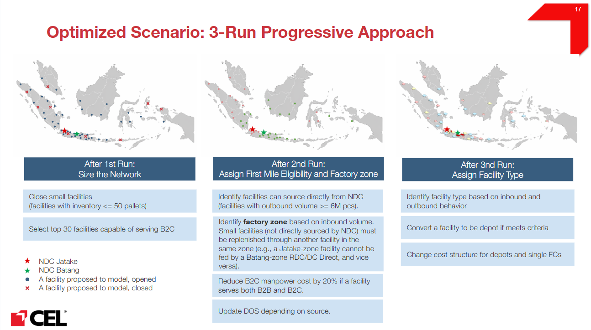

# Model

Client / EngagementParagon - ENO: Paragon - ENO
ETA: July 22, 2026
Initiative type: Model
Last validated: July 22, 2026
Lead author: Huy Lam
Meeting: With manager + team
Reuse tags: network-optimization
Reviewer: Duy Tran, Dung Huynh
Status: Final

- 📖 How to use this template (read once, then collapse)
    
    **The bar.** A new analyst who knows nothing about this work should be able to read this document and restart a similar initiative from scratch without asking the author a single question. If something would block them, it belongs here.
    
    **Scope of a document.** One document per *initiative* - a self-contained piece of analytical work with its own method, inputs, and deliverable. Not per project.
    
    **Header fields** live in the database properties (Client, Initiative type, Status, Lead author, Reviewer, Date closed, Last validated, Reuse tags, Reusable assets) - fill them there, not in the body.
    
    **Process.** Documentation is produced at initiative close; an initiative can't be marked complete until its doc reaches *Final*.
    
    - **Stage 1 - Senior Analyst review (content).** A Senior Analyst who didn't write the doc ticks the checkboxes against the bar and challenges any gaps.
    - **Stage 2 - Manager sign-off.** Manager confirms Stage 1 happened, then flips Status to Final.
    
    **The checkboxes are the definition of done** - ticked by the *reviewer* at Stage 1, not the author. The author uses them while writing as a guide to what "done" means.
    

# Part 1 - Fixed template

## Summary

This document describes the Paragon ENO (PRGN - ENO) end to end network optimization model. The same underlying LP is run as **two main types of model**:

- **Baseline (current network)** - reproduces Paragon's network as it runs today, following the observed shares of the current network. It has two runs: a **2025** current-state baseline (the starting point and cost reference) and a **2030** baseline that keeps the current network at projected 2030 demand with some modifications. Each is solved in a **single run** (no rule-based pruning between passes).
- **Optimized (projected 2030 network)** - redesigns the network for the lowest total cost at projected **2030** demand. An example is the **Unconstrained 2030** scenario. It is solved in **three runs**, with rule-based adjustments applied between passes.

The document is organized around the three parts of this workflow: the **Mathematical model** (sets, variables, objective, and constraints), **Model Running** (how each scenario and its runs are executed), and **Output Processing** (how raw solver output is allocated, validated, and published).

- **What was the initiative?**
    
    A Linear Programming (LP) optimization model that finds the minimum-cost design of Paragon's end-to-end distribution network at current (2025) demand for the Baseline and at projected **2030** demand for the optimized scenarios. In one optimization it decides the network flows and production allocation. The initiative is not only the mathematical model: it also covers **model running** (executing each scenario, including the rule-based steps between runs) and **output processing** (allocating and validating the results down to ship-to level). It supports **two main types of model** - **Baseline** (reproduces the current network as-is, run once - a 2025 current-state run and a 2030 current-network run at projected demand) and **Optimized** (redesigns the network for minimum cost, three runs) - and, within these, **variants** such as **Jatake First**, which prioritizes production at the Jatake factory before Batang.
    
- **Why the client needed it:**
    
    Optimized 2030 network. Paragon needed to see what its distribution network should look like in 2030, and the impact of the main levers: changing the flows, adding or removing facilities, adding MFCs, and applying automation.
    
- **What it produced (deliverable + link):**  [Link](https://bitbucket.org/celconsulting/prgn_model_runner/src/master/Model_Running/)
- **Key results / recommendation:**
    
    The fully optimized network, published on ATOM and delivered to the client.
    
    - Measured against the 2030 baseline, the recommended network delivers:
        - about **358B IDR/year of operational savings** plus **36B IDR of inventory opportunity cost (IOC) reduction** by 2030
        - **56% faster B2C delivery**
        - **2.2x same-day population reach** (20M to 43M people)
        - a **30% smaller warehouse footprint**
        - **13% lower inventory**
    - The savings come from four reinforcing initiatives, on top of opening the new Batang factory:
        - **Network rationalization** - RDC bypass, re-routing, role conversions, and mergers; network flows fall from **96 to 58 (-40%)**.
        - **B2C decentralization** - shift fulfillment from the central FC Tegal to regional MWHs with co-pick.
        - **MFC programme** - deploy **17 MFCs** (Micro Fulfillment Centers, small local facilities that provide instant delivery).
        - **DC automation** - across the NDCs, 21 selected DCs, and the MFCs.
    - **Facility evolution.** The network shifts from single-role to multi-capable facilities:
        - **more DC Direct** (4 to 7)
        - far **more multi-capable MWHs** (MWH Direct 4 to 16)
        - fewer single-role nodes (RDC 5 to 2, MWH Satellite 14 to 3)
        - **single FCs phased out** (consolidated into MWHs)
        - the result is **8 fewer non-MFC warehouses** (58 vs 66 today) with clearer roles
    - Realizing the transformation needs phased CAPEX of about **3.0T IDR** through 2030 (Batang and Jatake manufacturing plus 348B IDR for distribution automation), and the structural recommendation stays stable across ±27% demand variability.
- **Scenarios & variants:**
    
    The same model runs several scenarios. The **Baseline** reproduces Paragon's current network and acts as the cost reference. The **optimized** scenarios redesign the network for minimum cost, for example **Unconstrained 2030**. "Unconstrained" is what makes it the optimized case: the model is free to redesign the network rather than being forced to follow the current network shares. On top of these, variants adjust the rules, for example **Jatake First**, which prioritizes production at the Jatake factory before Batang.
    
- **Who did what:** Huy Lam
- [x]  A reader with no context understands purpose and outcome from this section alone

## Method

- **Approach:**
    
    Formulate Paragon's distribution network as a **single-period, deterministic Linear Program (LP)** that minimizes total production cost and cost-to-serve (logistics cost) while meeting all projected 2030 demand. Written in **AMPL**, solved with the **HiGHS** open-source LP solver. The solver simultaneously decides how much each factory produces and on which line, how product flows factory → NDC, how it transfers between DCs, and how it is delivered last-mile to B2B and B2C customers.
    
    **Run structure - solved in three passes, not one.** Optimized scenarios are run three times, with rule-based adjustments applied between runs to prune the network and refine cost inputs (Baseline scenarios run once). The full pass-by-pass logic (what each run solves and the rules applied after it) is in the **Run structure (three passes)** section in Part 2.
    
- **Why this approach (alternatives rejected):**
    
    We use an **exact LP optimization** because it is simple, transparent, and reusable across CEL projects, and the same method transfers directly to other network-design engagements. The main choices, and why:
    
    - **LP, not a heuristic or demand clustering.** An LP reaches a provable global optimum and optimizes all cost components together (production, supply, transfer, last-mile, storage, handling, IOC), rather than settling for a good-enough local answer. Demand clustering is used only to keep the problem tractable, not to decide the flows.
    - **AMPL, not PuLP.** PuLP is open and free, but AMPL is a stronger, more expressive modeling language and connects cleanly to high-performance solvers, which made a model of this size easier to build and faster to solve.
    - **HiGHS, not Gurobi.** Inside AMPL, HiGHS is a strong, free solver well suited to LP, so it covers our needs with no license fee. Gurobi is stronger still but paid, so it stays an option if a future model needs it.
    - **Pure LP, not MILP.** Turning open/close or direct-supply decisions into binary variables makes the model far slower to solve, so we keep it a pure LP and handle those decisions through the rule-based steps between runs instead.
    
    The main trade-off is the **rule-based, multi-run design**: thresholds such as the 50-pallet close rule and the 6M PCS direct-supply rule are set and applied by hand between runs. The goal for future versions is to reach the same result in a **single pass**, without these manual settings, and to explore other solvers and methods (for example a stronger paid solver such as Gurobi, or building the open/close logic directly into the model).
    
- **Scope - what it covers and what it does not:**
    
    Covers annual steady-state (single-period) flows for projected 2030 demand across the four-tier network (Factory → NDC → RDC/DC/DEPO → B2B/B2C customer), for both channels.
    
    On cost, it covers the full end-to-end cost-to-serve: **production** (raw material, packaging material, and conversion cost), **warehousing** (storage, including facility depreciation and rental, plus handling), and **distribution** (first mile, mid mile, and B2B last mile). B2C last-mile flows are modeled but not costed, since those costs are not borne by Paragon, and inventory opportunity cost (IOC) is also included. 
    
    Does **not** model temporal sequencing, stochastic demand, or sub-annual dynamics. Demand is treated as **deterministic** (a single known value per demand point, not a probability distribution). 
    
    The model is built to support **strategic** network-design decisions (where to produce, which facilities to open or close, and how flows are structured), not **tactical or operational** decisions such as number of trucks, daily inventory levels, or shift scheduling.
    
- **Units & conventions (currency, volume, horizon, exchange rate):**
    - IDR, all costs annualized.
    - Volume in pieces (PCS), converted to pallets (supply/transfer/B2B) or KG (B2C).
    - Horizon: one year, projected to 2030.
    - WACC = 10%;
    - Inventory days annualized over 360.
- [x]  Approach and scope are clear to someone who knows the technique

## Pitfalls & reuse

- **What would have saved you a full day if you'd known it on day one?**
    
    Read the **mathematical model**, the **Model Running** documentation, and the [training deck](https://docs.google.com/presentation/d/1uhJ1eCFfr0EXAlmcbPxiVeNZC7594pyqKrQpDWo5Tb8/edit?slide=id.g3ea6602d5b6_4_103#slide=id.g3ea6602d5b6_4_103) end to end first, to understand the overall process before touching the data or code. Getting the big picture up front makes everything downstream (inputs, the three-run structure, and outputs) much faster to follow.
    
- **What's the one step that breaks if done out of order?**
    
    Data cleaning and validation must come before the run. If the input data has missing or NA values, the model will fail to run, so every input has to be checked and fixed first.
    
- **What did the client push back on?**
    
    The client pushed back on two points. First, the model sometimes chose **unrealistic routes** (a minor issue); next time we should review the results together with the client earlier, so these are caught sooner. Second, the model chose **Depo Jakarta and some other DCs to serve Jabodetabek**, which is not operationally realistic because a depo (or last-mile hub) cannot handle Jabodetabek's huge 2030 volume. The lesson is not to over-rely on the raw model output: results need a business-judgment sense-check against operational reality before they are accepted.
    
- **What would you do differently next time?**
    
    Find a way to get the same result in a single run, without the manual rule-based steps between passes (for example, the 50-pallet close rule and the 6M PCS direct-supply rule). Building these rules into the model itself would make it faster to run, easier to reproduce, and less error-prone.
    
    A few process improvements would also help:
    
    - **Build in automatic flags for basic flaws** like weird flows, so senior and manager reviewers do not have to catch these by hand.
    - **Add systematic code and logic checks** to the pipeline, so mistakes in the model or data surface early rather than at review. This matters especially because AI can speed up writing model and pipeline code, but its output is not always correct, so every AI-generated piece of code and logic must be reviewed and tested before it is trusted.
    - **Share model progress and results in real time** with the team, so everyone can see when numbers change while they are working on downstream tasks.
- **What here is directly reusable, and where is it?**
    
    The model itself is **not directly reusable** as a plug-and-play asset: it is project-specific to Paragon (covering both MNO and DNO). It is best reused as a **reference**, a worked example of how to structure an end-to-end network LP, which can be adapted (or split to keep only the DNO part) for a project with a similar scope. The model file is `PRGN_Unconstrained_Baseline_Model_2030.mod`, stored on Bitbucket at [prgn_model_runner / Model_Running / MODELS](https://bitbucket.org/celconsulting/prgn_model_runner/src/master/Model_Running/MODELS/).
    
    What **is** directly reusable are several helper functions under `Model_Running/utils/`, covering reading inputs, extracting outputs, and flagging issues. In general terms, the reusable helpers (all in the `Model_Running/utils/` folder) are:
    
    - **Read input** - build the standard input paths and load the model inputs (demand, cost, DOS, shares, facility and product master) in a consistent, column-safe way, including normalizing column names.
    - **Read / extract output** - build the output paths and pull individual variables out of the solved AMPL object (filtering to meaningful positive values), turning raw solver output into usable data.
    - **Write output** - no reusable helper yet; outputs are written inline via pandas / pickle.
    - **Flag issue** - sanity-check a run, for example recomputing the model's flow cost and comparing it against the allocated cost to catch mismatches or missing cost rows.
    - **Output summary** - aggregate results to facility level or by chosen dimensions (for example facility outbound volume, or cost-to-serve summaries).
    
    More detail on each function will be added in [Model: Standardize functions](https://app.notion.com/p/Model-Standardize-functions-3711626ddff280bdbb1ddc1d68b67d84?pvs=21).
    
- [x]  All six questions answered; reviewer challenged any that look evasive

## Inputs

- **Main data sources:**
    - Projected **2025 demand** - B2B by ship-to group × product group, B2C by city × product group (PCS/year).
    - Projected **2030 demand** - B2B by ship-to group × product group, B2C by city × product group (PCS/year).
    - **Transport cost rates** - supply, transfer, and B2B last-mile per pallet; B2C last-mile per KG.
    - **Product properties** - PCSPerPallet, KGPerPCS, PricePerPCS, factory-specific COGM.
    - **Facility properties** - DOS, warehouse capacity, fixed storage cost, storage penalty, pallet conversion factor.
    - **Production data** - line capacity, production mapping (ProdMap).
    - **Routing shares** - ShareDeliveryB2C (for MFC/Instant Hub).
- **External references:**
    - WACC = 10%.
    - DOS divisor = 360 (industry convention); BigM = 1×10¹² (modeling convention).
    - HiGHS open-source LP solver; AMPL modeling language.
- [x]  Main sources named and traceable; detail deferred to Part 2

## Outputs & where it landed

- **Final deliverable(s):**
    
    Optimized flow volumes (Supply, Transfers, DeliveryB2B, DeliveryB2C), Production allocation, the cost breakdown (production, supply, transfer, delivery, storage, handling, IOC), and slack variables (UnmetDemand, ExcessInventory, ExcessProduction).
    
- **Where it landed:**
    
    The model produces raw output data that is processed and pushed into the Interface.
    
- **How to read it:**
    - Raw model output is written to `DATA/08.Model_Data_Processed_Output/ScenarioData/`, with one set of files per scenario. Go here when you need the underlying numbers.
    - For the readable view, open the **Interface**. To visualize the network flows, open the map on the Interface. The Interface does not show exactly what the model produces: most of what it displays comes from output processing, and while many results appear as they come out of that step, some metrics are calculated on top of the raw output before being pushed to the Interface, for example Delivery Lead Time, Inventory Intensity, and so on.
- [x]  Outputs located and their interpretation explained

## Runtime expectations

- **Typical runtime, with input complexity:**
    - For the full model (including all MFCs), a single run takes close to one hour.
- **What makes it slower (cost drivers):**
    - The main driver is solve time: the larger the network (more facilities, customers, products, variables, and routes), the longer the solver takes to reach the optimal solution.
- **Hardware / environment measured on:**
    - Measured on a virtual machine with 200 GB of RAM and a 32-core CPU.
- [x]  If the initiative runs, a runtime estimate tied to input complexity is given (or marked not applicable)

---

# Part 2 - Detailed body (free-form)

<aside>
📖

**How to read this part.** Part 2 is organized in four blocks. **Context** sets up Paragon's business, channels, and network configuration. **Mathematical model** is the core: it introduces the model and its assumptions, the data it reads (inputs) and produces (outputs), the full formulation (sets, decision variables, parameters, objective function, and constraints), and the model variants. **Running the model** explains the three-pass run logic used for optimized scenarios. **Output Processing** covers how the raw solver output is turned into business outputs: allocating volume and cost into Cost to Serve (CTS), and classifying each facility's type. If you only need the formulation, go straight to Mathematical model; if you want to know how a scenario is executed, read Running the model; for how the results become business outputs, read Output Processing.

</aside>

## 1. Context

PT Paragon Universa Utama (ParagonCorp) is a leading Indonesian FMCG company (14 Beauty & Personal Care brands, 312M+ pieces/year, 42+ facilities). It serves two channels with different cost structures: **B2B** (~67% of revenue, pallet-based trade) and **B2C** (~30%, growing ~46% YoY, parcel/courier e-commerce). The ENO project builds a data-driven blueprint for the optimal 2026-2035 network. This scenario projects demand to 2030 and finds the theoretical best-case network.

### 1.1 Network configuration

**Table 1. Network tiers**

| Tier | Node Type | Role | Examples |
| --- | --- | --- | --- |
| Tier 0 | Factory | Production source (with lines) | Jatake, Batang factories |
| Tier 1 | NDC | National Distribution Center | Jatake, Batang NDC |
| Tier 2 | RDC / DC / DEPO | Regional & local distribution, crossdock | RDC Medan, DC Semarang, DEPO Bali |
| Tier 3 | Customer | B2B ship-to / B2C e-commerce | Distributors, Shopee, Tokopedia |

**Table 2. Flow types**

| Flow Type | Origin → Destination | Cost Basis |
| --- | --- | --- |
| Supply | Factory → NDC | IDR / pallet |
| Transfer | Facility → Facility | IDR / pallet |
| Delivery B2B | Facility → ShipTo | IDR / pallet |
| Delivery B2C | Facility → Customer | IDR / KG |

B2B and B2C are modeled with separate demand sets, delivery variables, cost parameters, and handling rates. All production is currently at Jatake (Tangerang), with future expansion at Batang. ProdMap defines valid factory-line-product combinations (hard constraint); production capacity is soft (BigM-penalized).

## 2. Mathematical model

### 2.1 Model & assumptions

Single-period, deterministic LP (AMPL / HiGHS) optimizing annual steady-state flows. The main modeling assumptions are:

**Table 3. Modeling assumptions**

| Topic | Assumption |
| --- | --- |
| Demand | Deterministic and fully met; any unmet demand is penalized by BigM. |
| Flow balance | Inbound equals outbound at every facility, per product. |
| Transfers | No self-transfers (a facility cannot transfer to itself). |
| Inventory | Inventory = Outbound × DOS / 360, in pallets, with PalletConversionFactor 1.44 at the two NDCs. |
| Capacity utilization | Warehouses are assumed to use only 85% of their nominal pallet capacity, so the capacity needed to hold a given inventory is inventory ÷ 0.85 (about a 15% headroom buffer). In the optimized scenarios this is applied as a 15% storage-cost buffer on every warehouse except NDC Jatake. |
| IOC | Inventory opportunity cost uses WACC, price, and DOS. |
| Production by factory | Powder is produced only at Jatake and Semisolid only at Batang (a Paragon business requirement, confirmed by the client). Liquid can be made at both, so for the Optimized scenario Liquid is forced with no transfer between the two factories (each factory's Liquid stays in its own supply zone). |

**Table 4. Global parameters**

| Parameter | Value | Description | Source |
| --- | --- | --- | --- |
| WACC | 10% | Cost of capital for IOC | Confirmed by Paragon |
| BigM | 1 × 10¹² | Penalty for unmet demand / capacity violation | Modeling convention |
| DOS Divisor | 360 | Annualization factor for inventory | Industry convention |

### 2.2 Data inputs

The model reads two kinds of data: **shared data** (`DATA/GeneralData`, common to every scenario) and **scenario-specific data** (`DATA/ScenarioData/{scenario}`, one folder per scenario).

**Shared data** holds the master, distance, and lead-time data that does not change between scenarios:

**Table 5. Shared data inputs**

| Group | Input | Key |
| --- | --- | --- |
| Master data | Product master (PCSPerPallet, KGPerPCS, Price) | Product |
| Master data | Facility / node master (location, main island) | Facility |
| Distance | Distance B2C | Facility → B2C city |

**Scenario-specific data** changes per scenario. Its inputs and keys are:

**Table 6. Scenario-specific data inputs**

| Group | Input | Key |
| --- | --- | --- |
| Demand | Demand B2B | Destination B2B × Product |
| Demand | Demand B2C | Destination B2C × Product |
| DNO cost | Warehousing Cost (Facility Master) | Facility |
| DNO cost | Supply Cost | Factory → Facility |
| DNO cost | Transfer Cost | Facility → Facility |
| DNO cost | Last Mile B2B Cost | Facility → B2B ship-to group |
| DNO cost | Last Mile B2C Cost | Facility → B2C city |
| Inventory | DOS | Facility × Product |
| Share (Baseline only) | Share Supply / Transfer / Last Mile B2B | per corresponding flow |
| Share | Share Last Mile B2C for MFCs | Facility → B2C city × Product |
| MNO cost | Fixed COGM | Factory |
| MNO cost | Variable COGM | Factory × Product |
| MNO capacity | Capacity | Factory × Production Line |
| MNO mapping | Production Mapping | Production Line × Product |

**B2C routing (cost and distance).** B2C has both cost and distance data, and the distance is what drives routing. B2C last-mile flows are not optimized freely: each B2C destination is assigned to its lowest-distance eligible facility, and that assignment becomes the forced B2C share (`ShareDeliveryB2C`, constraint 17). The eligible B2C network is also capped at **30 facilities**. This cap is a Paragon requirement, not a modeling choice: the client can operationally serve B2C from at most 30 sites. Within that cap, the top 30 are chosen after Run 1 as the facilities with the highest B2C last-mile volume, with the rule that every main island keeps at least one B2C-serving facility.

**Why clean inputs matter.** Because several rules are enforced through the data rather than as equations, a wrong input usually changes the answer silently instead of raising an error. For example: if Supply Cost is missing, flows bypass the NDC; if B2C last-mile cost is missing, the NDC ends up serving everything; a facility that has last-mile flows but no first or mid-mile flows is supplied directly from the NDC; and any NA or duplicated key breaks the run. Every input is validated (column names, NA, duplicates, negative values, grouping, and coverage) before the model is built.

### 2.3 Outputs

The model output is mainly the optimal **flows and production allocation** the solver chooses:

- **Flows** - Supply (factory → NDC), Transfers (facility → facility), DeliveryB2B, and DeliveryB2C.
- **Production allocation** - Production: how much each factory line makes.

It also returns the accounting variables pinned to these flows: met / unmet demand, inventory, and the cost breakdown (production, supply, transfer, delivery, handling, IOC) that sums to TotalCost.

### 2.4 Model formulation - sets, variables, and parameters

Before the objective and constraints below, the model is defined over the following sets, decision variables, and parameters. Sets are the lists of entities that give every variable and parameter its dimensions, and each set is populated from a specific input file, so the data fed in literally defines the size of the model. Throughout the formulation, `f` indexes factories, `pl` production lines, `fl` facilities, `d1` and `d2` the B2B and B2C destinations, and `p` products.

**Table 7. Sets and indices**

| Set | Index | What it is | Defined by (input) |
| --- | --- | --- | --- |
| Factory | f | Production sites (Jatake, Batang) | Production Mapping |
| Production Line | pl | Lines within each factory | Production Mapping |
| Facility | fl | All warehouse nodes (NDC, RDC, DC, DEPO, FC, MFC) | Facility Master (Warehousing Cost) |
| Destination B2B | d1 | B2B ship-to groups | Demand B2B |
| Destination B2C | d2 | B2C cities / regencies | Demand B2C |
| Product | p | Product groups | Demand B2B + Demand B2C |

**Decision variables (primary).** The flows the solver chooses.

**Table 8. Primary decision variables**

| Variable | Dimensions | Meaning |
| --- | --- | --- |
| Production[f, pl, p] | Factory × Production Line × Product | Volume produced on each line |
| Supply[f, fl, p] | Factory × Facility × Product | First-mile volume, factory to NDC / facility |
| Transfers[fl, fl2, p] | Facility × Facility × Product | Mid-mile volume between facilities |
| DeliveryB2B[fl, d1, p] | Facility × Destination B2B × Product | Last-mile B2B volume |
| DeliveryB2C[fl, d2, p] | Facility × Destination B2C × Product | Last-mile B2C volume |

**Decision variables (derived / accounting).** Pinned to the primary flows by the constraints; they track demand, inventory, capacity slack, and cost.

**Table 9. Derived / accounting decision variables**

| Variable | Dimensions | Meaning |
| --- | --- | --- |
| MetDemandB2B, UnmetDemandB2B | Destination B2B × Product | B2B demand satisfied / not satisfied |
| MetDemandB2C, UnmetDemandB2C | Destination B2C × Product | B2C demand satisfied / not satisfied |
| TotalInventoryFacility | Facility | Inventory held in pallets (outbound × DOS) |
| ExcessInventoryFacility | Facility | Inventory above warehouse capacity (soft slack) |
| ExcessProduction | Factory × Production Line | Production above line capacity (soft slack) |
| Cost accumulators | Facility or Factory | ProductionCost, SupplyCost, TransferCost, DeliveryCostB2B / B2C, HandlingCostB2B / B2C, IOC |

**Parameters (inputs).** Grouped by role, with dimensions.

**Table 10. Model parameters (inputs)**

| Group | Parameter | Dimensions |
| --- | --- | --- |
| Demand | DemandB2B | Destination B2B × Product |
| Demand | DemandB2C | Destination B2C × Product |
| Cost rates | SupplyRate | Factory × Facility |
| Cost rates | TransferRate | Facility × Facility |
| Cost rates | LastMileB2B | Facility × Destination B2B |
| Cost rates | LastMileB2C | Facility × Destination B2C |
| Cost rates | StorageCost (fixed rental), StoragePenalty | Facility |
| Cost rates | Manpower & Packaging rate (B2B, B2C) | Facility |
| Cost rates | COGM | Factory × Product |
| Inventory & finance | DOS | Facility |
| Inventory & finance | WACC | scalar |
| Inventory & finance | PricePerPCS | Product |
| Conversion | PCSPerPallet, KGPerPCS, KGPerPallet | Product |
| Conversion | PalletConvFactor | Facility |
| Capacity & mapping | LineCapacity | Factory × Production Line |
| Capacity & mapping | Warehouse pallet capacity | Facility |
| Capacity & mapping | ProdMap (valid combinations) | Factory × Production Line × Product |
| Shares (forcing) | ShareSupply, ShareTransfer, ShareDeliveryB2B, ShareDeliveryB2C, ShareProduction | per corresponding flow |

Parameters range from a single scalar (WACC, one value for the whole model) up to three-dimensional (last-mile cost per facility × customer × product).

### 2.5 Objective function

```
minimize TotalCost =
  # Real operating costs
    sum{f}  ProductionCost[f]        # Production (COGM)
  + sum{fl} SupplyCost[fl]           # First-mile transport
  + sum{fl} TransferCost[fl]         # Mid-mile transport
  + sum{fl} DeliveryCostB2B[fl]      # Last-mile B2B (per pallet)
  + sum{fl} DeliveryCostB2C[fl]      # Last-mile B2C (per KG)
  + sum{fl} FixedStorageCost[fl]     # Fixed warehouse rental
  + sum{fl} HandlingCostB2B[fl]      # B2B handling (manpower + packaging)
  + sum{fl} HandlingCostB2C[fl]      # B2C handling
  + sum{fl} IOC[fl]                  # Inventory opportunity cost
  # Penalties (drive feasibility)
  + sum{fl} StoragePenaltyPerPallet[fl] * ExcessInventoryFacility[fl]
  + sum{d,p} BigM * UnmetDemandB2B[d,p]
  + sum{d,p} BigM * UnmetDemandB2C[d,p]
  + sum{f,pl} BigM * ExcessProduction[f,pl]
```

BigM (1e12) dwarfs every real cost, so the solver meets demand and respects capacity first, then minimizes true logistics cost. Any `UnmetDemand > 0` or `ExcessProduction > 0` signals a real constraint rerouting cannot fix.

### 2.6 Constraint summary

**Table 11. Constraint summary**

| # | Constraint | Type | Why it is needed |
| --- | --- | --- | --- |
| 1 | Production_Cost_Def | Cost definition | Defines production cost (COGM × volume) so it enters the objective to be minimized. |
| 2 | SupplyCost_def | Cost definition | Defines supply cost so factory-to-NDC transport is counted and minimized. |
| 3 | TransferCost_def | Cost definition | Defines transfer (first and mid-mile) cost so inter-facility moves are counted and minimized. |
| 4 | DeliveryCostB2B_def | Cost definition | Defines B2B last-mile cost so each facility's delivery cost is counted and minimized. |
| 5 | DeliveryCostB2C_def | Cost definition | Defines B2C last-mile cost (per KG) so B2C delivery is counted and minimized. |
| 6 | HandlingCostB2B_def | Cost definition | Defines B2B handling cost (manpower + packaging) so warehouse throughput is counted. |
| 7 | HandlingCostB2C_def | Cost definition | Defines B2C handling cost on the same basis so B2C throughput is counted. |
| 8 | IOC_def | Cost definition | Defines inventory opportunity cost so the capital tied up in stock is counted and minimized. |
| 9-12 | MetDemand / UnmetDemand (B2B, B2C) | Demand | Force the network to meet demand; shortfalls are allowed only under a heavy BigM penalty to keep the model feasible. |
| 13 | TotalInventoryFacility_def | Inventory | Converts outbound flow into inventory held, the basis for storage and IOC costs. |
| 14 | ExcessInventoryFacility_def | Inventory | Measures inventory above warehouse capacity. Used for facilities with CapacityInPallet = 0, where all held inventory becomes excess and is charged at a variable storage cost. |
| 15 | FlowBalance | Flow | Ensures flow in = flow out at every facility, per product. This is the core DNO constraint that links supply, transfers, and deliveries into one connected network; the model cannot work without it. |
| 16 | Avoid_Facility_Transfer | Flow | Stops meaningless self-transfers that would only inflate handling cost. |
| 17 | Force_DeliveryShare_B2C | Share | Forces B2C last-mile flow for MFCs. |
| 18 | Production_Supply_Link | Production | Ties production to what the network actually ships, plus a 10% buffer. |
| 19 | NoProd_IfNotMapped | Production | Prevents producing a product on a line that cannot make it. |
| 20 | Production_Capacity | Production | Keeps production within line capacity, allowing overflow only as a penalized slack. |

**Constraint formulas.** Readable formulation of the constraints above (indices: factory `f`, line `pl`, product `p`, facility `fl`, demand point `d`). The exact AMPL is in `PRGN_Unconstrained_Baseline_Model_2030.mod`.

```jsx
# --- Cost definitions ---
# 1 Production_Cost_Def
ProductionCost[f]    = sum{pl,p} COGM[f,pl,p] * Production[f,pl,p]
# 2 SupplyCost_def
SupplyCost[f,l]      = sum{p} SupplyRate[f,l]  * Supply[f,l,p]     / PCSPerPallet[p]
# 3 TransferCost_def
TransferCost[f,l]    = sum{p} TransferRate[f,l] * Transfer[f,l,p]  / PCSPerPallet[p]
# 4 DeliveryCostB2B_def
DeliveryCostB2B[f,l] = sum{p} B2BRate[f,l]     * DeliveryB2B[f,l,p]/ PCSPerPallet[p]
# 5 DeliveryCostB2C_def
DeliveryCostB2C[f,l] = sum{p} B2CRate[f,l]     * DeliveryB2C[f,l,p]* KGPerPCS[p]
# 6 HandlingCostB2B_def  (outbound B2B pallets = transfer OUT + B2B delivery)
HandlingCostB2B[f]   = (ManpowerRateB2B[f] + PackagingRateB2B[f])
                       * sum{l,p} (TransferOut[f,l,p] + DeliveryB2B[f,l,p]) / PCSPerPallet[p]
# 7 HandlingCostB2C_def
HandlingCostB2C[f]   = (ManpowerRateB2C[f] + PackagingRateB2C[f])
                       * sum{l,p} DeliveryB2C[f,l,p] * KGPerPCS[p] / KGPerPallet[p]
# 8 IOC_def
IOC[f]               = WACC * sum{p} Price[p] * (DOS[f]/360) * Outbound[f,p]

# --- Demand satisfaction (9-12) ---
MetDemandB2B[d,p]   = sum{f} DeliveryB2B[f,d,p]
MetDemandB2C[d,p]   = sum{f} DeliveryB2C[f,d,p]
MetDemandB2B[d,p] + UnmetDemandB2B[d,p] >= DemandB2B[d,p]
MetDemandB2C[d,p] + UnmetDemandB2C[d,p] >= DemandB2C[d,p]

# --- Inventory (13-14) ---
# 13 TotalInventoryFacility_def
TotalInventoryFacility[f] = sum{p} PalletConvFactor[f] * Outbound[f,p]
                            * (DOS[f]/360) / PCSPerPallet[p]
# 14 ExcessInventoryFacility_def (soft)
ExcessInventoryFacility[f] >= TotalInventoryFacility[f] - Capacity[f]
ExcessInventoryFacility[f] >= 0

# --- Flow (15-16) ---
# 15 FlowBalance: inbound = outbound per facility per product
sum{o} Flow[o,f,p] = sum{d} Flow[f,d,p]      for all f, p
# 16 Avoid_Facility_Transfer: no self-transfer
Transfer[fl,fl,p] = 0

# --- Fixed routing share (17) ---
# 17 Force_DeliveryShare_B2C (MFCs only)
DeliveryB2C[f,d,p] = ShareDeliveryB2C[f,d] * DemandB2C[d,p]

# --- Production (18-20) ---
# 18 Production_Supply_Link: production = demand + 10% buffer per factory
sum{pl,p} Production[f,pl,p] = 1.1 * sum{l,p} Supply[f,l,p]
# 19 NoProd_IfNotMapped
Production[f,pl,p] = 0        if (f,pl,p) not in ProdMap
# 20 Production_Capacity (soft)
sum{p} Production[f,pl,p] <= LineCapacity[f,pl] + ExcessProduction[f,pl]
```

**Optimized scenario - no cross-factory Liquid transfer.** Both NDCs (Jatake and Batang) can make Liquid, so transferring Liquid between them adds cost with no benefit. The Optimized scenario therefore adds a constraint that forces Liquid transfer between the two NDCs to zero in both directions:

```jsx
# Optimized only: block Liquid transfer between the two NDCs (both can produce Liquid)
subject to NoLiquidTransfer_NDC_NDC3 {p in LiquidProduct}:
    Transfers['NDC','NDC3',p] + Transfers['NDC3','NDC',p] = 0;
```

**How business rules become constraints**

Paragon's operating rules reach the model in three different ways. Knowing which layer a rule lives in tells you where to change it.

- **Inside the model (constraints 1-20 above).** Hard and soft constraints written directly in the `.mod` file: flow balance, demand satisfaction, no self-transfer, forced MFC B2C shares, the production-to-supply link, the ProdMap restriction, and the soft capacity limits.
- **Enforced through the data inputs (parameters).** Some rules are baked into the numbers fed to the solver rather than written as equations. Only allowed origin-destination pairs are given a real cost, while disallowed routes carry the blocked rate (999,999,999,999 IDR) so the solver never uses them. SLA coverage (Java ≤ 150 km / 1 day, outer Java ≤ 500 km / 3 days), closed facilities, and product mix are all shaped this way before the solve.
- **Enforced between runs (rule-based).** The remaining rules are applied by the pipeline between passes (facility-close, direct-supply, B2C-cap, and cost-correction rules). These are defined in full in §3.1 Run structure (three passes).

### 2.7 Model variants

Both variants reuse the same sets, parameters, variables, objective, and constraints described above. Each only adds a small delta.

**Baseline (forced current network)**

The Baseline reproduces Paragon's current network as the cost reference and is the starting point for the whole study. Instead of optimizing flows and production, it forces them to follow the observed shares of today's network, so the model only has to meet demand along fixed routes. It is run in two forms: a **2025 baseline** at current demand (the true current state), and a **2030 baseline** that keeps the current network but at projected 2030 demand with some modifications, so it can be compared like-for-like against the optimized 2030 scenarios. Each runs once (no three-pass pruning), and its `TotalCost` is the reference cost the optimized scenarios are measured against.

Added share constraints:

```jsx
# Force flows and production to match the current network (Baseline)
subject to Force_SupplyShare {f in Factory, fl in Facility, p in Product}:
    Supply[f,fl,p] = ShareSupply[f,fl,p]
        * ( sum{f1 in Factory} Supply[f1,fl,p]
          + sum{fl1 in Facility: fl1 != fl} Transfers[fl1,fl,p] );

subject to Force_TransferShare {fl in Facility, p in Product, fl1 in Facility: fl1 != fl}:
    Transfers[fl1,fl,p] = ShareTransfer[fl1,fl,p]
        * ( sum{fl2 in Facility} Transfers[fl2,fl,p]
          + sum{f in Factory} Supply[f,fl,p] );

subject to Force_DeliveryShare {fl in Facility, d1 in DestinationB2B, p in Product}:
    DeliveryB2B[fl,d1,p] = ShareDeliveryB2B[fl,d1,p] * DemandB2B[d1,p];

subject to Force_DeliveryShare_B2C {fl in Facility, d2 in DestinationB2C, p in Product}:
    DeliveryB2C[fl,d2,p] = ShareDeliveryB2C[fl,d2,p] * DemandB2C[d2,p];

subject to Force_ProductionShare {f in Factory, pl in ProductionLine, p in Product:
        (f,pl,p) in HasShareProd}:
    Production[f,pl,p] = ShareProduction[f,pl,p]
        * sum{pl2 in ProductionLine: (f,pl2,p) in ProdMap} Production[f,pl2,p];
```

- `Force_SupplyShare` / `Force_TransferShare` fix each facility's inbound split across supplying factories and transferring facilities.
- `Force_DeliveryShare` / `Force_DeliveryShare_B2C` fix last-mile B2B and B2C routing to observed shares.
- `Force_ProductionShare` fixes each factory's production mix across its lines, for the combinations where a share is defined (`HasShareProd`).

**Jatake First**

This variant keeps the full optimization but biases production toward Jatake, filling the Jatake lines (J1/J2/J4) before Batang. It adds a small negative bonus to the objective for every unit produced at Jatake, so the solver prefers Jatake whenever costs are otherwise equal or close. `JatakeBonus` is kept small enough to act as a tie-breaker, not to override real cost differences.

Added to the objective:

```jsx
# Jatake production bonus - prioritize J1/J2/J4 before Batang
  - sum{f in Factory, pl in ProductionLine, p in Product:
        (f in {'J1','J2','J4'}) and (f,pl,p) in ProdMap}
      JatakeBonus * Production[f,pl,p]
```

## 3. Running the model

**How to run a scenario end to end (step-by-step).** The full run guide - environment setup, the entry-point script, the exact commands, and the run order - lives in [PRGN Model Training](https://app.notion.com/p/PRGN-Model-Training-36b1626ddff2806d9661e288f340bb93?pvs=21) (see its *End-to-End Model Run Guide* section). In short, once miniconda, the required Python packages (`pip install -r requirements.txt`), and AMPL are set up, a scenario is run end to end from the `Model_Running` folder with a single entry-point script:

```bash
python3 Run_and_Process.py <SCENARIO_NUMBER>   # e.g. python3 Run_and_Process.py 4By2A
```

`Run_and_Process.py` is a single end-to-end command that covers **both model running (§3) and output processing (§4)** - it solves the model and then processes the raw outputs into the business output files in one pass, automatically applying the correct number of runs (Baseline once, optimized scenarios three times). The pass-by-pass logic that each run applies is described below.

### 3.1 Run structure (three passes)

Optimized scenarios (every scenario except Baseline) are solved in **three sequential LP runs**. Each run uses the same core model above; between runs, rule-based adjustments prune the network and refine cost inputs. The Baseline variant runs only once.



**How the three passes are operationalized (reproducibility).** This part maps the three-pass logic above onto the actual code, so a new analyst can rerun a scenario end to end and find exactly where each rule lives.

**Entry point and run order.** The executable workflow is in `Model_Running/` (see `Model_Running/README.md`). The normal entry point is `Model_Running/Run_and_Process.py`, which reads the scenario list in `Model_Running/ScenarioList.xlsx` and, for each pass, runs `Run_Model.ipynb` (solve) then `Output_Processing.ipynb` (process and write artifacts), in that order. Run the three-pass chain through `Run_and_Process.py`; do not run the notebooks by hand unless you are debugging.

**Where the rules live (code map).**

- **Thresholds and business constants** are centralized in `Model_Running/utils/config.py`:
    - `RUN2_INVENTORY_THRESHOLD = 50.0` - the 50-pallet Run-1 closure threshold.
    - `HIGH_OUTBOUND_THRESHOLD_PCS = 6_000_000.0` - the 6M PCS direct-supply threshold.
    - `B2C_MANPOWER_REDUCTION_FACTOR = 0.91` - the multi-role warehouse (MWH) B2C manpower reduction.
    - Protected / force-keep / force-include facility IDs are also maintained here.
- **Run-1 closure and B2C top-30 artifact logic** - `Model_Running/utils/output_artifacts.py`, function `build_first_run_artifacts()`.
- **Facility protection, outbound aggregation, and closed-facility reading** - `Model_Running/utils/facility.py`.
- **Jatake / Batang favor pruning helpers** - `Model_Running/utils/favor.py`.
- **How the notebooks use these utilities** - `Run_Model.ipynb` consumes the prior-run artifacts and filters the model input before solving; `Output_Processing.ipynb` writes the artifacts that the next pass consumes.

**Pass-by-pass implementation map.**

| Pass | What happens | Where implemented | Main artifact |
| --- | --- | --- | --- |
| Run 1 | Solve the full network. Then identify facilities to close using the `< 50 pallets` rule, protection rules, SLA checks, and island safeguards; also select the B2C top-30. | `Output_Processing.ipynb`  • `utils/output_artifacts.py` | `facility_decisions_1st_run.parquet`, `top30_b2c_facilities_1st_run.parquet` |
| Run 2 | Re-solve with Run-1 closures applied and B2C restricted to the top-30 / preserved hubs. | `Run_Model.ipynb` | Reads Run-1 artifacts |
| After Run 2 | Identify high-outbound facilities (`>= 6M PCS`), the preferred NDC / NDC3 source, the DOS override input, and the MWH manpower adjustment input. | `Output_Processing.ipynb`  • `utils/facility.py` / `utils/favor.py` | `high_demand_warehouses.parquet`, `dos_override_3rd_run.parquet`, `multi_warehouse_2nd_run.parquet` |
| Run 3 | Apply Run-2 decisions, the 6M direct-supply lane filter, the DOSB2B override, NDC favor pruning, and the MWH B2C manpower cost adjustment before the final solve. | `Run_Model.ipynb` | Reads Run-2 artifacts |
| After Run 3 | Final facility-type classification, Depot / Depot-FC conversion checks, DOS / inventory updates, and mid-mile cost re-aggregation from the updated transfer output. | `Output_Processing.ipynb` | Final outputs under `OUTPUT/ScenarioData/{scenario}` |

**How to modify a rule.**

- Change numeric thresholds or force-keep lists in `Model_Running/utils/config.py`.
- Change Run-1 closure or B2C top-30 selection logic in `utils/output_artifacts.py`.
- Change Jatake / Batang favor pruning in `utils/favor.py`.
- Change when prior-run artifacts are consumed in `Run_Model.ipynb`.
- After any rule change, rerun the scenario group from the first affected pass so all downstream artifacts are regenerated.

**Manual step.** The only manual input is selecting the scenario group / key when launching `Run_and_Process.py`. All between-run artifact creation and loading is automatic; if an artifact is missing, rerun the prior pass (including its output processing) rather than editing the parquet files by hand.

**Run 1 - full network.** Solve with every candidate facility open, assuming each can be supplied by an NDC. After solving, prune:

- Close any candidate facility holding `< 50 pallets` of inventory. Exceptions: DC Kuching and all MFCs are always kept, and a facility is also kept if closing it would break B2B SLA coverage.
- Keep only the top 30 facilities by B2C last-mile volume as the eligible B2C network, ensuring every main island keeps at least one B2C-serving facility.

**Run 2 - reduced network.** Re-solve on the surviving facilities. After solving:

- Any facility with outbound ≥ 6M PCS becomes eligible for direct NDC supply.
- Tag every facility and demand point to a Jatake or Batang supply zone (no cross-zone replenishment).
- Reduce B2C manpower cost for multi-role warehouses.

**Run 3 - final costing.** Introduce mid-mile and re-optimize cost-to-serve. After solving, classify last-mile hubs and single-channel FCs and apply their correct rental, handling, and mid-mile / last-mile rates.

The result of Run 3 is the reported optimized network.

## 4. Output Processing

After the model solves, output processing turns the raw solver output into the business output files that are pushed to the Interface. It reads the raw flow tables (Supply, Transfers, DeliveryB2B, DeliveryB2C, Production), builds the detailed allocation (down to ship-to level) and validation checks, and writes the processed files each scenario needs.

**Allocating volume and cost (Cost to Serve).** The main data processing is to **allocate volume** and then **allocate cost** onto that volume, so we can build the network's **Cost to Serve (CTS)**.

- **Allocate volume** - trace each unit along its full path (factory → NDC → transfers → last-mile leg) down to the individual ship-to / B2C destination, so every unit of demand is tied to the exact route that served it.
- **Allocate cost** - spread each cost component (production, supply, transfer, last-mile B2B / B2C, storage, handling, IOC) across those allocated volumes.

The result is a per-unit and per-flow cost that rolls up to CTS by facility, channel, product, and customer.

The main job of this step is to **classify each facility's type**. A facility's type is not fixed in the master data - it depends on the flows the facility actually carries in that scenario, and almost everything downstream depends on it: the correct rental, handling, and mid-mile / last-mile rates, and the flow labels shown on the Interface. Classification is done per scenario and written to `FacilitySummary_Output.parquet`.

**How we classify facility type.** Each facility is tagged from the flows it carries in the solved output, read on two axes - how it is supplied (first mile straight from the NDC vs replenished by transfer) and what it serves (B2B delivery, B2C delivery, or an onward transfer leg):

**Table 12. Facility type classification**

| Type | How it is classified from the output |
| --- | --- |
| NDC | Top-tier national node that supplies the rest of the network - here NDC Jatake and NDC Batang. |
| RDC | Supplied directly from the NDC (first mile) and mainly transfers stock onward to downstream facilities rather than serving customers itself. |
| DC Direct | Supplied directly from the NDC (first mile) and delivers to customers itself. |
| DC Satellite | Replenished by transfer from another facility (no direct NDC supply), then delivers to customers. |
| FC | Receives directly from the NDC and delivers to B2C customers directly. |
| MFC (Instant Hub) | Small local site for instant / same-day B2C delivery (serves B2C only). Not derived from the output flows - it is defined by the data input. |
| LMH (Last Mile Hub) | Serves B2B only and is sourced from a DC (not directly from the NDC). It is only classified as an LMH when it also satisfies the distance and coverage-share thresholds for the final leg. |
| LMH-FC | Dual role that serves both B2B and B2C, and likewise only qualifies when it satisfies the source distance and coverage-share thresholds: it counts as an FC when it delivers directly to B2C customers, and as an LMH when it instead serves a B2B delivery or an onward transfer leg. |

In short, three signals decide the type:

- **How it is supplied** - direct from the NDC vs via transfer (splits DC Direct from DC Satellite).
- **What channel it serves** - B2B, B2C, or both.
- **Whether it passes stock onward or serves customers** - an onward-transfer node is an RDC / LMH; a customer-serving node is a DC / FC.

A facility can hold more than one role in the same scenario (the LMH-FC case above), so the type is assigned by what it actually does, not by a fixed label. A final forced facility-type set can also pin specific facilities to a fixed type, overriding the derived classification where a business rule requires it.

## 5. Network decisions (business view)

This section reads the optimized 2030 result in plain business terms - what the model actually decides for the network, so a business reader gets the "so what" without going through the formulation. The exact facility-by-facility list (names, locations, and sizes) lives in the Interface and in `FacilitySummary_Output.parquet`; the points below are the decisions and the headline numbers that are settled.

**How many facilities, and how the mix changes.** The optimized network is leaner and built around fewer, multi-capable sites:

- Network flows drop from **96 to 58 (-40%)** as routes are straightened (RDC bypass, re-routing, role conversions, and mergers).
    - *This 58 is the count of active network flows - the supplying / serving lanes between nodes - not the number of warehouses. It lands close to the warehouse count because, in a leaner network of ~58 facilities, each facility typically sits on about one main flow (its supplying / serving lane), so the number of flows ends up on the same order as the number of facilities.*
- **8 fewer non-MFC warehouses** (58 vs 66 today), plus **17 MFCs** (Micro Fulfillment Centers) added for instant delivery.
    - *This 58 is the number of physical non-MFC facilities kept after optimization - single-role sites are consolidated, with several merged into multi-role MWHs and single-purpose FCs folded in. It is a different metric from the 58 network flows above and only coincidentally shares the same value.*
- The mix shifts from single-role to multi-capable: **DC Direct 4 → 7**, **MWH Direct 4 → 16**, **RDC 5 → 2**, **MWH Satellite 14 → 3**, and **single-purpose FCs phased out** (folded into multi-role MWHs).

**What the new facility types are.** The network moves from fixed single-purpose sites to role-based types, several of which are new for Paragon:

- **NDC** - the two national hubs (Jatake and Batang) that feed the whole network.
- **RDC** - supplied straight from an NDC and mainly transfers stock onward to other facilities.
- **DC Direct** - supplied straight from an NDC and delivers to customers itself.
- **DC Satellite** - replenished by transfer from an RDC (not the NDC), then delivers to customers.
- **FC** - receives from the NDC and delivers to B2C directly.
- **MFC (Instant Hub)** - small local site for instant / same-day B2C (new).
- **LMH (Last Mile Hub)** - B2B-only final-leg hub, sourced from a DC rather than the NDC (new).
- **LMH-FC** - dual-role site that serves both B2B and B2C under one roof (new).

**Which facilities are sourced directly from the NDCs.** Direct supply from a national hub (first mile) is reserved for the facilities that move enough volume to earn a dedicated lane; everything else is replenished by transfer from an RDC:

- **The principle:** a facility with **high outbound volume** is cheaper to serve directly from the NDC than to feed it through an intermediate RDC, because the fixed cost of a direct first-mile lane is spread over many more pallets. Low-volume sites do not justify their own lane, so they are replenished by transfer instead.
- **The rule the model applies:** high-throughput facilities become eligible for **direct NDC supply**, and smaller sites are replenished by transfer from an RDC (exact threshold and pass in §3.1 Run structure).
- **What this decides in the network:** it is what splits facilities into direct vs transfer-fed roles - high-throughput sites (RDC, DC Direct, FC) sit directly off the NDC, while smaller sites (DC Satellite, last-mile hubs) hang off those via transfer.

**How B2C customers are assigned to facilities.** B2C routing is distance-driven, not free:

- Each B2C city is assigned to its **nearest eligible facility** (lowest distance).
- Only **30 facilities serve B2C**, and this cap is a **Paragon requirement**, not a modeling choice: the client can operationally run B2C fulfillment from at most 30 sites. Within that cap the model keeps the highest-volume B2C sites, with **at least one B2C facility per main island** so no region is left uncovered (selection mechanics in §3.1 Run structure).
- B2C fulfillment **decentralizes away from the single central FC (Tegal) to regional multi-role MWHs** with co-pick, while **MFCs** cover instant / same-day delivery in dense areas.

**Where they are and how big each is.** The precise locations and per-facility sizes are read from the Interface and `FacilitySummary_Output.parquet` and are not fixed in this document. At the network level the footprint is about **30% smaller** than the 2030 baseline and inventory is about **13% lower**.

## 6. Limitations

**What the model does NOT do or claim:**

- **Single-period & deterministic** - no temporal sequencing, no stochastic demand, no sub-annual dynamics; demand is a single known value per point, not a distribution.
- **Strategic, not tactical / operational** - does not decide truck counts, daily inventory levels, or shift scheduling.
- **Pure LP, not MILP** - open/close and direct-supply decisions are handled by rule-based steps between runs, not as native binary variables, so the structure depends partly on hand-set thresholds rather than a single integer optimum.
- **Multi-run, rule-based design** - the between-run rules (§3.1) are applied manually between passes; the result is optimal *given* those rules, not a single-pass global optimum.
- **B2C routing forced, not optimized** - each B2C destination is assigned to its nearest eligible facility (distance-driven) within the 30-site cap, not freely optimized.

## 7. Open items / things to validate

These are the points still uncertain, estimated, or pending client confirmation. They should be resolved (or explicitly signed off) before the recommended network is treated as final.

**From client pushback (needs joint review with the client):**

- **Unrealistic routes.** The model occasionally picks lanes that don't match how the network really runs - some routes that in real operations should follow a different path. Needs a route-by-route sense-check with the client to confirm which lanes are operationally valid before the design is accepted.
- **Depo Jakarta / DCs serving Jabodetabek.** The model assigned Depo Jakarta (and some other DCs) to serve Jabodetabek, which isn't operationally realistic - a depo / last-mile hub can't handle Jabodetabek's huge 2030 volume. Pending client confirmation on which facility type realistically serves Jabodetabek at 2030 demand.

**Hand-set rules / assumptions to validate:**

- **Rule-based thresholds.** The 50-pallet close rule and the 6M PCS direct-supply threshold are set by hand between runs, not optimized.
- **30-facility B2C cap.** This cap comes from Paragon, not from the model: the client stated they can operationally run B2C fulfillment from at most 30 sites. To validate, confirm with Paragon that this max-30 capability still holds for the 2030 operating model (and whether the limit changes as B2C volume grows).
- **85% warehouse capacity utilization.** The model assumes warehouses can practically use only 85% of their nominal pallet capacity (needed capacity = inventory ÷ 0.85, about 15% headroom), applied as a 15% storage-cost buffer on every warehouse except NDC Jatake. The 0.85 factor is an assumption, not a measured value; confirm with Paragon whether 85% is the right practical utilization for the 2030 network (and whether it should differ by facility type or size).

## Definition of done (reviewer checks each)

- [x]  **Reproducibility path** - another analyst can regenerate the deliverable (run instructions / calculation logic / data structure + update steps).
- [x]  **Data inputs, fully traced** - table of every input: source, format, owner, vintage, known issues; cleaning steps reference real scripts.
- [x]  **Tools, code &amp; files** - stack, repo/folder links, key scripts with purpose and entry point. No undocumented manual step.
- [x]  **Global assumptions, each with a rationale** - nothing load-bearing left in someone's head.
- [x]  **Limitations** - what it does NOT do or claim; confidence level; how it was validated.
- [x]  **Open items / things to validate** - explicit list of what's uncertain, estimated, or pending client confirmation.
- [x]  Open-items section present and honest
- [ ]  Reproducibility path verified by reviewer

## Appendix

### Glossary (acronyms & terms)

| Term | Meaning |
| --- | --- |
| LP | Linear Program - continuous optimization with a provable global optimum |
| MILP | Mixed-Integer Linear Program - LP plus binary/integer decisions such as open/close; rejected here for solve speed |
| AMPL | Algebraic modeling language used to write the model |
| HiGHS | Open-source LP solver used to solve the model |
| B2B | Business-to-business channel (pallet-based trade) |
| B2C | Business-to-consumer channel (parcel / courier e-commerce) |
| MNO | Manufacturing Network Optimization (production side of the model) |
| DNO | Distribution Network Optimization (distribution side of the model) |
| NDC | National Distribution Center (Tier 1 national hub) |
| RDC | Regional Distribution Center - NDC-supplied, mainly transfers stock onward |
| DC | Distribution Center (regional / local) |
| DC Direct | Single-purpose DC supplied directly from the NDC that serves customers; the multi-role equivalent that serves both B2B and B2C is MWH Direct. |
| DC Satellite | Single-purpose DC replenished by transfer (not from the NDC) that serves customers; the multi-role equivalent that serves both B2B and B2C is MWH Satellite. |
| MWH | Multi-role warehouse - a DC that serves both B2B and B2C under one roof. "MWH Direct / MWH Satellite" and "DC Direct / DC Satellite" describe the same Direct / Satellite roles: the DC form is single-purpose (one channel), and the MWH form is the multi-role equivalent that serves both B2B and B2C. So MWH is not a different tier from DC - it is the multi-channel version of the same role. |
| MWH Direct | Multi-role Direct warehouse - same behavior as DC Direct (supplied directly from an NDC and serves customers), but serves both B2B and B2C rather than a single channel. |
| MWH Satellite | Multi-role Satellite warehouse - same behavior as DC Satellite (replenished by transfer, not directly from the NDC, then serves customers), but serves both B2B and B2C. |
| DEPO | Local depot / last-mile hub |
| FC | Fulfillment Center - NDC-fed, delivers B2C directly |
| MFC | Micro Fulfillment Center - small local site for instant / same-day B2C |
| LMH | Last Mile Hub - B2B-only final-leg hub, sourced from a DC |
| LMH-FC | Dual-role hub serving both B2B and B2C |
| COGM | Cost of Goods Manufactured (production cost) |
| DOS | Days of Supply (inventory expressed in days) |
| IOC | Inventory Opportunity Cost |
| CTS | Cost to Serve |
| ProdMap | Production Mapping - valid factory-line-product combinations |
| WACC | Weighted Average Cost of Capital (10%) |
| BigM | Large penalty constant (1×10¹²) used to force feasibility |
| PCS | Pieces (unit of volume) |
| IDR | Indonesian Rupiah |
| SLA | Service Level Agreement (delivery distance / time targets) |
| CAPEX | Capital expenditure |
| ATOM | The platform / interface where results are published and visualized |

Full mathematical model and code at this [Link](https://bitbucket.org/celconsulting/prgn_model_runner/src/master/Model_Running/).

Step-by-step run guide (how to execute a scenario end to end - setup, entry-point script, commands, and run order, covering both model running and output processing): [PRGN Model Training](https://app.notion.com/p/PRGN-Model-Training-36b1626ddff2806d9661e288f340bb93?pvs=21).

Training deck (walkthrough of the model and run process): [PRGN model training slides](https://docs.google.com/presentation/d/1uhJ1eCFfr0EXAlmcbPxiVeNZC7594pyqKrQpDWo5Tb8/edit?slide=id.g3ea6602d5b6_4_103#slide=id.g3ea6602d5b6_4_103).