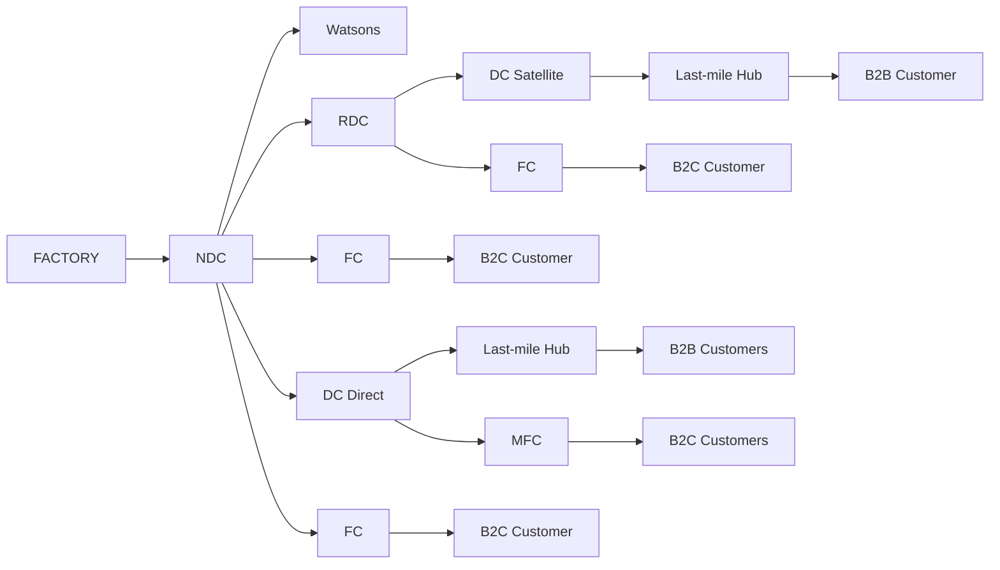

# ENO Perimeter — Indonesia & Malaysia

> Markdown reconstruction of the network shown in the source image. Repeated FC and customer symbols are numbered only for clarity; these numbers were not present in the original image.

## Network structure

## Elements shown in the diagram

| Category | Nodes / labels shown |
|---|---|
| Upstream | Factory |
| National distribution | NDC |
| Regional distribution | RDC |
| Direct distribution | DC Direct |
| Satellite distribution | DC Satellite |
| Fulfilment | FCs, MFC |
| Last mile | Last-mile Hubs |
| Customers | B2B Customers, B2C Customers, Watsons |

## Scope notes from the source

- B2C delivery from **FCs and MFC** is in scope and modeled to reflect the end-to-end flows, despite not being costed as these costs are not borne by **Paragon**.
- **Watsons** is the only case of direct customer delivery from the **NDC**.

## Simplified logical view

1. **Factory → NDC**
2. From the **NDC**, the network branches into regional, direct-distribution, fulfilment-center, and direct-customer flows.
3. **RDC / DC Satellite / Last-mile Hub** support downstream delivery flows.
4. **DC Direct → Last-mile Hub → B2B Customers** represents a direct B2B distribution path.
5. **FCs and MFC → B2C Customers** represent B2C fulfilment paths.
6. **NDC → Watsons** is the explicitly noted direct-customer exception.

