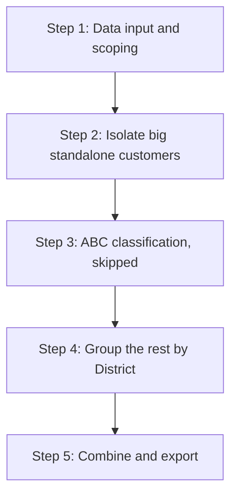

# Ship-To Grouping

Client / EngagementParagon - ENO: Paragon - ENO
ETA: June 23, 2026
Initiative type: Data Processing/Modeling
Last validated: July 10, 2026
Lead author: Phu Tran
Meeting: None
Reviewer: Dung Huynh
Status: Final

- 📖 How to use this template (read once, then collapse)
    
    **The bar.** A new analyst who knows nothing about this work should be able to read this document and restart a similar initiative from scratch without asking the author a single question. If something would block them, it belongs here.
    
    **Scope of a document.** One document per *initiative* - a self-contained piece of analytical work with its own method, inputs, and deliverable. Not per project.
    
    **Header fields** live in the database properties (Client, Initiative type, Status, Lead author, Reviewer, Date closed, Last validated, Reuse tags, Reusable assets) - fill them there, not in the body.
    
    **Process.** Documentation is produced at initiative close; an initiative can't be marked complete until its doc reaches *Final*.
    
    - **Stage 1 - Senior Analyst review (content).** A Senior Analyst who didn't write the doc ticks the checkboxes against the bar and challenges any gaps.
    - **Stage 2 - Manager sign-off.** Manager confirms Stage 1 happened, then flips Status to Final.
    
    **The checkboxes are the definition of done** - ticked by the *reviewer* at Stage 1, not the author. The author uses them while writing as a guide to what "done" means.
    

# Part 1 - Fixed template

## Summary

- **What was the initiative?**
    
    The client's network model had far too many delivery points to solve quickly. We shrank that list: most B2B customers are merged into one group per District, while a few very large customers that sit close to an NDC are kept on their own so they can still be supplied directly.
    
- **Why the client needed it:**
    
    The client has 35,000+ B2B Ship-tos - far too many for the network optimization model (a linear program) to solve in reasonable time. Grouping them into a much smaller set of destinations lets the model run faster, leaving more time to test different scenarios.
    
- **What it produced (deliverable + link):**
    - The output is a **mapping table**: for each `ShipToID`, which `ShipToGroupID` it belongs to. It is saved in two forms:
        - Parquet (for R/Python pipelines): `DATA/03.Summarized_data/Grouping/ShipToGroup_Mapping.parquet`
        - Excel (for manual review): `DATA/03.Summarized_data/Grouping/ShipToGroup_Mapping.xlsx`
    - The script that generates it is documented in Part 2.
- **Key results / recommendation:**
    - The destination list shrank ~10×: from 35,000+ B2B Ship-tos down to ~3,500 Ship-to groups.
- **Who did what:**
    - @Dung Huynh: Authored the initial Rmd logic for filtering demand, querying distances, and generating the naming conventions
    - @Phu Tran: Took over the initiative post-handover, split the high-demand Ship-tos, and compiled the workflow for this document
- [x]  A reader with no context understands purpose and outcome from this section alone

## Method

- **Approach:**
    
    The rule is simple: **group every B2B customer by District** - all Ship-tos in the same District become one group. The one exception is a handful of **big customers close to an NDC**, which are kept on their own so they can be supplied directly. The two sets are then combined into a single mapping table.
    
- **Why group by District (options considered):**
    
    The model's transport cost is driven mainly by **geography** - how far each customer sits from its supply point (cost per pallet). So the only thing that matters when choosing a grouping is: *does it keep customers with a similar distance-to-supply together, so the model's result stays close to the no-grouping baseline?* A grouping that mixes far-apart customers averages their distances and distorts cost; a geography-based grouping does not.
    
    **Table 1. Grouping options considered**
    
    | **Option** | **Description** | **Strength (for model accuracy)** | **Weakness (for model accuracy)** |
    | --- | --- | --- | --- |
    | **No grouping (most granular)** | Keep all 35k+ Ship-tos as separate destinations | Exact transport cost - the ground-truth result the model should reproduce | 35k+ destinations make the LP too slow to solve, so no scenarios can be tested |
    | **By District (chosen)** | One group per administrative District | Only geographically close customers share a node, so their distance-to-NDC and cost per pallet are almost identical - the model result stays very close to the baseline | A few oversized Districts still blend slightly different distances (mitigated by carving out the big NDC-adjacent customers first) |
    | **By ABC class** | Group by sales-volume tier (A / B / C) | None for the model - a volume tier says nothing about distance | Puts customers hundreds of km apart in one node, averaging their distances and materially shifting the modelled cost |
    | **By channel (GT / MT / Others)** | Group by customer channel type | None for the model - channel is a commercial attribute, not a geographic one | Cost per pallet depends on geography, not channel, so this changes distances arbitrarily and skews the result with no accuracy upside |
    | **By order frequency** | Group by how often each customer orders | None for the model - cadence has no bearing on distance | Mixes far-apart customers, so the modelled transport cost is distorted |
    | **Grid / hexagonal binning** | Group by fixed geographic cells | Distance-based, so it broadly preserves the geography the model cares about | Cells cut across District / City boundaries used for routing and reporting, so groups don't match how deliveries are actually planned |
    
    The big, NDC-adjacent customers are not a grouping option - they are an exception carved out before grouping (see Approach and Step 2).
    
- **Scope - what it covers and what it does not:**
    - B2B customers only, in Indonesia and Malaysia, with demand in the 2025 Jan–Nov window.
    - B2C is out of scope (it is grouped by City/Province during data cleaning).
    - Only Indonesia customers are eligible for standalone treatment (since Malaysia is too far to be shipped direct from NDCs).
- **Units & conventions (currency, volume, horizon, exchange rate):**
    - Volume: Piece (PCS)
    - Currency: Indonesia Rupiah (IDR)
    - Distance: KM
- [x]  Approach and scope are clear to someone who knows the technique

## Pitfalls & reuse

- **What would have saved you a full day if you'd known it on day one?**
    
    Understanding how the distance calculation server handles errors. If a routing request fails or returns an unexpected format, the process silently assigns a zero-kilometer distance instead of stopping and warning you.
    
- **What did the client push back on, and why?**
    
    There was no push-back on this initiative. The Ship-to grouping was a CEL-side proposal to shrink the problem size and cut solver runtime, and Paragon team agreed with it from the start.
    
- **What's the one step that breaks if done out of order?**
    
    You cannot group customers into their general administrative districts before explicitly isolating the high-demand customers into standalone nodes. If you apply the geographic groupings first, the exact locations of your massive, critical clients will be permanently swallowed by the general district buckets.
    
    Just as important, clean the Customer Master **before** grouping: the whole grouping keys off the `District`, `City`, and `Province` columns, so if those are dirty or wrong, customers get sorted into the wrong District and the grouping is silently incorrect.
    
- **What did you do by hand that isn't in any script?** No
- **What would you do differently next time?**
    - Decide upfront what deserves to be an exception (here, the big customers close to an NDC). Spotting these on day one avoids reworking the grouping later.
    - It would also help to ask the owner of the OSRM distance file to include NDC-to-customer flows, so the distances can be loaded directly instead of queried one at a time.
- **What here is directly reusable, and where is it?** No
- [x]  All six questions answered; reviewer challenged any that look evasive

## Inputs

- **Main data sources:**
    
    **Table 2. Main data sources** 
    
    | Data | Purpose |
    | --- | --- |
    | B2B Sales Orders (Jan-Nov 2025) | Used to classify ship-tos by sales contribution and attach historical volume profiles to the final groupings |
    | Base Demand Projection 2025-2030 | Provides projected 2030 B2B demand to identify high-demand ship-tos that require standalone treatment |
    | Customer Master B2B | Provides ship-to geography and ship-to point coordinates for grouping and distance calculation |
    | Facility Master | Provides NDC coordinates used as origins for NDC-to-Ship-to distance calculation |
- **External references:** OSRM internal server to compute driving distance from NDC Jatake and NDC Batang to each high-demand candidate Ship-to.
- [x]  Main sources named and traceable; detail deferred to Part 2

## Outputs & where it landed

- **Final deliverable(s):**
    - `DATA/03.Summarized_data/Grouping/ShipToGroup_Mapping.parquet`
    - `DATA/03.Summarized_data/Grouping/ShipToGroup_Mapping.xlsx`
- **Where it landed:** `DATA/03.Summarized_data/Grouping/`
- **How to read it:**
    - **Which file to pick:**
        - `ShipToGroup_Mapping.parquet`: master mapping table, use this by default in any R/Python pipeline that consumes the grouping.
        - `ShipToGroup_Mapping.xlsx`: same content in Excel form, for manual inspection or sharing with non-technical reviewers.
    - **Key columns to know:**
        - `ShipToID`: original Ship-to identifier
        - `ShipToGroupID`: New destination-node identifier used in the optimization model. Two patterns:
            - For grouped Ship-tos: `{CountryCode}_{MainIslandCode}_{Province}_{City}_{District}` (example:`ID_JV_Jawa Barat_Kota Bandung_Coblong`)
            - For high-demand standalone Ship-tos, it remains equal to the original `ShipToID`, so each Ship-to stays as its own node
        - `ShipToGroupIndex`: 4-digit zero-padded rank of each District-level group, based on total `VolumeInPCS`. Kept to give a stable group ordering, but (like `abcclass`) it is **not used in the model** - traceability only. Standalone Ship-tos are marked as `NA`
        - `abcclass`: ABC class based on historical B2B sales volume from January to November 2025 (leftover work-in-progress column - not used in the model)
        - `SoldToID`, `Channel`, `District`, `City`, `Province`, `SalesArea`, `MainIsland`, `Country`: pass-through attributes from Customer Master B2B, kept for traceability
- [x]  Outputs located and their interpretation explained

## Runtime expectations

- **Typical runtime, with input complexity:**
    
    Under 1 minute end-to-end for a full script run
    
- **What makes it slower (cost drivers):** N/A
- **Hardware / environment measured on:**
    
    Peak ∼1.3 GB RAM used, on a machine with ∼45 GB RAM available
    
- [x]  If the initiative runs, a runtime estimate tied to input complexity is given (or marked not applicable)

---

# Part 2 - Detailed body (free-form)

## Workflow & methodology

*This section is the authoritative reference for how the mapping is produced. To regenerate it, run the script `NETWORK DESIGN/PRGN.Group_ShipTos.Rmd` (full source in the Appendix). Both output files land in `DATA/03.Summarized_data/Grouping/`.*

The workflow has five steps. ABC classification (Step 3) is a leftover work-in-progress and can be skipped - it does not affect the final mapping.

**Figure 1. End-to-end workflow (Steps 1–5)**



Each step below is described as **Input → Process (with rationale) → Output**.

### Step 1: Data input & scoping

**Input:** four cleaned datasets (Table 3).

**Process & rationale:** Load the four datasets. Scope is **B2B customers in Indonesia and Malaysia** - B2C is out of scope because it is already grouped by City/Province during data cleaning. Only **Indonesia** customers are ever considered for standalone treatment; Malaysia customers are always grouped, since they sit well beyond the 200 KM radius of both Indonesian NDCs. (In the script this is the `filter(Country == "Indonesia")` line - it doesn't change the result and could be dropped to avoid confusion.)

**Output:** the four datasets loaded and ready for Steps 2–4.

**Table 3. Cleaned input datasets used by the workflow**

| Data | File path | Purpose |
| --- | --- | --- |
| B2B Sales Orders Jan-Nov 2025 | `DATA/02.Cleaned_data/B2B_SO_2025_JantoNov.parquet` | Historical B2B sales used for ABC classification |
| Base Demand Projection 2025-2030 | `DATA/02.Cleaned_data/Base_Demand_Projection_2025_2030_Details.parquet` | Projected 2030 demand used to identify high-demand ship-tos |
| Customer Master B2B | `DATA/02.Cleaned_data/CustomerMasterB2B.parquet` | Ship-to geography, channel, sales area, and Ship-to point coordinates |
| Facility Master | `DATA/02.Cleaned_data/FacilityMaster.parquet` | Coordinates of NDC Jatake (`FacilityID` = `NDC`) and NDC Batang (`FacilityID` = `NDC3`) |

### Step 2: Isolate the big standalone customers

**Input:** Base Demand Projection 2025–2030, Customer Master B2B, Facility Master.

**Process & rationale:** Find the few customers too big to fold into a District group and keep each as its own node. A customer qualifies only if it passes **both** tests:

1. **Big enough to ship direct** - 2030 B2B demand above **4M PCS**. The initiative switches these customers from *DC → customer* to *NDC → customer* delivery, which only pays off if they order enough to fill a container. (Agreed with Paragon.)
2. **Close enough for 1-day delivery** - within **200 KM** of NDC Jatake or NDC Batang. Paragon commits to next-day delivery, so anything farther is excluded. (Agreed with Paragon.)

In practice: aggregate `QtyInPCS2030` by `LocationID`, keep Indonesia B2B Ship-tos above 4M PCS, then compute driving distance from each NDC with `GetOSRMDrivingDistance()` (an in-house `CELRPackage` function) on CEL's internal OSRM server. **Prerequisite:** OSRM runs on an internal server, so a new analyst may first need port / network access - if it will not run on your account, ask a technical senior to fix the setup rather than working around it.

**Output:** `Chosen_2030ShipTos` - the standalone customers. They skip District grouping and keep their original `ShipToID` as their final `ShipToGroupID`.

<aside>
⚠️

**Caveat:** if an OSRM request fails, the code currently records the distance as `0 KM`. Since 0 also passes the 200 KM test, a failed lookup can quietly slip a customer into the standalone list - always check the distances before trusting the result. (Ideally a failure should be recorded as `NA` with a warning, not `0`.)

</aside>

### Step 3: ABC classification *(skipped)*

<aside>
⚠️

**This step can be skipped.** ABC classification is a leftover work-in-progress - the `abcclass` tag it produces is *not used* in the final grouping, and is kept only for completeness.

</aside>

**Input:** B2B Sales Orders Jan–Nov 2025, Customer Master B2B.

**Process & rationale:** Profile each Ship-to by historical sales so customers could later be tagged A/B/C by volume. (Paragon shared the extract in mid-December 2025 before December closed, so December is excluded.) Group sales by `ShipToID`, compute `VolumeInPCS`, `VolumeInTon`, and `ValueInIDR`, then run `ABCClassify()` from `CELRPackage` on `VolumeInPCS` and join `Channel` from Customer Master B2B.

**Output:** an `abcclass` tag per Ship-to - carried through for traceability only, not used downstream.

### Step 4: Group the rest by District

**Input:** the non-standalone customers from Customer Master B2B.

**Process & rationale:** Group all remaining Ship-tos by administrative geography, using **District** as the level - it is the most granular geography in the customer master, so grouped customers stay close together and operationally similar. This shrinks the number of destinations while barely changing the model result. The grouping key is `Country` + `MainIsland` + `Province` + `City` + `District`. For each group, total `VolumeInPCS` is computed and groups are ranked high-to-low; the rank becomes a 4-digit `ShipToGroupIndex` (`0001`, `0002`, …).

**Output:** each District group gets a standardized `ShipToGroupID` - `{CountryCode}_{MainIslandCode}_{Province}_{City}_{District}` (e.g. `ID_JV_Jawa Barat_Kota Bandung_Coblong`). `CountryCode` is `ID` for Indonesia and `ML` for Malaysia; `MainIslandCode` is mapped from the standardized main island name (Table 4).

**Table 4. Main Island → Main Island Code mapping**

| Main Island | Main Island Code |
| --- | --- |
| Java | JV |
| Sumatra | SMT |
| Kalimantan | KLMT |
| Sulawesi | SLWS |
| Bali - Nusra | BLN |
| Papua | PPA |
| Maluku | MLK |
| Peninsular Malaysia | PNML |
| East Malaysia | EAML |

### Step 5: Combine & export

**Input:** the standalone customers (`Chosen_2030ShipTos`, Step 2) and the District groups (Step 4).

**Process & rationale:** Stack the two sets into one table, `GroupedShipTo`, so the model has a single lookup from every `ShipToID` to its destination node:

- **Standalone customers:** `ShipToGroupID = ShipToID`, `ShipToGroupIndex = NA`; geography and `abcclass` joined back from Customer Master B2B.
- **District groups:** `ShipToGroupID` follows the naming convention above; `ShipToGroupIndex` is the group's volume rank.

**Output:** the final mapping table with columns `ShipToID`, `ShipToGroupID`, `ShipToGroupIndex`, `SoldToID`, `Channel`, `District`, `City`, `Province`, `SalesArea`, `MainIsland`, `Country`, `abcclass` - saved as:

- `DATA/03.Summarized_data/Grouping/ShipToGroup_Mapping.parquet`
- `DATA/03.Summarized_data/Grouping/ShipToGroup_Mapping.xlsx`

### Limitations & open items

**Limitations:**

- **The script does not compute group coordinates.** It assigns each Ship-to to a `ShipToGroupID`, but it does *not* work out a representative coordinate (centroid) for each District group - and the final output carries no lat/long at all.  Next time, fold the group-centroid calculation into this same Rmd so the whole grouping is controlled end-to-end in one file.
- **OSRM failures are recorded as `0 KM`** (see the Step 2 caveat), so distances should be sanity-checked before use.

**Open items:** None.

### Definition of done (reviewer checks each)

- [x]  **Reproducibility path** - another analyst can regenerate the deliverable (run instructions / calculation logic / data structure + update steps).
- [x]  **Data inputs, fully traced** - table of every input: source, format, owner, vintage, known issues; cleaning steps reference real scripts.
- [x]  **Tools, code &amp; files** - stack, repo/folder links, key scripts with purpose and entry point. No undocumented manual step.
- [x]  **Global assumptions, each with a rationale** - nothing load-bearing left in someone's head.
- [x]  **Limitations** - what it does NOT do or claim; confidence level; how it was validated.
- [x]  **Open items / things to validate** - explicit list of what's uncertain, estimated, or pending client confirmation.
- [x]  Open-items section present and honest
- [x]  Reproducibility path verified by reviewer

## Appendix

- Script
    
    ---
    
    title: "Grouping Ship-Tos"
    author: "Dung Huynh"
    date: "`r format(Sys.time(), '%d %B, %Y %H:%M')`"
    output:
    CELRPackage::CELReport:
    number_sections: TRUE
    self_contained: TRUE
    knit: (function(inputFile, encoding) {
    out_dir <- '../DATA/99.Reports/';
    rmarkdown::render("Default.Rmd",
    encoding=encoding,
    output_file=file.path(dirname(inputFile), out_dir, '')) })
    
    ```
    library(janitor)
    library(leaflet)
    library(CELRPackage)
    library(readxl)
    library(janitor)
    library(knitr)
    library(kableExtra)
    library(formattable)
    library(dplyr)
    library(tidyverse)
    library(writexl)
    library(base)
    library(arrow)
    
    options(scipen=999)
    options(digits=2)
    knitr::opts_knit$set(root.dir = normalizePath(".."))
    ```
    
    ```
    # source("source_functions.R")
    ```
    
    ```
    SalesOrders_connection    <- open_dataset("DATA/02.Cleaned_data/B2B_SO_2025_JantoNov.parquet")
    FacilityMaster            <- read_parquet("DATA/02.Cleaned_data/FacilityMaster.parquet")
    CustomerMaster            <- read_parquet("DATA/02.Cleaned_data/CustomerMasterB2B.parquet")
    DemandProjection <- open_dataset("DATA/02.Cleaned_data/Base_Demand_Projection_2025_2030_Details.parquet")
    OSRM_existingflows <- read_parquet("DATA/03.Summarized_data/All_Flows_FMM_LM_Indo_Malay_With_Distance.parquet")
    OSRM_nonexistingflows <- read_parquet("DATA/03.Summarized_data/All_Non_Existing_Flows_FMM_LM_Indo_Malay_with_distance.parquet")
    ```
    
    # Detect ship-tos having >4MPCS demand in 2030 projection & either <200km from NDC Jatake or NDC Batang
    
    ```
    Great2030Demand_ShipTos <- DemandProjection %>%
      filter(Type == "B2B") %>%
      group_by(LocationID) %>%
      summarise(
        VolumeInPCS_2030 = sum(QtyInPCS2030)
      ) %>%
      ungroup() %>%
      filter(
        VolumeInPCS_2030 > 4*10^6
      ) %>%
      collect() %>%
      rename(ShipToID = LocationID) %>%
      left_join(CustomerMaster %>% select(ShipToID, Country), by = c("ShipToID")) %>%
      filter(Country == "Indonesia")
    ```
    
    # Compute OSRM distance for these great-demand ship-tos (Malaysia excluded)
    
    ```
    # Prepare input data
    indo_flow_data <- Great2030Demand_ShipTos %>%
      select(DestinationID = ShipToID) %>%
      left_join(
        CustomerMaster %>% select(DestinationID = ShipToID, Longitude_Destination = CentroidLong, Latitude_Destination = CentroidLat),
        by = c("DestinationID")
      ) %>%
      cross_join(
        tibble(OriginID = c("NDC", "NDC3"))
      ) %>%
      left_join(
        FacilityMaster %>% select(OriginID = FacilityID, Longitude_Origin = Longitude, Latitude_Origin = Latitude),
        by = c("OriginID")
      ) %>%
      select(OriginID, Longitude_Origin, Latitude_Origin, DestinationID, Longitude_Destination, Latitude_Destination)
    
    write_parquet(indo_flow_data, "DATA/03.Summarized_data/LastMileFlows_fromNDC_to_Great2030DemandIndonesiaShipTos.parquet")
    
    # Run
    set_config(use_proxy(url="100.112.147.4",port=5000))
    
    for (i in 1:nrow(indo_flow_data)){
        osrm_result <- GetOSRMDrivingDistance(origin = indo_flow_data[i,] %>% select(OriginID, Longitude_Origin, Latitude_Origin),
                                   destination = indo_flow_data[i,] %>% select(DestinationID, Longitude_Destination, Latitude_Destination),
                                   server = "100.112.147.4:5000",
                                   overview = FALSE,
                                   exclude = NULL)
        if(ncol(osrm_result) == 6){
          indo_flow_data[i,"DistanceInKM"] = 0
        } else{
          indo_flow_data[i,"DistanceInKM"] = osrm_result$distance
        }
    }
    ```
    
    ```
    # Final chosen ship-tos
    Chosen_2030ShipTos <- Great2030Demand_ShipTos %>%
      select(DestinationID = ShipToID) %>%
      cross_join(
        tibble(OriginID = c("NDC", "NDC3"))
      ) %>%
      left_join(indo_flow_data %>% select(OriginID, DestinationID, DistanceInKM), by = c("OriginID", "DestinationID")) %>%
      filter(DistanceInKM <= 200) %>%
      distinct(ShipToID = DestinationID)
    ```
    
    # Load data
    
    ```
    grouped_SalesOrders <- SalesOrders_connection %>%
      group_by(ShipToID) %>%
      summarise(VolumeInPCS = sum(QtyOrderedInPCS),
                VolumeInTon = sum(QtyOrderedInKG)/1000,
                ValueInIDR = sum(ValueOrderedIDR)) %>%
      ungroup() %>%
      collect()
    
    abc_shiptos <- ABCClassify(grouped_SalesOrders, VolumeInPCS) %>%
      left_join(CustomerMaster %>% select(ShipToID, Channel), by = "ShipToID")
    
    CustomerMaster_togroup <- CustomerMaster %>%
      anti_join(Chosen_2030ShipTos, by = c("ShipToID")) %>%
      right_join(abc_shiptos %>%
                   anti_join(Chosen_2030ShipTos, by = c("ShipToID")) %>%
                   select(ShipToID, abcclass, VolumeInPCS),
                 by = "ShipToID") %>%
      select(ShipToID, SoldToID, Channel, District, City, Province, SalesArea, MainIsland, Country, abcclass, VolumeInPCS)
    ```
    
    # Rank Ship District (optional)
    
    ```
    group_volume_rank <- CustomerMaster_togroup %>%
      group_by(Country, MainIsland, Province, City, District) %>%
      summarise(
        TotalVolume = sum(VolumeInPCS, na.rm = TRUE),
        .groups = "drop"
      ) %>%
      arrange(desc(TotalVolume)) %>%
      mutate(
        ShipToGroupIndex = row_number(),
        ShipToGroupIndex = sprintf("%04d", ShipToGroupIndex)
      )
    ```
    
    # Group by District
    
    ```
    Chosen_2030ShipTos_final <- Chosen_2030ShipTos %>%
      mutate(
        ShipToGroupID = ShipToID,
        ShipToGroupIndex = NA_character_
      ) %>%
      left_join(
        CustomerMaster %>% select(ShipToID, SoldToID, Channel, District, City, Province, SalesArea, MainIsland, Country),
        by = c("ShipToID")
      ) %>%
      left_join(
        abc_shiptos %>% distinct(ShipToID, abcclass),
        by = c("ShipToID")
      )
    
    GroupedShipTo <- CustomerMaster_togroup %>%
      left_join(
        group_volume_rank %>%
          select(Country, MainIsland, Province, City,  District, ShipToGroupIndex),
        by = c("Country", "MainIsland", "Province", "City", "District")
      ) %>%
      mutate(
        CountryCode     = ifelse(Country == "Indonesia", "ID", "ML"),
        MainIslandCode  = case_when(MainIsland == "Java" ~ "JV",
                                    MainIsland == "Sumatra" ~ "SMT",
                                    MainIsland == "Kalimantan" ~ "KLMT",
                                    MainIsland == "Sulawesi" ~ "SLWS",
                                    MainIsland == "Bali - Nusra" ~ "BLN",
                                    MainIsland == "Papua" ~ "PPA",
                                    MainIsland == "Maluku" ~ "MLK",
                                    MainIsland == "Peninsular Malaysia" ~ "PNML",
                                    MainIsland == "East Malaysia" ~ "EAML",
                                    T ~ "Has not defined"),
        # Province_clean      = str_remove(Province, regex("^Kota\\s+ |^Dki\\s+", ignore_case = TRUE)),
        # ProvinceCode        = toupper(str_sub(str_replace_all(Province_clean, "[^A-Za-z]", ""), 1, 3)),
        ShipToGroupID       = sprintf("%s_%s_%s_%s_%s", CountryCode, MainIslandCode, Province, City, District)
      ) %>%
      select(ShipToID, ShipToGroupID, ShipToGroupIndex, SoldToID, Channel, District, City, Province, SalesArea, MainIsland, Country, abcclass) %>%
      bind_rows(Chosen_2030ShipTos_final)
    ```
    
    # Sanity Check
    
    ```
    # check <- GroupedShipTo %>%
    #   group_by(ShipToGroupID) %>%
    #   summarise(n_distinct(ShipToGroupIndex))
    #
    # agg_map <- st_read("DATA/04.Map_data/map_adm3.shp", quiet = TRUE)
    #
    # District_Shapefile <- agg_map %>%
    #   st_drop_geometry() %>%
    #   distinct(District, City, Province, MainIsland)
    #
    # # Phu to check
    # inconsistent_geography <- GroupedShipTo %>%
    #   distinct(ShipToGroupID, District, Province, City, MainIsland, Country) %>%
    #   group_by(District) %>%
    #   filter(n_distinct(City) > 1) %>%
    #   ungroup() %>%
    #   arrange(District)
    #   # group_by(District) %>%
    #   # filter(n_distinct(Province) == 1 & n_distinct(City) > 1) %>%
    #   # ungroup() %>%
    #   # arrange(District)
    #
    # District_check <- inconsistent_geography %>%
    #   distinct(ShipToGroupID, District, Province, City, MainIsland) %>%
    #   anti_join(District_Shapefile, by = c("District", "City", "Province", "MainIsland"))
    #
    # inconsistent_geography %>%
    #   write_xlsx("DATA/03.Summarized_data/DistrictCheck_ShipToGroups.xlsx")
    #
    # n_distinct(GroupedShipTo$ShipToGroupIndex)
    # n_distinct(GroupedShipTo$District)
    ```
    
    ```
    write_parquet(GroupedShipTo, "DATA/03.Summarized_data/Grouping/ShipToGroup_Mapping.parquet")
    write_xlsx(GroupedShipTo, path = "DATA/03.Summarized_data/Grouping/ShipToGroup_Mapping.xlsx")
    ```