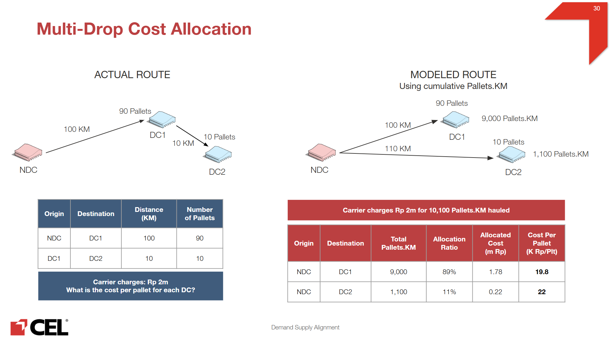

# Transportation Cost

- First Mile
    - Objective
        - Build a Cost per Pallet heatmap from NDCs to City/Regency destinations, then apply it to estimate First Mile transportation costs for existing and candidate (new) DC locations.
    - Costing assumption
        - Cost per Pallet is computed as: (transportation cost of the highest-capacity truck) ÷ (maximum pallet capacity of that truck).
    - Data sources
        - **NDC Jatake:** Existing facility data (CostPerPallet from NDC Jatake to existing facilities) combined with transport quotations from NDC Jatake.
        - **NDC Batang:** Transport quotations from NDC Batang to City/Regency destinations.
    - Heatmap construction & cleaning
        - Construct Cost per Pallet by City/Regency from the available quotations.
        - Smooth outliers for consistency: regions with values materially different from surrounding areas are adjusted using the average of neighboring regions.
    - Application in the model
        - Use the finalized heatmap to assign Cost per Pallet from NDC Jatake or NDC Batang to each City/Regency.
        - Apply these costs to estimate First Mile cost for flows to any new DC located in the corresponding City/Regency.
- Last Mile B2B
    - Objective
        - Estimate B2B last-mile costs for both (i) new DC → customer flows and (ii) NDC → customer flows, using destination-level cost benchmarks.
        - New inter-island lane combinations are restricted to the pairs listed below
    
    | **Origin Main Island** | **Destination Main Island** |
    | --- | --- |
    | Java | Java |
    | Sumatra | Sumatra |
    | Kalimantan | Kalimantan |
    | Sulawesi | Sulawesi |
    | Bali - Nusra | Bali - Nusra |
    | Peninsular Malaysia | Peninsular Malaysia |
    | Maluku | Maluku |
    | Java | Bali - Nusra |
    | Sulawesi | Papua |
    | Peninsular Malaysia | East Malaysia |
    - 1) New DC → Customer flows (new last-mile lanes)
        - Use historical shipment data to compute `CostPerPalletKM` by destination.
        - Apply the destination `CostPerPalletKM` to any new flows serving the same destination.
        - Inflate the resulting cost using the scenario inflation factor.
    - 2) NDC → Customer flows
        - Determine cost based on the customer’s City/Regency.
        - Retrieve the corresponding Cost per Pallet from the First Mile heatmap.
        - Inflate the resulting cost using the scenario inflation factor.
    - Depot qualification
        - A facility is classified as a DEPO if it meets all criteria below:
            - Served by at least one facility within a 200 km radius.
            - Meets minimum demand coverage within its service radius:
                - **≥ 90% of demand** if located in **Jabodetabek**
                - **≥ 80% of demand** if located **outside Jabodetabek**
            - Service radius thresholds follow the reference table below.
        
        | Mainland | Is Jabodetabek | Coverage (km) | Min Volume % in coverage |
        | --- | --- | --- | --- |
        | Java | TRUE | 25 | 90% |
        | Java | FALSE | 50 | 80% |
        | Sumatra | FALSE | 150 | 80% |
        | Kalimantan | FALSE | 100 | 80% |
        | Sulawesi | FALSE | 150 | 80% |
        | Maluku | FALSE | 250 | 80% |
        | Bali - Nursa | FALSE | 250 | 80% |
        
- Mid Mile
    
    **0/ Objective**
    
    Estimate mid-mile transportation cost for inter-facility flows (DC to DC, DC to FC, DC to Depot, DC to Instant Hub), and extend the cost logic to new candidate lanes and new candidate facilities.
    
    **1/ Cost reference methodologies**
    
    Lane-level cost benchmarks were derived from historical shipments using `CostPerPalletKM` patterns by route and geography. The benchmarks are applied differently depending on flow type:
    
    - **DC to DC:** Weighted-average `CostPerPalletKM` of the *destination* main island.
        
        
        | **Origin Main Island** | **Cost per Pallet-KM (IDR)** |
        | --- | --- |
        | North Sumatra | 2,065.2 |
        | Central Sumatra | 3,769.1 |
        | South Sumatra | 2,669.1 |
        | Java | 3,185.5 |
        | Sulawesi | 3,309.5 |
        | Kalimantan | 3,414.7 |
        | Bali - Nusra | 3,453.1 |
    - **DC to FC:** Weighted-average `CostPerPalletKM` across all historical DC-to-FC lanes. (~3453 IDR)
    - **DC to Depot:** Transportation cost logic inherited from the Last Mile methodology.
        
        
        | **Origin Main Island** | **Cost per Pallet-KM (IDR)** |
        | --- | --- |
        | Sumatra | 2,803.5 |
        | Java | 1,342.8 |
        | Sulawesi | 2,635.6 |
        | Kalimantan | 5,379.3 |
    - **DC to Instant Hub:** Estimated in two legs
        - DC to Depot: using the same logic above
        - Depot to Instant Hub: using weighted-average B2B `CostPerPalletKM`.
        
        | Origin Main Island | Cost per Pallet-KM (IDR) |
        | --- | --- |
        | Sulawesi | 6,972.8 |
        | Kalimantan | 11472 |
        | Maluku | 12,126.6 |
        | Sumatra | 16,292.7 |
        | Java | 16,371.6 |
        | Bali-Nusra | 17,844.3 |
        | Peninsular Malaysia | 28,337.9 |
    
    **2/ Defining new flows coverage**
    
    - New flows cover lanes involving both existing and new facilities. Only the following pre-defined inter-island origin–destination combinations are in scope:
    
    | **Origin Main Island** | **Destination Main Island** |
    | --- | --- |
    | Java | Java |
    | Sumatra | Sumatra |
    | Sulawesi | Sulawesi |
    | Java | Bali - Nursa |
    | Kalimantan | Kalimantan |
    | Bali - Nursa | Bali - Nursa |
    | Sulawesi | Maluku |
    | East Malaysia | East Malaysia |
    | East Malaysia | Peninsular Malaysia |
    | Peninsular Malaysia | Peninsular Malaysia |
    | Peninsular Malaysia | East Malaysia |
    | Sulawesi | Papua |
    | Papua | Papua |
    | Maluku | Maluku |
    - Two additional scoping rules apply to new flows:
        - DC to Depot lanes: Only routes within **200 km** are included.
        - New facilities: Candidate facilities are generated from demand clustering and treated as DC-type (not FC-type). The same DC-based costing approach applies to any lane involving a new facility.
    
    **3/ Applying cost**
    
    - The flow-type specific cost rules and historical benchmarks described in Cost reference methodologies are applied consistently across all flows - both existing lanes and newly generated ones.
    - Two further adjustments are then applied, in sequence:
        - Cost adjustment factor: Applied to all flows to account for stock-balancing shipments that were excluded from the adjusted baseline. This prevents the modeled cost from being understated.
        
        | Destination Main Island | Factor |
        | --- | --- |
        | Sumatra | 0.054 |
        | Kalimantan | 0.015 |
        | Sulawesi | 0.011 |
        | Maluku | 0.003 |
        | Java | 0.248 |
        | Bali - Nusra | 0.027 |
        - Scenario inflation: Applied after the full lane set is built, as a final step to reflect scenario-level cost assumptions.
- Last Mile B2C
    
    B2C flows are created based on proximity to eligible facilities (excluding NDCs and last-mile hubs).
    
    Inter-island serving restrictions
    
    - **Sulawesi** cities can only be served by **Sulawesi** facilities.
    - **Bali - Nusra** cities can only be served by facilities located in **Java**, **Bali - Nusra**, or **Bali**.
    - **Kalimantan** cities can only be served by **Kalimantan** facilities. Likewise, **Kalimantan** facilities can only serve **Kalimantan** cities.
    
    **First optimization run**
    
    An initial candidate set of feasible B2C flows is created after applying the inter-island restrictions above.
    
    - For each B2C city located within **100 km** of one or more eligible facilities, flows are created to all eligible facilities within that radius.
    - If no eligible facility exists within 100 km, the city is assigned to the closest designated regional FC hub:
        - **Indonesia:** RDC Makassar, RDC Kediri, FC Tegal, RDC Palembang, RDC Medan, DC Direct Pontianak, and RDC Banjarmasin.
        - **Malaysia:** FC Shah Alam.
    
    **Subsequent optimization runs**
    
    After the first optimization run, facilities are ranked by B2C volume and the **top 30 facilities** are retained as the candidate B2C network.
    
    For each B2C city, only the flow to the **nearest facility among these top 30 facilities** is retained. All other B2C facility-to-city flows are removed from the optimization model.
    
    <aside>
    
    This **top-30 restriction** is required by PRGN and reflects an operational constraint from the e-commerce platform, which supports a maximum of **30 hubs** in the fulfillment network configuration.
    
    </aside>
    
- Mid Mile (old version)
    - Objective
        - Estimate mid-mile transportation cost for inter-facility flows (DC to DC, DC to FC, DC to Depot, DC to Instant Hub), and extend the cost logic to new candidate lanes and new candidate facilities.
    - Method (existing lanes)
        - Build lane-level cost benchmarks from historical shipments, using `CostPerPalletKM` patterns by route and geography.
        - Apply flow-type specific rules:
            - **DC to DC:** use the weighted-average `CostPerPalletKM` of the *destination main island*.
            - **DC to FC:** use the weighted-average `CostPerPalletKM` across all historical DC to FC lanes.
            - **DC to Depot:** use the corresponding transportation cost logic from **Last Mile**.
            - **DC to Instant Hub:** estimate in 2 legs:
                - **DC to Depot:** same as DC to Depot logic above.
                - **Depot to Instant Hub:** use weighted-average B2B `CostPerPalletKM`.
        - Apply an adjustment factor to account for stock-balancing flows excluded from the adjusted baseline, to avoid understating modeled cost.
    - Method (new lanes involving existing and/or new facilities)
        - Generate the only pre-defined inter-island flow combinations below
        
        | **Origin Main Island** | **Destination Main Island** |
        | --- | --- |
        | Java | Java |
        | Sumatra | Sumatra |
        | Sulawesi | Sulawesi |
        | Java | Bali - Nursa |
        | Kalimantan | Kalimantan |
        | Bali - Nursa | Bali - Nursa |
        | Sulawesi | Maluku |
        - For new **DC to Depot** lanes, only include routes within **200 km**.
        - Estimate costs using the same flow-type rules and historical cost benchmarks applied to existing lanes.
    - Flows involving new facilities
        - New facilities are generated from demand clustering and treated as **DC-type** facilities (not FC-type).
        - Apply the same DC-based costing approach for any lane involving a new facility.
    - Final adjustment: Apply scenario inflation after the full lane set is built.
- ARCHIVED
    - First & Mid Mile
        
        Scope: 10/2024 - 9/2025
        
        Related dataset:
        
        - TO: missing VehicleType
        - Main rate card (cost rate of Origin, Destination, Vendor Name, Vehicle Type)
        - Backup rate card (average cost by Origin, Destination, VehicleType)
        
        **1/ TO Cleaning & Assumption**
        
        **1.1. Fill RouteID with following order:** FirstMileRouteID → TMSRouteID → OdooRouteID → MidMiileRouteID 
        
        **1.2. Infer missing vendor name based on existing vehicle plates**
        
        **1.3. Standardize vendor name between TO and rate card**
        
        1.4. Impute missing RouteID
        
        **1.5. Fill known special services from rate card (LCL/LTL +Air freight)**
        
        Rationale: All later major steps (define trip type + allocating cost) depend on it
        
        - LCL/LTL
            - Use the rate card to identify which lanes (Forwarder + Origin + Destination) are priced as **LCL/LTL**
            - If Vehicle Type is missing in TO, we assign “LCL” or “LTL” based on the rate card matching lane
        - Air freight
            - Focus on routes handled by vendor “Lion Express, PT” (the only vendor carry air delivery in rate card) where Vehicle Type is still missing
            - Note: The average cost of express and regular air services is used, as only 20% of air routes have both service types in the rate card, and these routes represent just 5.6% of total delivery volume in TO data.
        
        **1.6. Detect internal fleet:** based on 2 patterns
        
        - Vendor is “Netral” or “MOBIL PENGHANTARAN RDC”
        - Rows with missing vendor names but vehicle plates containing the phrase “NETRAL”
        
        *→ Impact: Fulfilled 67,814 rows which account  12.1 MPCS (~13% aggregated First & Mid Miles)* 
        
        **1.7. Infer vehicle types**
        
        Approach: Imputing them using a step-by-step priority hierarchy, from most reliable to most general
        
        Level 1: Same Origin, Destination, VehiclePlateNumber, VendorName 
        
        Level 2: Same Origin, Destination, VehiclePlateNumber
        
        Level 3: Origin, Destination, VendorName
        
        Level 4: Origin, Destination
        
        Level 5: RouteType (RDC to DC Satellite, DC Direct to FC, etc)
        
        Level 6: TransferFlow (DC to DC, NDC to DC)
        
        At each step, I review historical shipments that match the criteria and apply two simple rules:
        
        - Major rule: A vehicle type is selected only if it accounts for more than 50% of the total shipped volume (in PCS) at that level.
        - Air freight exception: If the most common vehicle type is Air Freight, it is skipped and the next most common vehicle type is evaluated instead.
        
        If no vehicle type meets these conditions, we move down to the next level (more general one).
        
        Also for routes from/to Malaysia: temporarily filled by NA
        
        **1.8. Classify trip type: Single trip and multi-drop**
        
        **Goal:** Identify whether a trip serves 1 destination or multiple destinations.
        
        - For each trip (same RouteID, Origin, Vehicle Type, Vendor), count the number of unique destinations
            - 1 destination → Single trip
            - ≥ 2 destinations → Multi-drop
        
        **Note: I** did not use timestamps (Assigned / Picked up / Delivered) to classify trips, because timing patterns are inconsistent (e.g., one “single trip” can be delivered across multiple days).
        
        - I also standardize Delivery Method into:
            - Trip (associated with single trip) (cover Big Mama, Motorbike, Small Box,…)
            - Multi-drop
            - KG (equivalent to LCL/LTL/Air Freight)
        
        **2/ Rate Card Cleaning & Assumption**
        
        2.1. Main rate card: Origin, Destination, VendorName, VehicleType
        
        - Same route, vendor, and vehicle and delivery type (trip, multi-drop, kg) but have 2 costs
        
        → retrieve the average values
        
        - Air freight: calculate average cost for routes have 2 delivery type (express & regular)
        
        2.2.  Backup rate card: Origin, Destination, VehicleType
        
        - Approach:  Standardize Origin & Destination to Province level and then map them with facility locations
        
        **3/ Apply transportation cost**
        
        To ensure accurate costing, I calculate cost differently by delivery type
        
        - Single trip + LCL/LTL + Air Freight
            - Match TO records with main rate card using: RouteID + Origin + Destination + Vehicle Type + Vendor
            - Cost calculation:
                - Single trip: Cost = Rate card amount
                - LCL/LTL + Air freight: Cost = Rate card amount x Delivered Qty in KG
        - Multi-drop trip
            - Multi-drop needs one extra step: define the delivery order for multiple points
                - Use the earliest delivered time recorded at each destination to determine the stop sequence
                - Treat the last stop as the main trip for rate card matching (check abnormal flows with map)
            - Cost calculation:  Cost = Rate card amount
        - If there are still missing costs, pivot to use backup rate card with the same logic.
        
        **4/ Calculate Shipment Cost Per Pallet Per Km**
        
        
        
    - Last Mile
        - Cumulative distance for last mile
        - Depot cost